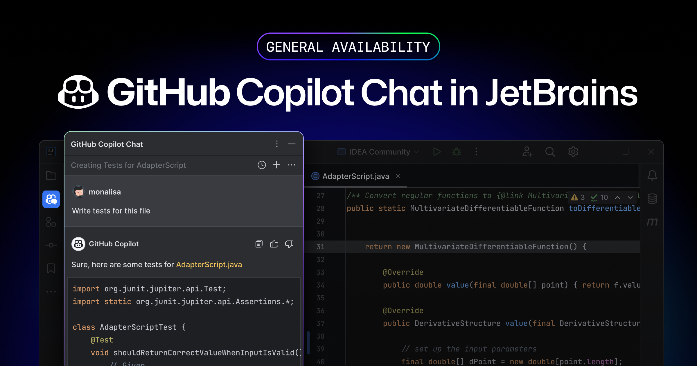

2024年3月7日、GitHubは**JetBrains IDE向けにGitHub Copilot Chatが一般公開されたことを発表しました**。

これにより、GitHub Copilotを使用して直接IDE内でコーディングに関連する質問をして、回答を得られるようになりました。この記事では、GitHub Copilot Chatの特徴やJetBrains IDEでの使い方について詳しく説明します。

<!-- toc -->

## GitHub Copilot Chatとは？

**GitHub Copilot Chatは、GitHub Copilotと対話して、コーディングに関連する質問ができるチャットサービス**です。GitHub.comとサポートされているIDE内で利用できます。

ドキュメントを調べたり、オンラインフォーラムを検索したりすることなく、コーディングの情報やサポートにアクセスできます。

GitHub Copilot Chatは、構文、プログラミング概念、テストケース、デバッグなど、幅広いコーディング関連のトピックに関する質問に回答できます。

## GitHub Copilot Chatの特徴

*画像：「[GitHub Copilot Chat General Availability in JetBrains IDE - The GitHub Blog](https://github.blog/changelog/2024-03-07-github-copilot-chat-general-availability-in-jetbrains-ide/)」より*

今回、**GitHub Copilot ChatがJetBrains IDEで正式に利用できるようになりました**。GitHub Copilot Chatには、次のような特徴があります。

- **GPT-4による駆動**：GitHub Copilot Chatは、GPT-4によって提供されます
- **豊富なサポート**：複雑な概念の理解、コードの説明、ユニットテストの生成、コード内のバグの修正提案など、さまざまなユースケースで開発者をサポートします
- **言語スタイルの調整**：開発者が好む言語スタイルに簡単に適応します

## 利用を開始する方法

### すでにプライベートベータを使用している場合

何もする必要はありません。チャット機能を今までどおり使用できます。

### Chatを有効にしていないが使用したい場合

Copilot Individualユーザーは、JetBrains IDE内で自動的にチャットにアクセスできます。

Copilot BusinessとEnterpriseユーザーは、組織の管理者がIDE内でCopilotチャットにアクセスするための許可を与える必要があります。

## GitHub Copilot Chatの使い方

:::note[必要条件]
GitHub Copilot Chatを使用するには、**有効なGitHub Copilotサブスクリプション**が必要です。

また、JetBrains IDEでGitHub Copilot Chatを使用するには、互換性のあるJetBrains IDEがインストールされている必要があります。
:::

### プラグインのインストールまたはアップデート

GitHub Copilot ChatをJetBrains IDEで使用するには、GitHub Copilotプラグインをインストールするか、更新する必要があります。

1. JetBrains IDEの［ファイル］メニュー（Windowsの場合）またはIDEの名前（例: PyCharmやIntelliJなど）の下にある［設定］または［環境設定］をクリックします
2. ［設定］または［環境設定］ダイアログボックスの左側のメニューで［プラグイン］をクリックします
3. ダイアログボックスの上部で［Marketplace］をクリックし、「GitHub Copilot」と検索してから［インストール］をクリックします
   - すでにインストールされている場合は、［インストール済み］から「GitHub Copilot」を検索して［更新］をクリックします

:::tip
プラグインをインストールしたり更新したりしたら、IDEを再起動します。

プラグインをはじめてインストールした場合は、［ツール］メニューから［GitHub Copilot］>［GitHubにログイン］からGitHubにログインします。
:::

## まとめ

GitHub Copilot ChatがJetBrains IDEで一般公開されたことで、開発者はIDE内で直接質問をして回答を得ることができるようになりました。GitHub Copilot ChatをJetBrains IDEで使用するには、GitHub Copilotプラグインをインストールまたは更新する必要があります。

GitHub Copilot Chatを使用するには、有効なGitHub Copilotサブスクリプションが必要です。また、JetBrains IDEでGitHub Copilot Chatを使用するには、互換性のあるJetBrains IDEがインストールされている必要があります。

GitHub Copilot Chatを使用することで、開発プロセスが大幅に効率化されるため、開発者にとって非常に有用なツールとなります。

## 参考

- [GitHub Copilot Chat General Availability in JetBrains IDE - The GitHub Blog](https://github.blog/changelog/2024-03-07-github-copilot-chat-general-availability-in-jetbrains-ide/)
- [About GitHub Copilot Chat - GitHub Docs](https://docs.github.com/en/copilot/github-copilot-chat/about-github-copilot-chat)
- [Using GitHub Copilot Chat in your IDE - GitHub Docs](https://docs.github.com/en/copilot/github-copilot-chat/using-github-copilot-chat-in-your-ide?tool=jetbrains)
