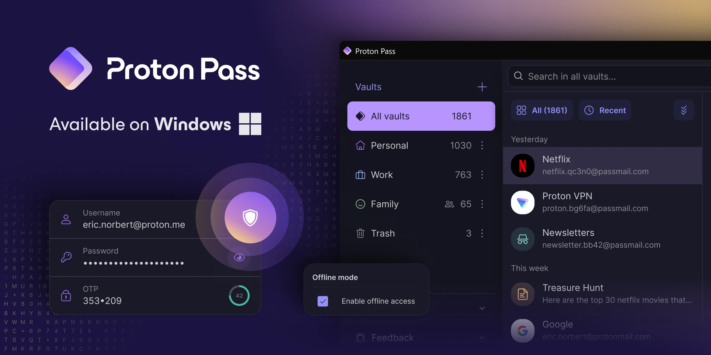
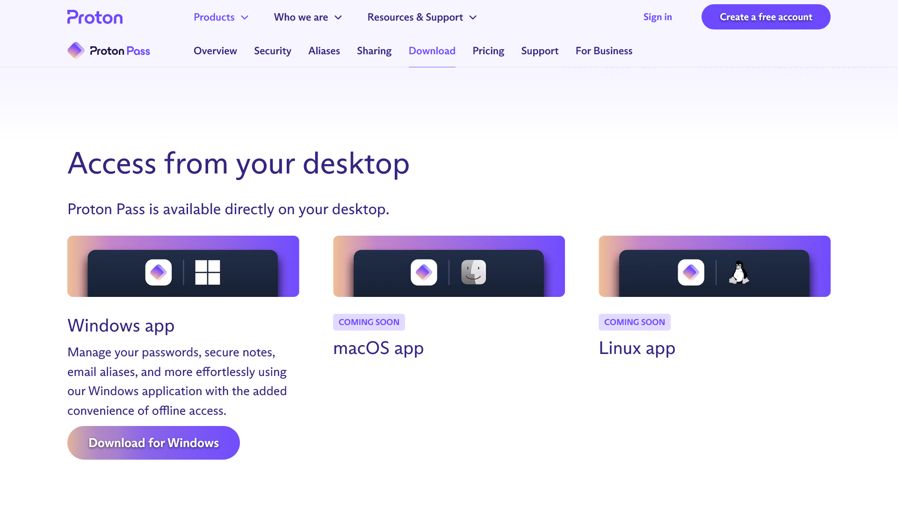
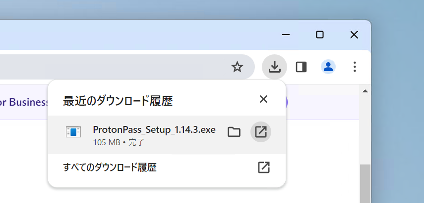
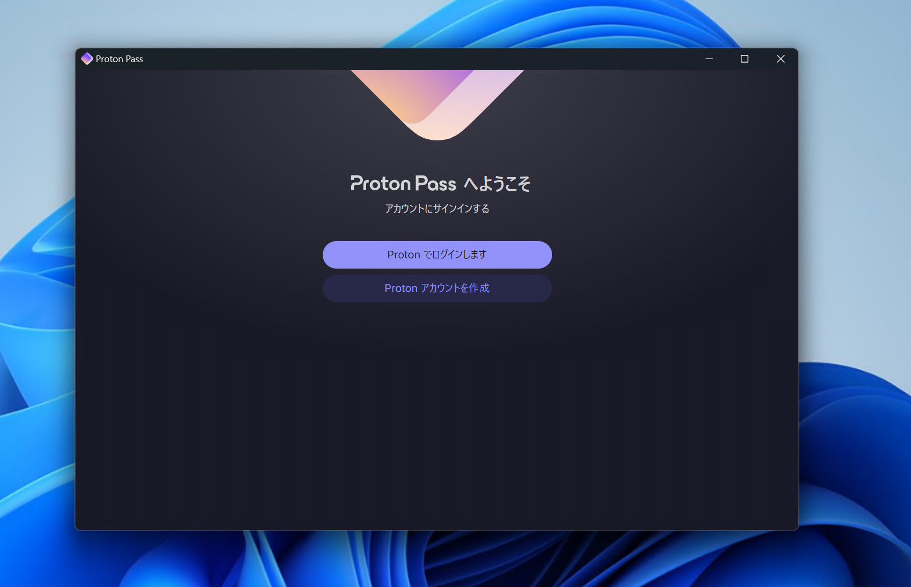
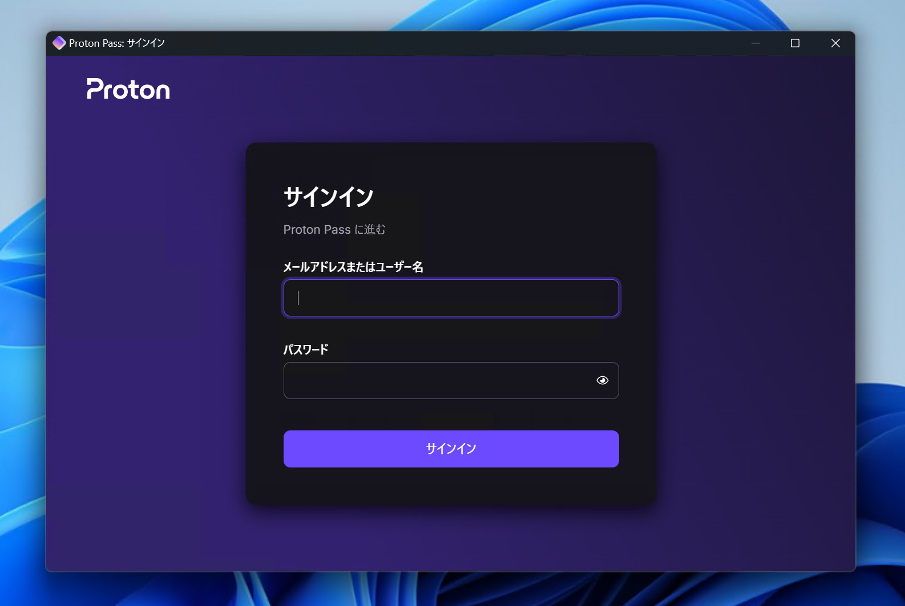

import ArticleCard from "@components/ArticleCard.astro";

Proton Passは、Proton MailやProton VPNなどで知られるProtonが提供しているパスワードマネージャーです。基本的な機能は無料で利用でき、エンドツーエンドの暗号化により、パスワードの安全な保管が可能です。

最近、そんなProton PassのWindowsアプリがリリースされました。この記事では、Proton PassのWindowsアプリのインストール方法と使い方について解説します。

<!-- toc -->

## Proton PassのWindowsアプリの特徴

*画像：「[Proton Pass Windows app is now available for everyone | Proton](https://proton.me/blog/proton-pass-windows-app)」より*

Proton Passはこれまで、モバイルアプリとブラウザー拡張機能のみが提供されていました。しかし、最近になってWindowsアプリがリリースされました。

Proton PassのWindowsアプリは、オフラインでの動作やオープンソースとしてコードが公開されている点などが特徴的です。

Proton PassのWindowsアプリの特徴などは、こちらの記事を参考にしてください。

<ArticleCard link="/article/2024/03/02/proton-pass-now-supports-windows/" />

## インストール方法

Proton PassのWindowsアプリをインストールするには、まず[ダウンロードページ](https://proton.me/pass/download)を開きます。

https://proton.me/pass/download

少しスクロールすると、［Access from your desktop］というセクションがあるので、その中にある［Download for Windows］ボタンをクリックします。

インストーラーのダウンロードが完了したら、インストーラーを開きます。

少し待つと、Proton Passのログイン画面が表示されます。今回はすでにアカウントを持っているので、［Protonでログインします］をクリックします。

ログインすると、Proton PassのWindowsアプリが利用できるようになります。

:::note
デフォルトではロックがかかっていないので、右下の設定アイコンをクリックして［セキュリティ］でロックを有効化することをオススメします。
:::

## まとめ

Proton PassのWindowsアプリのインストール方法と使い方について解説しました。

Proton Passは、Proton MailやProton VPNなどで知られるProtonが提供しているパスワードマネージャーで、基本的な機能は無料で利用できます。エンドツーエンドの暗号化により、パスワードの安全な保管が可能です。

セキュリティやプライバシーなどに興味がある場合は、Proton Passを試してみてください。
