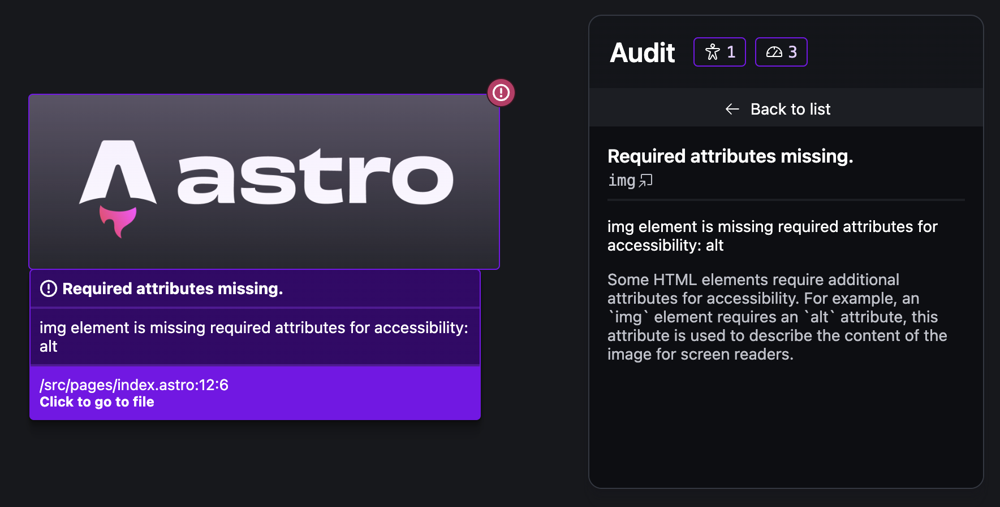

[Astro](https://astro.build/)は、高速なページ読み込みと優れた開発体験を提供することで人気のある静的サイトジェネレーターです。

3月11日（現地時間）、さらなる改善と便利な新機能を搭載した**Astro 4.5**がリリースされました。今回のアップデートでは、ページ性能やアクセシビリティに関する問題を開発者が簡単に特定できる**Dev Audit UI**や、View Transitionを使ったページ間遷移時の再描画の改善などが含まれています。

また、最新のシンタックスハイライター**Shiki 1.0**の導入、マルチCDNのサポートなど、非常に魅力的な機能が盛りだくさんです。

この記事では、Astro 4.5の主要な新機能と改善点について詳しく解説します。

<!-- toc -->

## Dev Audit UIによる開発者体験の改善


*Audit Panelのスクリーンショット。アクセシビリティに関する問題がページのプレビュー内に直接表示される。画像：「[Astro 4.5 | Astro](https://astro.build/blog/astro-450/)」より*

Webサイトのパフォーマンスやアクセシビリティは、ユーザー体験に直結する重要な要素です。

Astro 4.5では、これらの問題を開発中に自動的に特定し、修正をサポートするための**Dev Audit UI**が導入されました。これは開発モードのときにブラウザー上で動作し、実際のページを見ながらインラインで問題を確認できる機能です。

Dev Audit UIはページ上のどこが問題なのか、その原因と詳細な解説を確認できるため、アクセシビリティ改善の学習ツールとしても役立ちます。

https://docs.astro.build/ja/reference/dev-toolbar-app-reference/

## ページ間遷移の改善

Astroには、MPAのページ遷移でSPAのようなトランジションを実現する「[View Transitions API](https://developer.mozilla.org/ja/docs/Web/API/View_Transitions_API)」を簡単に使える機能が用意されています。

https://docs.astro.build/ja/guides/view-transitions/

Astro 4.5では、View Transitionsを使ったページ間での遷移時に特定のコンポーネント（**Astro islands**）を再描画する機能や、インラインスクリプトを再実行する機能が追加されました。

たとえば、次のように``data-astro-rerun``属性をスクリプトに追加することで、View Transitionsによるページ遷移時にスクリプトを再実行できるようになります。

```html ins="data-astro-rerun"
<script data-astro-rerun is:inline>
  console.log('This script will rerun when the page changes!');
</script>
```

これにより、たとえばページ遷移時にユーザーが設定したフィルターやリストの状態を保持しつつ、新しいページコンテンツに基づいて動的にコンテンツを更新できるようになります。

## Shiki 1.0の採用

Astro 4.5では、コードのシンタックスハイライトに**Shiki 1.0**が採用されました。

これまでAstroは、[Shiki](https://github.com/shikijs/shiki/)のフォークである[Shikiji](https://github.com/antfu/shikiji)を使用していましたが、ShikijiがShikiに再統合されたことに伴い、元のShikiに戻りました。

これにより、より安定したコードハイライトと、新しいカラーテーマのサポート、コードブロックの柔軟なスタイリングなどが可能になります。

https://shiki.style/

## マルチCDNへのアセットプレフィックスのサポート

コンテンツ配信速度の向上と耐障害性のため、異なる種類のアセットを異なるCDNから配信することがあります。複数のCDNを利用することで、特定のリソースへのアクセス速度を最適化し、グローバルなユーザー体験を向上させられます。

Astro 4.5では、[ファイル拡張子ごとに異なるCDNプレフィックスを指定](https://docs.astro.build/en/reference/configuration-reference/#buildassetsprefix)できるようになり、これによりアセット配信の柔軟性が格段に向上しました。

この機能を利用するには、``build.assetsPrefix``オプションでファイルの拡張子ごとにCDNを指定します。

```javascript title="astro.config.mjs" ins={5-9}
import { defineConfig } from "astro/config";

export default defineConfig({
    build: {
        assetsPrefix: {
            "js": "https://js.cdn.example.com",
            "png": "https://images.cdn.example.com",
            "fallback": "https://generic.cdn.example.com"
        }
    }
})
```

## データコレクションのJSONスキーマ

Astro 4.5では、[データコレクション](https://docs.astro.build/ja/guides/content-collections/)の構造を記述し、バリデーションやオートコンプリート、ドキュメンテーションを提供するための[JSONスキーマの自動生成を実験的にサポート](https://docs.astro.build/en/reference/configuration-reference/#experimentalcontentcollectionjsonschema)しています。

これにより、データ構造がより明確になり、開発者の生産性向上に寄与します。

この機能を利用するには、``experimental.contentCollectionJsonSchema``オプションを有効にします。

```javascript title="astro.config.mjs" ins={5}
import { defineConfig } from "astro/config";

export default defineConfig({
    experimental: {
        contentCollectionJsonSchema: true
    }
});
```

## その他の新機能とバグ修正

Astro 4.5には、上記の主要な新機能の他にも、未使用のスクリプトを検出する新しいアルゴリズムの実験的な導入や、多数のバグ修正とパフォーマンスの改善が含まれています。

## まとめ

Astro 4.5は、開発者がより高速でアクセシブルなWebサイトを構築するための新機能と改善点が盛りだくさんのリリースとなりました。

Astroを最新バージョンにアップデートするには、次のうちいずれかのコマンドを実行します。

```bash
npx @astrojs/upgrade
npm install astro@latest
pnpm upgrade astro --latest
yarn upgrade astro --latest
```

## 参考

- [Astro 4.5 | Astro](https://astro.build/blog/astro-450/)