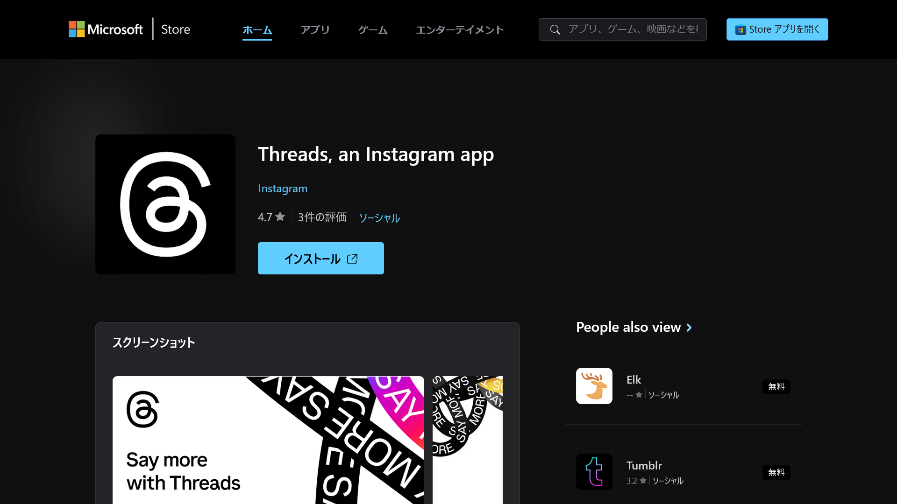
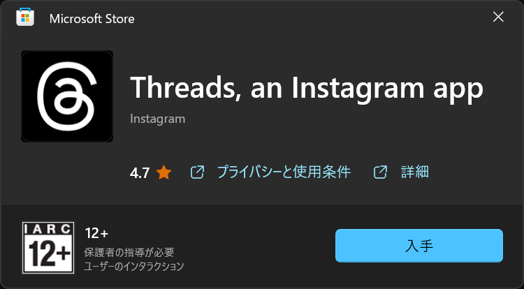
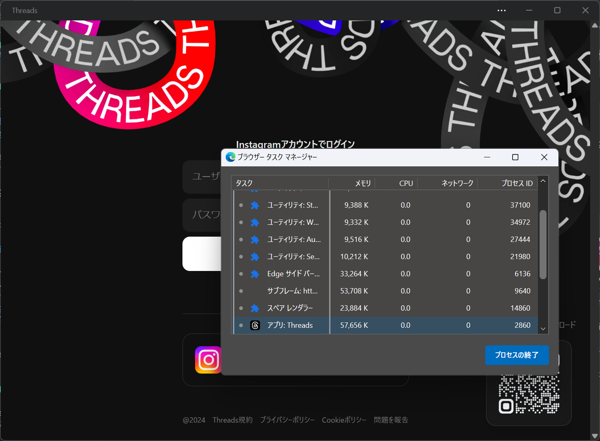

import ArticleCard from "@components/ArticleCard.astro";

Metaがついに**Windows用Threadsアプリ**をリリースしました。

SNSの選択肢をもたらすThreadsは、**X（旧：Twitter）の代替**として注目を集めています。このニュースは、とくにWindowsユーザーにとって嬉しい情報ではないでしょうか。

## Threads Windowsアプリが登場

Meta（Threadsの運営元）のマークザッカーバーグ氏は3月13日（日本時間）、Windows向けThreadsアプリのリリースを発表しました。

ザッカーバーグ氏は自身のThreadsアカウントで、Windows版Threadsアプリを操作しているようすの写真を投稿しています。<small>（ただし、机に置かれた携帯電話やWindowsのUIなどから、コラ画像だと思われます）</small>

<blockquote class="text-post-media" data-text-post-permalink="https://www.threads.net/@zuck/post/C4dPc4XrCcx" data-text-post-version="0" id="ig-tp-C4dPc4XrCcx" style=" background:#FFF; border-width: 1px; border-style: solid; border-color: #00000026; border-radius: 16px; max-width:540px; margin: 1px; min-width:270px; padding:0; width:99.375%; width:-webkit-calc(100% - 2px); width:calc(100% - 2px);"> <a href="https://www.threads.net/@zuck/post/C4dPc4XrCcx" style=" background:#FFFFFF; line-height:0; padding:0 0; text-align:center; text-decoration:none; width:100%; font-family: -apple-system, BlinkMacSystemFont, sans-serif;" target="_blank"> 

 <svg aria-label="Threads" height="32px" role="img" viewBox="0 0 192 192" width="32px" xmlns="http://www.w3.org/2000/svg"> <path d="M141.537 88.9883C140.71 88.5919 139.87 88.2104 139.019 87.8451C137.537 60.5382 122.616 44.905 97.5619 44.745C97.4484 44.7443 97.3355 44.7443 97.222 44.7443C82.2364 44.7443 69.7731 51.1409 62.102 62.7807L75.881 72.2328C81.6116 63.5383 90.6052 61.6848 97.2286 61.6848C97.3051 61.6848 97.3819 61.6848 97.4576 61.6855C105.707 61.7381 111.932 64.1366 115.961 68.814C118.893 72.2193 120.854 76.925 121.825 82.8638C114.511 81.6207 106.601 81.2385 98.145 81.7233C74.3247 83.0954 59.0111 96.9879 60.0396 116.292C60.5615 126.084 65.4397 134.508 73.775 140.011C80.8224 144.663 89.899 146.938 99.3323 146.423C111.79 145.74 121.563 140.987 128.381 132.296C133.559 125.696 136.834 117.143 138.28 106.366C144.217 109.949 148.617 114.664 151.047 120.332C155.179 129.967 155.42 145.8 142.501 158.708C131.182 170.016 117.576 174.908 97.0135 175.059C74.2042 174.89 56.9538 167.575 45.7381 153.317C35.2355 139.966 29.8077 120.682 29.6052 96C29.8077 71.3178 35.2355 52.0336 45.7381 38.6827C56.9538 24.4249 74.2039 17.11 97.0132 16.9405C119.988 17.1113 137.539 24.4614 149.184 38.788C154.894 45.8136 159.199 54.6488 162.037 64.9503L178.184 60.6422C174.744 47.9622 169.331 37.0357 161.965 27.974C147.036 9.60668 125.202 0.195148 97.0695 0H96.9569C68.8816 0.19447 47.2921 9.6418 32.7883 28.0793C19.8819 44.4864 13.2244 67.3157 13.0007 95.9325L13 96L13.0007 96.0675C13.2244 124.684 19.8819 147.514 32.7883 163.921C47.2921 182.358 68.8816 191.806 96.9569 192H97.0695C122.03 191.827 139.624 185.292 154.118 170.811C173.081 151.866 172.51 128.119 166.26 113.541C161.776 103.087 153.227 94.5962 141.537 88.9883ZM98.4405 129.507C88.0005 130.095 77.1544 125.409 76.6196 115.372C76.2232 107.93 81.9158 99.626 99.0812 98.6368C101.047 98.5234 102.976 98.468 104.871 98.468C111.106 98.468 116.939 99.0737 122.242 100.233C120.264 124.935 108.662 128.946 98.4405 129.507Z" /></svg>
 
 投稿者: @zuck
 
 Threadsで見る

</a></blockquote>

Threadsにはこれまで、モバイルアプリとWeb版のみが存在していました。そのため、WindowsでThreadsを利用するには、ブラウザーを使用する必要がありました。今回、公式のWindowsアプリがリリースされたことで、より利用しやすくなりました。

:::note[余談]
Windows上でAndroidアプリを利用できる機能「[WSA（Windows Subsystem for Android）](https://learn.microsoft.com/ja-jp/windows/android/wsa/)」を活用することで、これまでもAndroid版ThreadsアプリをWindowsで非公式に利用できました。

なお、Microsoftは[WSAを2025年に廃止すると発表](https://www.itmedia.co.jp/mobile/articles/2403/07/news179.html)しています。
:::

## Threads Windowsアプリのインストール方法

*画像：「[Threads, an Instagram app - Microsoft Apps](https://apps.microsoft.com/detail/9mxbp1fb84cq?hl=ja-jp&gl=JP)」より*

ThreadsのWindowsアプリをインストールするには、Microsoft StoreのThreadsの配布ページを開きます。

https://apps.microsoft.com/detail/9mxbp1fb84cq?hl=ja-jp&gl=JP

［インストール］ボタンをクリックすると、Microsoft Storeアプリが起動するので、［入手］をクリックするとインストールが始まります。

:::note
実際にWindows版のThreadsアプリをインストールしたところ、その実体は[PWA（Progressive Web App）](https://developer.mozilla.org/ja/docs/Web/Progressive_web_apps)でした。PWAは、Webサイトをアプリのようにインストールする機能です。

つまり、Windows版Threadsアプリは、ネイティブなソフトウェアではなく、Microsoft Edgeを使ってWeb版のThreadsを開いているだけです。技術的にはWeb版と共通化できるため、開発コストを抑えられるというメリットがありますが、パフォーマンスはネイティブアプリに劣る可能性があります。

*ThreadsのWindowsアプリのタイトルバーを右クリックし、［ブラウザータスクマネージャー］を選択するとEdgeのタスクマネージャーが開く。このことから、ThreadsのWindowsアプリの実体はPWAであることが分かる。*
:::

## Threadsについて

Threadsが注目される理由のひとつに、将来的に**ActivityPubプロトコル**に対応する予定があることが挙げられます。これは、MisskeyやMastodonなどの他のSNSとの連携を意味し、ユーザーの選択肢が広がることを示しています。

また、Threadsの**開発者向けAPI**が6月にリリースされると予告されており、カスタマイズ性や拡張性に富んだプラットフォームとなることが期待されています。

<ArticleCard link="/article/2024/03/02/threads-api-to-be-generally-available-by-june/" />

## まとめ

Windows向けThreadsアプリがリリースされたことで、Windowsユーザーにとっては利用しやすくなりました。Windowsを使っている方は、Microsoft StoreからThreadsアプリをダウンロードして、利用してみてはいかがでしょうか。

## 参考

- [@zuck • Really enjoying the new Threads desktop app for Windows. Excited to hear what you all think. • Threads](https://www.threads.net/@zuck/post/C4dPc4XrCcx)
- [Threads, an Instagram app - Microsoft Apps](https://apps.microsoft.com/detail/9mxbp1fb84cq?hl=ja-jp&gl=JP)
