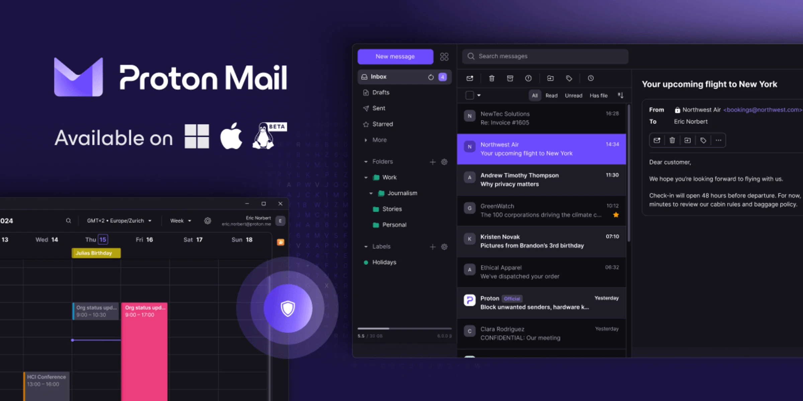

import ArticleCard from "@components/ArticleCard.astro";

プライバシーを重視するメールサービスとして知られる**Proton Mailのデスクトップアプリのリリースが発表**されました。

Proton Mailは、2014年にWebアプリとしてスタートしました。それから10年以上のときを経て、今回新しくデスクトップアプリとしてWindowsとmacOS向けに提供が開始されました。Linuxユーザーもβテスト版を試せるようになっています。

## 速さと集中力を向上

*画像：「[Introducing the Proton Mail desktop app | Proton](https://proton.me/blog/proton-mail-desktop-app)」より*

OutlookやChromeなどのプラットフォームでは、外部パートナーへのデータ共有や広告主への閲覧履歴の露出、悪意あるブラウザー拡張機能によるデータの悪用といった**プライバシー上の問題**があります。

さらに、ブラウザーにはさまざまな機能が搭載されているため、メールをブラウザーでチェックすると、**集中力を低下させる可能性**があります。

そこでProton Mailでは、これらの問題を解決し、安全で集中できるメール環境を提供するために、デスクトップアプリの開発に至ったとのことです。

新しいProton Mailのデスクトップアプリでは、専用のメール環境を通じて、Webアプリで提供されている機能をそのまま利用できます。ブラウザーを開くたびに発生する潜在的な邪魔を防ぎながら、メールやイベントを迅速に処理できるようになります。

デスクトップのライトモードやダークモードとのテーマ同期、ネイティブ通知の表示、メールとカレンダーの間のスムーズな切り替えなど、デバイスに最適化された新機能も実装されました。

:::note
OutlookやGmailからの乗り換えも簡単に行えるよう、「**Easy Switch**」ツールがアプリ内に用意されています。これにより、メッセージのインポートやGmailで受信した新しいメッセージの転送などができます。
:::

## 信頼のProtonセキュリティをそのままに

Proton Mailのデスクトップアプリは、Webアプリで築き上げられた10年以上にわたるセキュリティ強化の成果を受け継いでいます。

**ゼロアクセス暗号化**や**エンドツーエンド暗号化（E2EE）** など、Protonが提供するセキュリティやプライバシー保護機能はそのままに、トラッカーやフィッシング詐欺から保護します。また、Proton Sentinelという高セキュリティのアカウント保護プログラムを通じて、安全性が確保されています。

ブラウザー外でメールやカレンダーを使用することにより、悪質なブラウザー拡張機能からメールやイベントを保護し、ブラウザーに依存しない自動更新が可能になるなど、追加のセキュリティメリットもあります。

また、**新しいセキュリティセンター**の導入により、身元を保護するためのメールアリアスの簡単な作成が、Proton MailのWebとデスクトップアプリから可能になりました。

## まとめ

WindowsとmacOSユーザーは、すでに専用のデスクトップアプリをインストールできます。Linuxアプリもβテスト版として利用可能です。

https://proton.me/mail/download

Proton Mailのデスクトップアプリは、Webアプリで提供されている機能をそのまま楽しむことができるだけでなく、新しいセキュリティ機能も追加されています。これにより、Proton Mailのセキュリティとプライバシー保護機能をそのままに、より安全で集中できるメール環境を提供します。

また、Proton Mailの運営元のProtonは最近、Windows版のProton Passもリリースしています。Windows版のProton Passについては、こちらの記事で解説しています。

<ArticleCard link="/article/2024/03/02/proton-pass-now-supports-windows/" />

## 参考

- [Introducing the Proton Mail desktop app | Proton](https://proton.me/blog/proton-mail-desktop-app)
