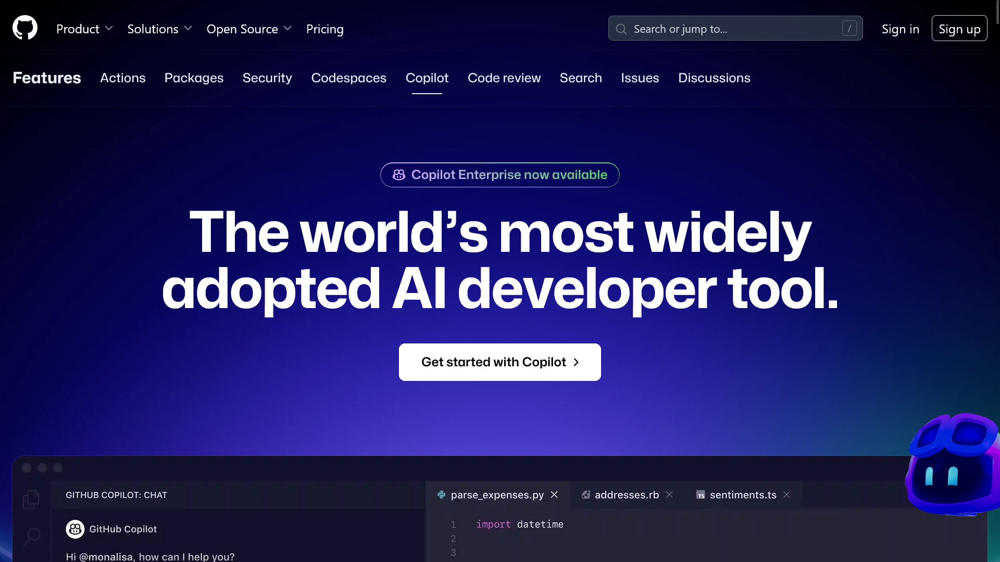
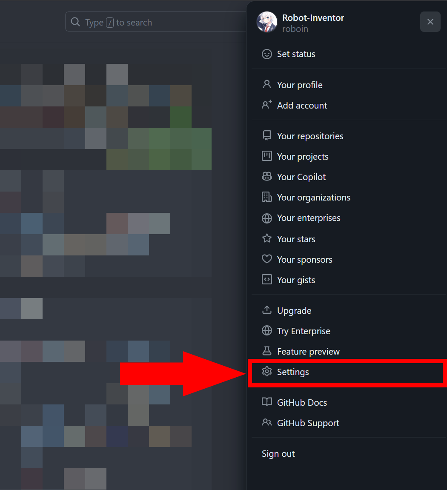
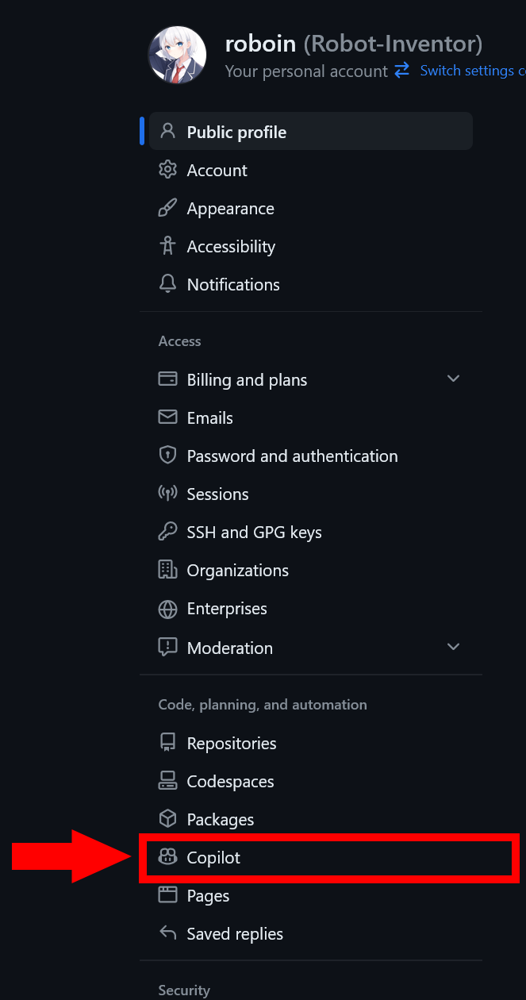
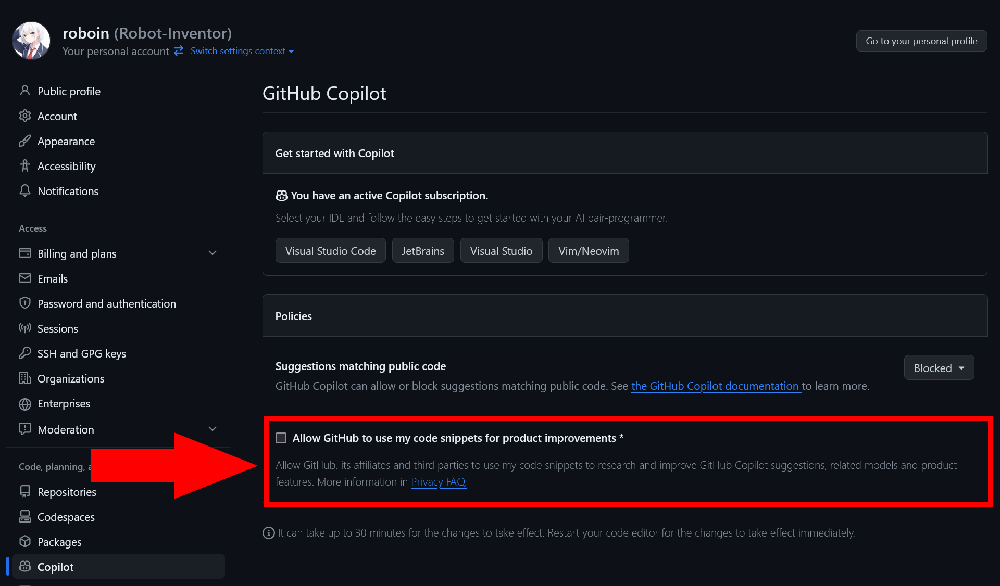

GitHub Copilotは、開発者の生産性を大きく向上させるツールのひとつです。コードの自動補完や、問題の解決策提案など、さまざまな機能が搭載されています。

しかし、GitHub Copilotは、**ユーザーが書いたコードスニペットを収集し、モデルの改善のために利用すること**があります。この記事では、GitHub Copilotのモデルトレーニングから自分のコードを除外する方法について解説します。

## GitHub Copilotにおけるデータ収集

*画像：「[GitHub Copilot · Your AI pair programmer](https://github.com/features/copilot)」より*

まず、GitHub Copilotがどのようにデータを収集して利用しているのかについて解説します。

GitHub CopilotはIDEやエディターの拡張機能として動作します。ユーザーがIDEやエディターで書いたコードに対して、GitHubは直接的な所有権を主張しないとしています。GitHub Copilotが生成したコードや提案は、ユーザーが自身の責任のもとに利用することが求められます。

GitHub Copilotは、**ユーザーがIDE（統合開発環境）で入力したコード**や、**補完候補**を利用してモデルを改善しています。GitHubは、ユーザーの設定に応じてテレメトリーやコードスニペット、使用状況を収集します。これらのデータは、プロダクトの改善には不可欠な要素ですが、設定からオプトアウトできるようになっています。

## オプトアウトの手順

次の手順で、GitHub Copilotのデータ収集からオプトアウトできます。

まずは、GitHubの任意のページの右上にある自分のプロフィール画像をクリックし、設定を開きます。

左側のサイドバーから［**Copilot**］をクリックします。

［**Allow GitHub to use my code snippets for product improvements**］のチェックボックスのチェックをオフにすると、GitHub Copilotのモデルトレーニングから自分のコードを除外できます。

:::tip
設定が反映されるまで、最大で30分かかることがあります。エディターを再起動すると、すぐに設定が反映されます。
:::

## GitHub Copilotに関するその他の注意点

GitHub Copilotの使用にあたっては、当然ながら**GitHubの利用規約**や**プライバシーポリシー**に従う必要があります。

また、GitHubの[**Acceptable Use Policies**](https://docs.github.com/en/site-policy/acceptable-use-policies/github-acceptable-use-policies)に従う必要があります。そのため、不法な内容や、GitHubの利用規約に反する内容をGitHub Copilotに入力することは禁止されていることに注意してください。

## まとめ

この記事では、GitHub Copilotのモデルトレーニングから自分のコードを除外する方法について解説しました。GitHub Copilotの設定画面から、データ収集の設定を変更することで、自分のコードを除外できます。必要に応じて、設定を変更してください。

## 参考

- [Configuring GitHub Copilot settings on GitHub.com - GitHub Docs](https://docs.github.com/en/copilot/configuring-github-copilot/configuring-github-copilot-settings-on-githubcom#enabling-or-disabling-prompt-and-suggestion-collection)
- [GitHub Terms for Additional Products and Features - GitHub Docs](https://docs.github.com/en/site-policy/github-terms/github-terms-for-additional-products-and-features#github-copilot)
