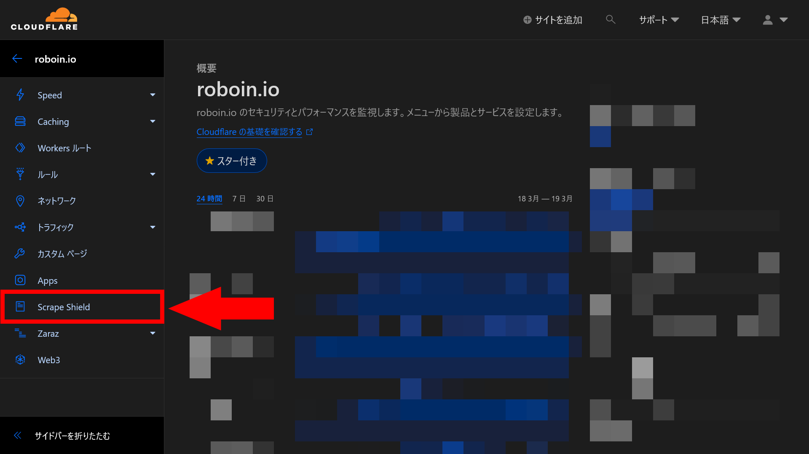
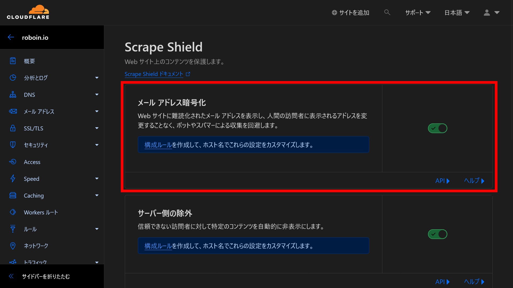

import Steps from "/src/starlight/components/Steps.astro";

インターネット上で活動する上で避けては通れないのが、スパムメールの問題です。とくにWebサイトにメールアドレスを掲載すると、爆速でボットが飛んできてスパムメールを送り付けてきます。

このような問題に対して、**Cloudflareのメールアドレス難読化機能**を利用することで、人間の訪問者には影響を与えずに、メールアドレスを保護できます。今回は、Cloudflareのメールアドレス難読化機能について解説します。

## Cloudflareメールアドレス難読化機能とは？

Cloudflareのメールアドレス難読化機能を利用することで、Webページ上に表示されるメールアドレスをボットから隠蔽し、人間の訪問者にのみ表示させることが可能になります。この機能は、訪問者には一切の変化を感じさせることなく、自動的にメールアドレスを保護します。

この機能を有効化することで、Webページのデザインや操作感に影響を与えることなく、セキュリティ対策を講じることができます。

## 難読化機能のメリット

メールアドレスを狙うハーベスターやボットはインターネット上にあふれており、見つけたメールアドレスをスパムメールのリストに追加します。これが原因で多くの不要なメールが送信されてしまいます。

Webサイトの管理者は、メールアドレスを``hoge★example.com``と書き換えるなど、さまざまな方法でこの問題に対処してきました。しかし、これらの方法ではメールアドレスをクリックして直接メールを送信するという便利さが失われてしまいます。

Cloudflareのメールアドレス難読化機能を使えば、このようなデメリットなく、メールアドレスを保護できます。

## 設定方法

Cloudflareに登録すると、メールアドレス難読化機能は自動的に有効になります。しかし、何らかの理由でこの機能を無効にしたい場合は、Cloudflareのダッシュボードから簡単に設定変更が可能です。

<Steps>

1. Cloudflareダッシュボードにログインします
2. 複数のアカウントにログインしている場合は、対象のアカウントを選択します
3. Webサイトを選択します
4. サイドバーからScrape Shieldを選択します
    
5. ［メールアドレス暗号化］のトグルスイッチをオンまたはオフにします
    

</Steps>

## 特定のメールアドレスの難読化を防ぐ

上記の手順で、サイト全体でメールアドレスの難読化を無効にできます。一方で、サイト全体では難読化を有効にしつつ、特定のメールアドレスの難読化を無効にすることもできます。メールアドレスではないものが誤って難読化され、``[email protected]``と表示されてしまう場合も、この方法で対処できます。

もっとも手軽なのは、HTMLのコメントを使ってメールアドレスを囲む方法です。次のように、メールアドレスを``email_off``というコメントで囲むことで、そのメールアドレスの難読化を無効にできます。

```html showLineNumbers=false
<!--email_off-->contact@example.com<!--/email_off-->
```

他にも、AJAX通信でメールアドレスをJSON形式で返し、サーバーが``application/json``というコンテンツタイプを返すようにする方法や、[構成ルール](https://developers.cloudflare.com/rules/configuration-rules/)を作成する方法などがあります。

## デフォルトで難読化されないもの

意図しない挙動を防ぐため、次のような場合はデフォルトで難読化されません。

- ``href``属性以外の属性の値
- 特定のHTMLタグ内（``<script>``、``<noscript>``、``<textarea>``、``<xmp>``、``<head>``タグ）
- MIMEタイプが``text/html``または``application/xhtml+xml``でないページ
- ``Cache-Control: no-transform``ヘッダーを使用している場合
- [Cloudflare Worker](https://developers.cloudflare.com/workers/)によって追加されたHTML/JSコード

## まとめ

Cloudflareのメールアドレス難読化機能を利用することで、Webページ上に表示されるメールアドレスをボットから隠蔽し、人間の訪問者にのみ表示させることが可能になります。この機能を有効化することで、Webページのデザインや操作感に影響を与えることなく、セキュリティ対策を講じられます。

また、サイト全体で難読化を有効にしつつ、特定のメールアドレスの難読化を無効にできます。このようにCloudflareのメールアドレス難読化機能を使えば、スパムメール対策を実施しつつ、メールアドレスの利便性を損なうことなく、Webサイトを運営できます。

## 参考

- [Email Address Obfuscation · Cloudflare Web Application Firewall (WAF) docs](https://developers.cloudflare.com/waf/tools/scrape-shield/email-address-obfuscation/)
