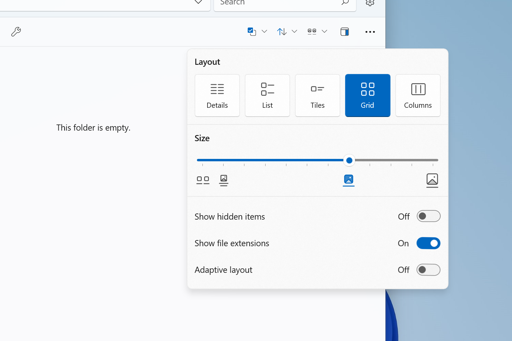
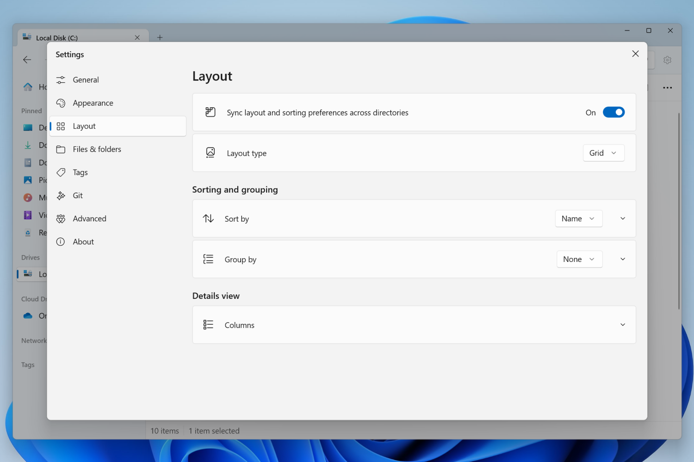

import ArticleCard from "@components/ArticleCard.astro";

2024年3月19日、**Windows向けの高機能オープンソースファイルマネージャー「Files」のv3.3がリリース**されました。この記事では、その新機能や改善点について詳しく解説します。

## Files v3.3の魅力とは？

Filesは、Windows標準のファイルエクスプローラーの代替として設計された、サードパーティの無料のファイルマネージャーアプリです。ユーザーインターフェースの美しさ、カスタマイズの自由度、そして使いやすさから多くのユーザーに支持されています。

このバージョン3.3では、次の新機能や改良が施されています。

### レイアウトピッカーの刷新

Files 3.3では、**レイアウトピッカー**のデザインが一新されました。

*レイアウトピッカーのデザインが一新された。画像：「[Files • Announcing Files v3.3](https://files.community/blog/posts/v3-3)」より*

レイアウトオプションが一列で大きなボタンとして表示され、選択しているレイアウトはシステムのアクセントカラーを用いて強調表示されるようになりました。

レイアウトオプションには、詳細表示、リスト表示、グリッド表示、カラム表示などがあります。これに加えて、アイテムサイズのカスタマイズが可能になり、より個人の好みに合わせた表示が可能になります。

### サムネイルのパフォーマンスとDPIサポートの向上

サムネイルの取り扱いについても、改良が加えられました。読み込みが遅い場合にはアニメーションが表示されるようになり、DPIに対応したアイコンがホームページ、タブ、サイドバーに表示されるようになりました。

### レイアウト設定ページの追加

ユーザーがレイアウトをより簡単に変更できるように、**新たな設定ページ**が追加されました。

*新しいレイアウトの設定ページが導入された。画像：「[Files • Announcing Files v3.3](https://files.community/blog/posts/v3-3)」より*

これまでは「フォルダー」設定ページ内のサブメニューに含まれていたオプションが、よりアクセスしやすい形で配置されています。「フォルダー」ページ自体も「ファイルとフォルダー」に名称変更され、整理されました。

### Windowsの再起動時に続きから再開する機能の強化

Windowsを再起動した際にも、Filesを開いたところから作業を再開できるようになりました。これまでのバージョンでは、Filesを閉じたあとにのみ機能していましたが、今回のアップデートにより、予期せぬ再起動でも作業をスムーズに続けられます。

## その他の改善と修正

Files v3.3ではさまざまな**修正や改善が行われています**。

- WinAppSdk 1.5への更新
- サイドバーの「お気に入り」セクションの名称を「ピン留め」へ変更
- ホームページにヘッダーを追加
- 「レイアウトモード」をより短い「レイアウト」に変更
- mrpackファイルの開封と抽出のサポート
- ビデオビットレートがプレーンテキストで表示される問題の修正
- アーカイブからのアイテムのコピーが機能しない問題の修正

この他にも、**ユーザーの体験を向上**させるための多くの修正が含まれています。さらに詳しい変更点の一覧は、[公式ブログ](https://files.community/blog/posts/v3-3)を参照してください。

## まとめ

Files v3.3は、機能性とカスタマイズ性が改善されています。とくにこのバージョンでは、操作性の向上や使いやすさに重点を置いた改善が多数施されています。

FilesはWindows用のオープンソースのファイル管理ツールです。 タブやデュアルペインなどの便利な機能を備えており、美しくモダンなデザインが特徴です。

Filesは[公式ダウンロードページ](https://files.community/download)からダウンロードできます。

:::note[前の記事]
前回のアップデート（Files 3.2）の情報は、こちらの記事で解説しています。

<ArticleCard link="/article/2024/02/14/files-v3-2/" />
:::
