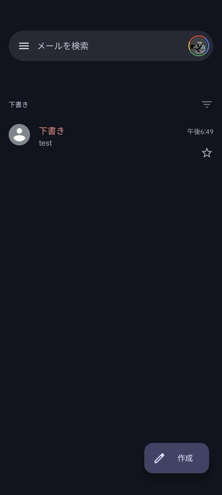
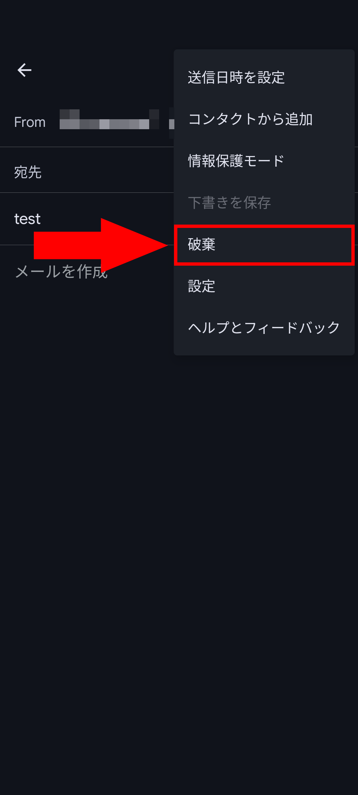

import Steps from "/src/starlight/components/Steps.astro";

Gmailは日常生活やビジネスシーンで欠かせないメールアプリのひとつです。メールをすぐに送信できないときや、返信内容をじっくり考えたい時など、下書き機能は非常に便利です。

ときには不要になった下書きを削除したい場合もありますよね。しかし、Gmailのスマホアプリで下書きを削除する方法は、分かりにくいものなっています。この記事では、**Gmailのスマホアプリで下書きを削除する手順**を解説します。

:::note
この記事ではAndroidアプリを使っていますが、iOSアプリでもほぼ同じ手順が使えるはずです。
:::

## 下書きを削除する際の注意点

下書きを削除する際には、いくつか注意すべき点があります。

- **削除の取り消しはできない**：下書きを削除すると、その操作は取り消すことができません。重要な内容の下書きは、削除する前によく確認しましょう
- **アカウント間での下書きの共有はできない**：別のアカウントで作成した下書きは、共有や移動ができません。削除前に正しいアカウントでログインしているか確認しましょう

## 下書きを削除する手順

下書きを削除する手順は、一度分かればシンプルです。

<Steps>

1. **Gmailアプリを開く**

    まず、スマートフォンでGmailアプリを開きます。アプリが見つからない場合は、アプリストアからダウンロードしてください。

2. **メニューから［下書き］を選択**

    アプリ左上の三本線（メニューバー）をタップし、表示されたメニューから［下書き］を選びます。これで、保存されている下書きの一覧が表示されます。
    

3. **削除したい下書きを選択**

    下書きの一覧から、削除したい下書きを探して選択します。

4. **鉛筆マークをタップして編集画面を開く**

    下書きを選択すると、メールの内容が表示されます。件名の横に表示される鉛筆マークをタップすることで、下書きの編集画面に移動できます。
    

5. **右上の3点ドットのメニューボタンから［破棄］を選択**

    編集画面にある右上の3点ドット（メニュー）をタップします。表示されるメニューから［破棄］を選択すると、下書きが削除されます。確認画面は表示されないので、注意してください。
    

</Steps>

:::tip
多くの下書きを一度に削除する方法はありません。ひとつずつ手動で削除する必要があります。不要になった下書きは、溜まる前にすぐに削除するとよいでしょう。
:::

## まとめ

Gmailのスマホアプリで不要になった下書きを削除する方法はとてもシンプルです。手順を覚えておけば、いつでもスムーズに削除できます。

下書きを削除する際には、誤って重要な内容を削除しないように注意しましょう。また、下書きはアカウント間で共有できないため、正しいアカウントでログインしているか確認することも大切です。
