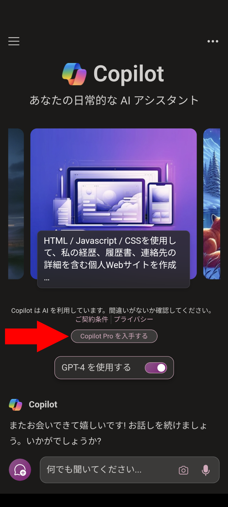
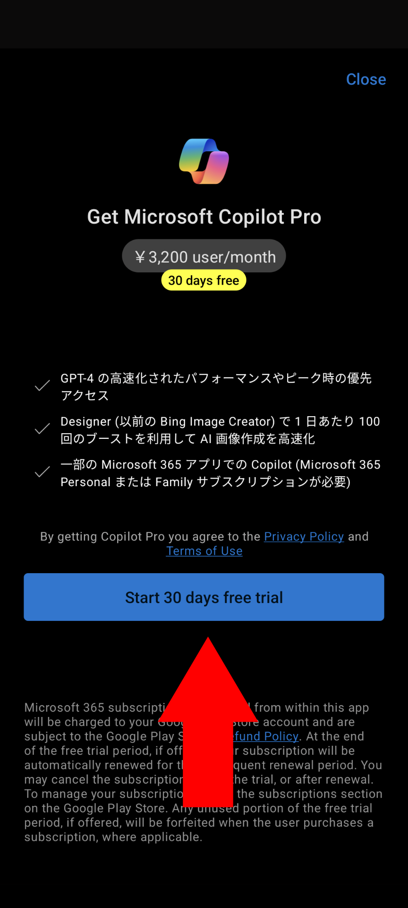

import ArticleCard from "@components/ArticleCard.astro";
import Steps from "/src/starlight/components/Steps.astro";

Copilot ProはMicrosoftが提供するAIサービスで、Microsoft Copilotの進化する機能を通して、画像の生成、メール処理の効率化、文章の作成、会議のフォローアップなど、幅広く活用できます。

この記事では、**Copilot Proを30日間無料で体験する方法**について紹介します。

<!-- toc -->

## Copilot Proとは

Copilot ProはMicrosoftが提供するAIアシスタントの有料版です。

**WordやOutlookなどのMicrosoft 365アプリケーション**でAIを利用できるようになるほか、画像生成やMicrosoft Copilot GPT Builderへのアクセスなど、さまざま機能を備えています。

デスクトップアプリでCopilotを利用したい場合は、Microsoft 365 PersonalまたはFamilyサブスクリプションが必要となります。一方で、Webアプリ版ならCopilot Proサブスクリプションのみでこれらの機能にアクセス可能です。

Copilotの無料版とCopilot Proの違いについては、こちらの記事で解説しています。

<ArticleCard link="/article/2024/01/20/copilot-pro-feature-comparison-pricing-usage/" />

### Copilot Proのメリット

Copilot Proには、次のようなメリットがあります。

- **高度なAIモデルへの優先アクセス**：画像生成や編集、文章作成において、より高品質な結果を期待できます
- **Microsoft 365アプリケーションでのAI機能**：WordやOutlookなどでAIのサポートを受けられます
- **Copilot GPT Builderへのアクセス**：特定のタスクに特化した、自分だけのカスタムAI Copilot GPTを作成できます

## 無料体験を始める方法

最近、MicrosoftはCopilot Proの無料体験を提供することを発表しました。これにより、Copilot Proの機能を30日間無料で利用できるようになります。

iOSまたはAndroid向けのCopilotモバイルアプリをインストールすると、無料体験を利用できます。

<Steps>

1. まず、iPhoneまたはAndroidスマホにCopilotアプリをインストールします

    - [iOS版](https://apps.apple.com/jp/app/microsoft-copilot/id6472538445)
    - [Android版](https://play.google.com/store/apps/details?id=com.microsoft.copilot)

2. Copilotアプリをインストールしたら起動します
3. ［Copilot Proを入手する］をタップします

    

4. Copilot Proの機能などについての説明が表示されます。利用規約やプライバシーポリシーも表示されているのでよく読み、［Start 30 days free trial］をタップします

    

</Steps>

:::caution
無料体験期間が終了すると、有料サブスクリプションへと移行します。利用条件をよく読み、忘れずに管理しましょう。
:::

## まとめ

Copilot Proは、Microsoft Copilotの進化する機能を通して、画像の生成、メール処理の効率化、文章の作成、会議のフォローアップなど、幅広く活用できます。無料体験を利用して、その機能を体験してみてはいかがでしょうか。

## 参考

- [Bringing Microsoft Copilot to more customers worldwide | Microsoft 365 Blog](https://www.microsoft.com/en-us/microsoft-365/blog/2024/03/14/bringing-copilot-to-more-customers-worldwide-across-life-and-work/)
