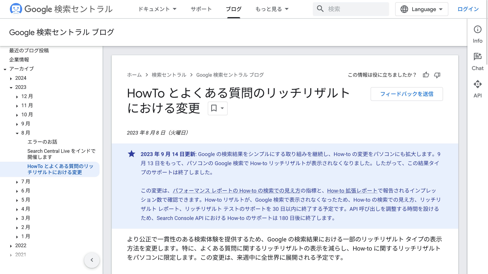

先日、ブログにHow-to構造化データを追加しようと思って調べていたところ、Google公式のドキュメントがほとんど出てこないことに気づきました。

検索結果に出てくるのは、How-to構造化データについて解説したサードパーティの記事ばかりです。これはどういうことなのでしょうか？

<!-- toc -->

## How-to構造化データが廃止

*GoogleはHow-to構造化データの廃止を発表していた。画像：「[HowTo とよくある質問のリッチリザルトにおける変更  |  Google 検索セントラル ブログ  |  Google for Developers](https://developers.google.com/search/blog/2023/08/howto-faq-changes?hl=ja)」より*

Googleの公式ドキュメントを探していたところ、こちらのページにたどり着きました。

- [HowTo とよくある質問のリッチリザルトにおける変更  |  Google 検索セントラル ブログ  |  Google for Developers](https://developers.google.com/search/blog/2023/08/howto-faq-changes?hl=ja)

これによると、Googleは2023年の8月から9月にかけて、検索結果におけるHow-toリッチリザルトの表示に関する変更を実施したようです。

また、同じ発表の中で、よくある質問（``FAQPage``構造化データ）が信頼できる政府機関や医療機関のWebサイトにのみ表示されるようになるとも述べられています。

## 変更の詳細

2023年8月に発表された当初の案では、How-toリッチリザルトが**デスクトップデバイス**でのみ表示されるよう変更されるとされていました。しかし、9月14日の追加発表により、**デスクトップにおいても表示されなくなる**ことが明らかにされました。

GoogleはHow-to構造化データについて、「この結果タイプのサポートは終了しました」としています。したがって、Googleが提供する検索結果における**How-to構造化データを用いたリッチリザルト完全に廃止**されました。実際、[Googleがサポートする構造化データの一覧](https://developers.google.com/search/docs/appearance/structured-data/search-gallery?hl=ja)からも削除されています。

Googleの発表をまとめると、次のようになります。

- **How-toリッチリザルトの廃止**：2023年9月13日をもって、Google検索結果におけるHow-toリッチリザルトの表示が完全に廃止されました。これにより、How-to構造化データを用いてリッチリザルトを表示させることが不可能になりました
- **FAQPageリッチリザルトの変更**：FAQPage構造化データを用いたリッチリザルトは、信頼できる政府機関や医療機関のWebサイトにのみ表示されるようになりました。これにより、一般のWebサイトにおけるFAQPage構造化データの表示が制限されることになります
- **検索結果の簡素化**：この変更は、検索結果をよりクリーンで一貫性のあるものにすることを目指しています。結果として、Webサイト運営者やSEO担当者は、リッチリザルトを通じた目立つ表示に頼ることなく、コンテンツの質自体を向上させる必要があります

## 影響を受けるWebサイト

How-toコンテンツを提供するすべてのWebサイトが影響を受けます。具体的には、DIY、レシピ、チュートリアルなど、手順を説明する形式のコンテンツをもつサイトが該当します。ただし、Google検索では引き続き[レシピ形式の構造化データ](https://developers.google.com/search/docs/appearance/structured-data/recipe?hl=ja)がサポートされています。

:::note
How-to構造化データを使用していたサイトは、検索結果でのリッチリザルト表示がなくなることにより、クリック率の低下やサイトへの訪問者数の減少を経験する可能性があります。
:::

## 今後の対策

Googleによると、すでに存在しているHow-to構造化データを削除する必要はないとのことです。一方で、これから新たに作成する記事やWebサイトでHow-to構造化データを実装することは、時間の無駄でしょう。

> サイトからこの構造化データを削除することもできますが、あえて削除する必要はありません。使用されていない構造化データによって検索で問題が発生することはなく、Google 検索において目に見える影響もありません。
>
> —「[HowTo とよくある質問のリッチリザルトにおける変更  |  Google 検索セントラル ブログ  |  Google for Developers](https://developers.google.com/search/blog/2023/08/howto-faq-changes?hl=ja)」より

では、既存のサイトでは他にどのような対策を取るべきでしょうか？

- **コンテンツの質に注力**：リッチリザルトの表示がなくなることで、より一層、コンテンツ自体の質を高めることが重要になります。ユーザーに価値を提供する、分かりやすく有用なコンテンツの作成が求められます
- **構造化データの最適化**：How-to以外の構造化データ（``Recipe``や``Article``など）の使用を検討しましょう
- **パフォーマンスのモニタリング**：Search Consoleのパフォーマンスレポートやその他のSEOツールを活用して、Webサイトのパフォーマンスの変化を定期的にチェックしましょう

このような対策を講じることで、Googleの構造化データの変更による影響を最小限に抑えられると考えられます。

## まとめ

GoogleのHow-to構造化データの廃止は、Webサイトの運営者やSEO担当者に大きな影響を与える可能性があります。しかし、これを機にコンテンツの質をさらに向上させるチャンスと捉え、ユーザーが求める価値のある情報を提供することが、今後のSEO戦略において重要になるでしょう。

## 参考

- [HowTo とよくある質問のリッチリザルトにおける変更  |  Google 検索セントラル ブログ  |  Google for Developers](https://developers.google.com/search/blog/2023/08/howto-faq-changes?hl=ja)
- [Google 検索がサポートする構造化データ マークアップ | Google 検索セントラル  |  ドキュメント  |  Google for Developers](https://developers.google.com/search/docs/appearance/structured-data/search-gallery?hl=ja)
