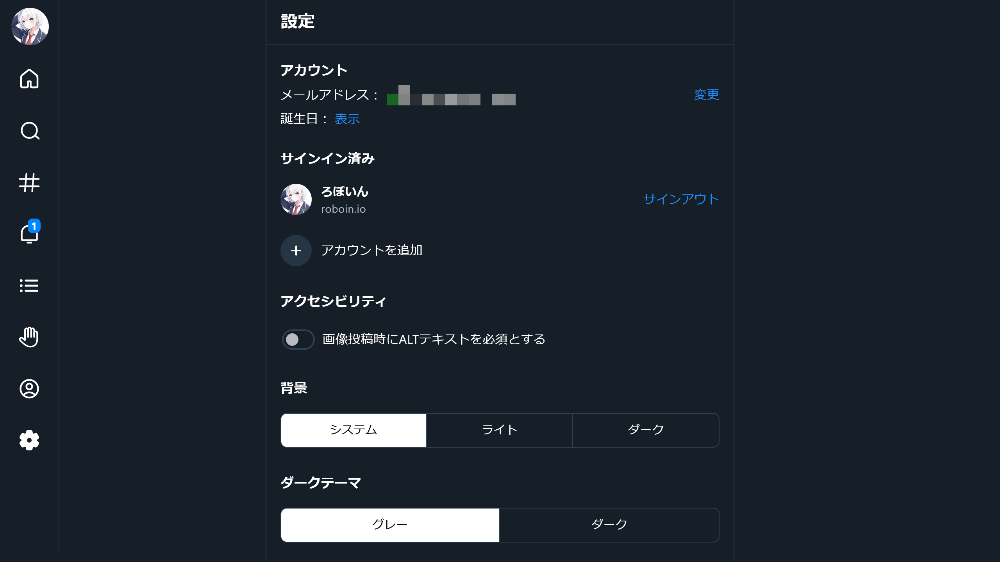
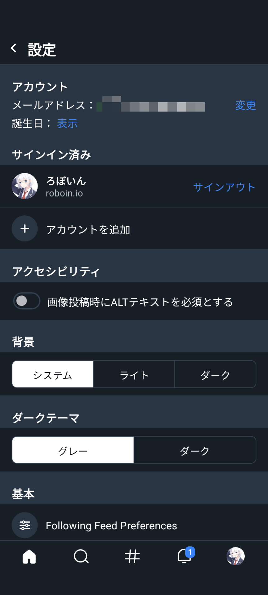

import ArticleCard from "@components/ArticleCard.astro";
import Steps from "/src/starlight/components/Steps.astro";

BlueskyはTwitter（X）の代替として注目されている分散型のSNSです。この記事では、Blueskyでダークモードを有効にする方法を解説します。

<!-- toc -->

## Blueskyとは？

**Blueskyは分散型SNS**で、従来のSNSに見られるデータの集中管理とは異なるアプローチを取っています。[ATプロトコル](https://atproto.com/)を採用しており、同プロトコルを採用した**他のSNSと相互にやり取りできる**ことが特徴です。Elon Muskに買収されたTwitter（X）の代替としても注目されています。

ThreadsやMisskey、Mastodonなど、ActivityPubを採用した他の分散型SNSとは異なり、Blueskyは独自の道を歩んでいます。

## Blueskyでダークモードを有効にする方法

Blueskyでダークモードを有効にする方法について、パソコン版とスマホアプリ版でそれぞれ解説します。

:::caution
ダークモードを使う理由は色々ありますが、消費電力を減らすことが目的の場合は、あまり効果がない可能性があります。詳しくは、こちらの記事を参考にしてください。

<ArticleCard link="/article/2022/06/27/power-saving-with-dark-mode/" />

:::

### パソコン版でダークモードを有効にする

BlueskyのPC版（Web版）でダークモードを有効にするには、次の手順で設定を変更します。

<Steps>

1. BlueskyのWeb版にログインして、メニューから設定を開きます
2. 設定画面の［背景］で［システム］または［ダーク］を選択します

    ［システム］を選択すると、OSのダークモード設定に従います。［ダーク］を選択すると、OSの設定にかかわらず、常にダークモードになります。

    

3. 設定の［ダークテーマ］で［グレー］または［ダーク］を選択します

    ［グレー］を選択すると、背景色が暗い青色になります。Twitter（X）のダークブルーに相当します。［ダーク］を選択すると、背景色が黒になります。

</Steps>

### スマホアプリ版でダークモードを有効にする

Android版やiOS版などでダークモードを有効にするには、次の手順で設定を変更します。

<Steps>

1. Blueskyのアプリを開いて、メニューから設定を開きます

    設定の開き方が分からない場合は、こちらの記事を参考にしてください。

    <ArticleCard link="/article/2024/02/13/how-to-open-bluesky-settings/" />

2. 設定画面の［背景］で［システム］または［ダーク］を選択します

    ［システム］を選択すると、OSのダークモード設定に従います。［ダーク］を選択すると、OSの設定にかかわらず、常にダークモードになります。

    

3. 設定の［ダークテーマ］で［グレー］または［ダーク］を選択します

    ［グレー］を選択すると、背景色が暗い青色になります。Twitter（X）のダークブルーに相当します。［ダーク］を選択すると、背景色が黒になります。

</Steps>

## まとめ

Blueskyでダークモードを有効にする方法について解説しました。ダークモードを使うことで、目に優しい表示になるだけでなく、条件によってはバッテリーの消費を抑えられます。ぜひ設定を変更してみてください。
