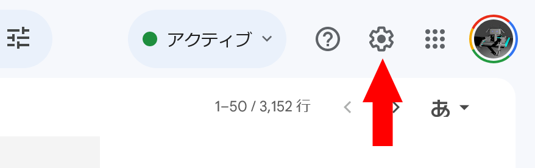
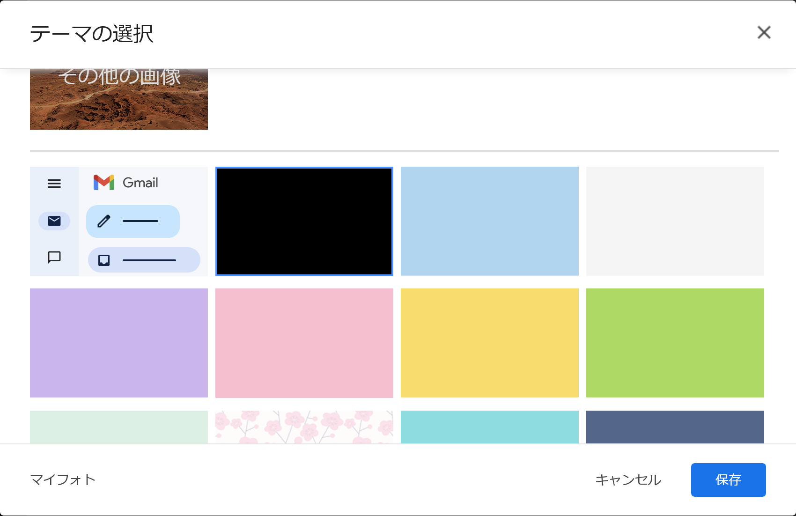
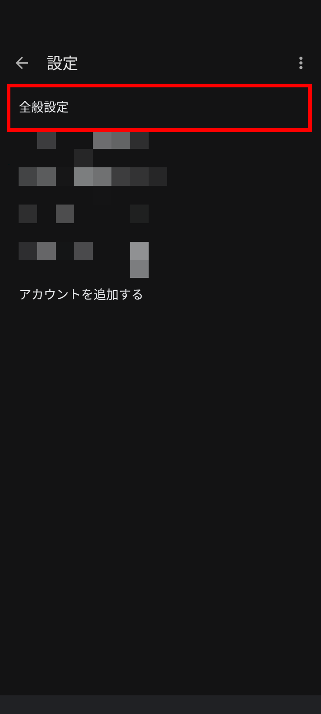
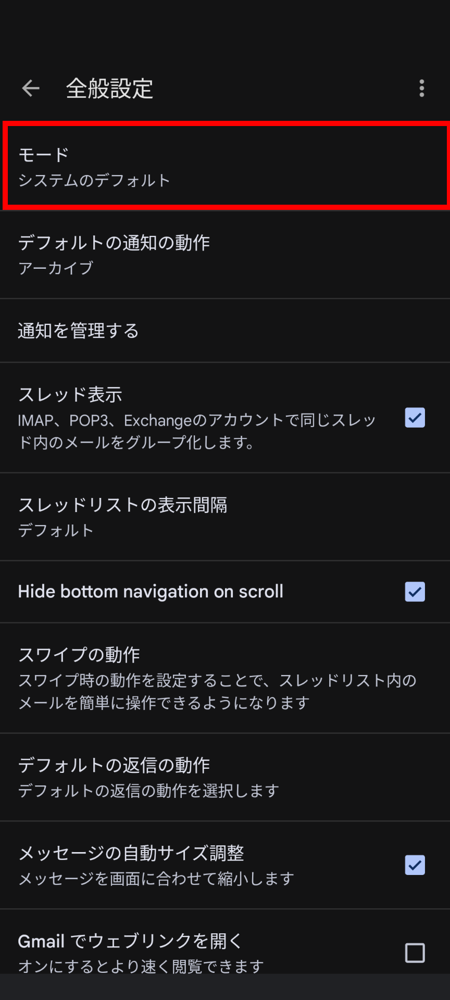
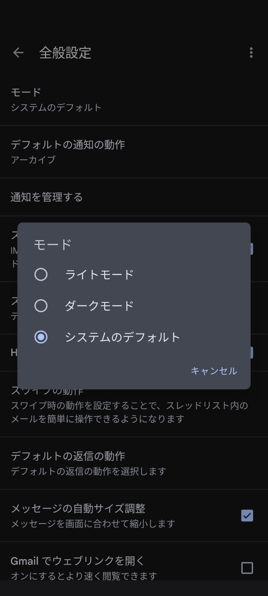
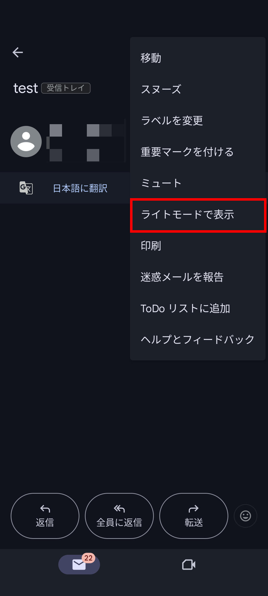

import ArticleCard from "@components/ArticleCard.astro";
import Steps from "/src/starlight/components/Steps.astro";

Gmailでは、Webやスマホアプリでダークモードを利用できます。ダークモードを有効にすると、画面の明るさが抑えられます。

この記事では、Gmailでダークモードを有効にしたり、逆にダークモードを解除したりする方法について紹介します。

<!-- toc -->

## Gmailのダークモードとは？

Gmailのダークモードは、画面の明るさを抑えるための機能です。ダークモードを有効にすると、画面が黒を基調とした配色に変わり、画面の明るさを抑えられます。

ただし、ダークモードを使う理由が消費電力の削減の場合は、条件によってはあまり効果がない可能性があります。詳しくは、こちらの記事を参考にしてください。

<ArticleCard link="/article/2022/06/27/power-saving-with-dark-mode/" />

## Gmailのダークモードを有効/無効にする方法

ここからは、Gmailでダークモードを有効にしたり、無効にしたりする方法について、Webとアプリのそれぞれの手順を紹介します。

### Web版の場合

<Steps>

1. まず、Web版のGmailにログインします
2. 右上の歯車アイコンをクリックします

    

3. ［クイック設定］が開くので、［テーマ］セクションの［すべて表示］をクリックします

    

4. ［テーマの選択］画面が表示されるので、ダークモードを有効にしたい場合は少しスクロールして［黒］、ダークモードを解除したい場合は［デフォルト］を選択します

    

5. ［保存］をクリックすると、設定が反映されます

</Steps>

### スマホアプリ版の場合

:::note
この記事ではAndroid版のスクリーンショットを使用していますが、iOS（iPhone）版でも同様の手順でダークモードを有効/無効にできるはずです。
:::

<Steps>

1. まず、Gmailアプリを起動します
2. 左上の三本線（メニューバー）をタップし、表示されたメニューから［設定］を選択します
3. ［全般設定］を選択します

    

4. ［モード］をタップします

    

5. 配色の設定画面が表示されるので、適切なものを選びます

    ダークモードにしたい場合は［ダークモード］を選択します。ダークモードを解除したい場合は、［ライトモード］を選択します。［システムのデフォルト］を選択すると、端末のダークモードの設定に従います。

    

</Steps>

ちなみに、アプリ全体ではダークモードを使いつつ、メールの本文の部分のみを一時的にライトモードにすることもできます。その場合は、メールを開いた状態で右上のメニューボタン（3点ドット）をタップして［ライトモードで表示］を選択します。

## まとめ

この記事では、Gmailでダークモードを有効/無効にする方法について紹介しました。ダークモードを使うことで、画面の明るさを抑えることができます。ぜひ、お試しください。
