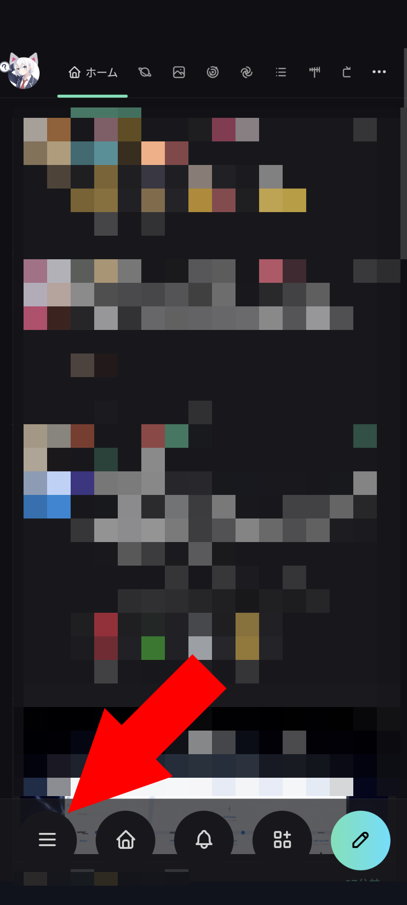
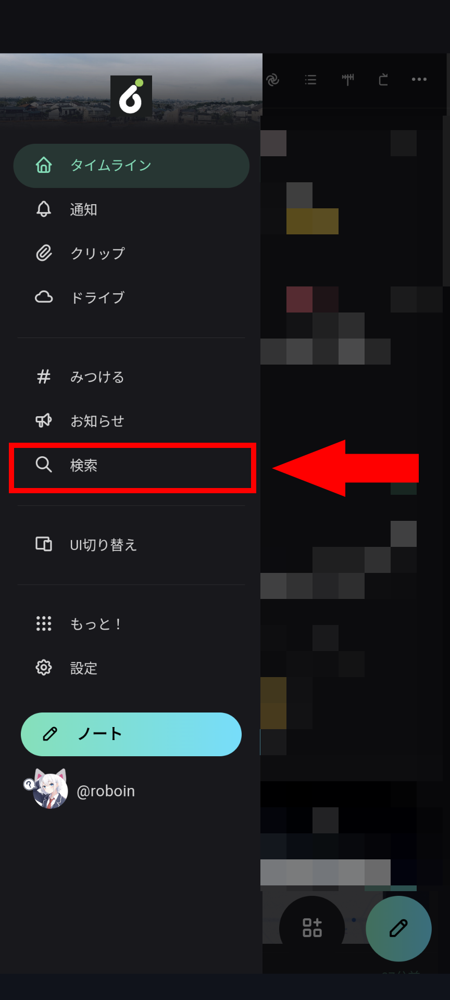
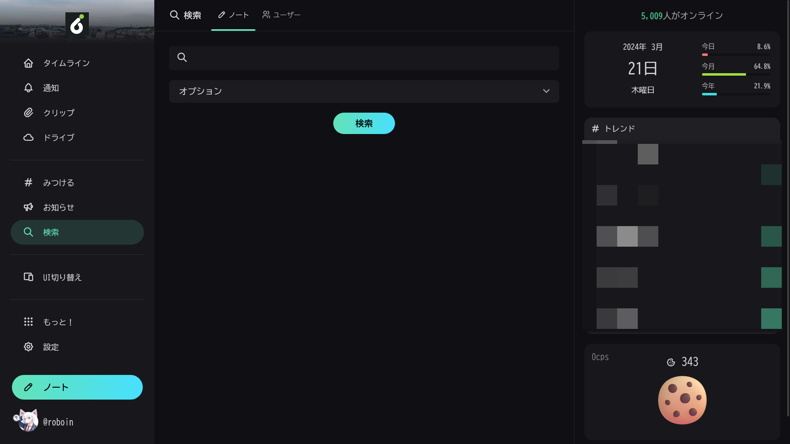
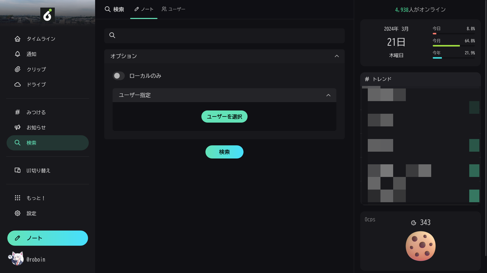
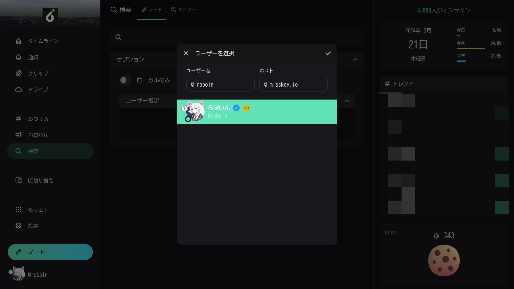
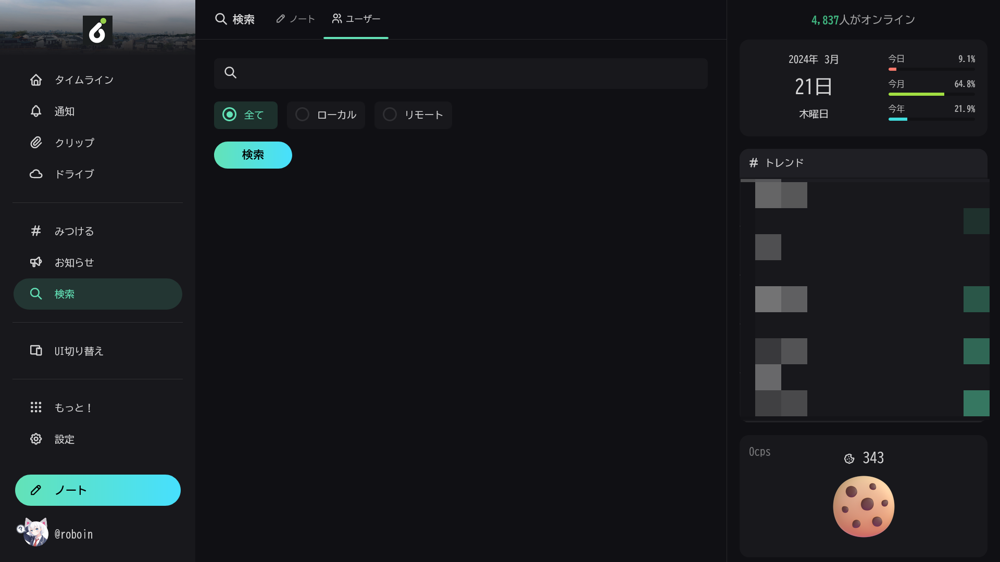

import ArticleCard from "@components/ArticleCard.astro";
import Steps from "/src/starlight/components/Steps.astro";

Misskeyは、Twitter（X）の代替のSNSとして注目されています。ActivityPubという仕組みを採用しており、Mastodonなどと連携できることや、Discordのようなリアクション機能が特徴的です。

しかし、Misskeyを使い始めたばかりの人にとっては、**検索ボックスがどこにあるのか分からない**ということがあるかもしれません。そこで、この記事では**Misskeyの検索ボックスの場所**について解説します。

なお、Misskeyのその他の詳しい使い方は、こちらの記事で解説しています。

<ArticleCard link="/article/2024/01/08/how-to-start-your-misskey-life/" />

<!-- toc -->

## 検索ボックスの開き方

### Web版の場合

まず、MisskeyのWeb版での検索ボックスの場所について解説します。Web版の場合は非常に分かりやすく、左側に表示されるサイドバーの［検索］をクリックします。

*Misskeyのスクリーンショット。左側のサイドバーに［検索］という項目がある*

### スマホ版の場合

:::note
Misskeyのスマホ版には、公式のWeb版と非公式のアプリ版があります。ここでは、公式のWeb版について解説します。
:::

スマホ版の場合は、検索窓の場所が少し分かりにくいです。

<Steps>

1. まず、スマホでMisskeyのWeb版にアクセスします
2. 画面下部のボタンから3本線のメニューを開きます

    

3. メニューが表示されるので、［検索］を選択します

    

</Steps>

## 検索の使い方

ここからは、検索機能の使い方について解説します。

他のSNSでは、投稿やアカウントをまとめて検索できますが、Misskeyの検索機能ではそれぞれ別々にしか検索できません。

### ノートの検索方法

Misskeyでノート（投稿）を検索するには、検索画面の上部にある［ノート］を選択します。検索画面を最初に開いたとき、デフォルトではノートの検索画面が表示されます。基本的な検索はこの画面で可能です。

［オプション］をクリックすると、検索条件を指定できます。［ローカルのみ］をオンにすると、同じサーバーのノートのみを検索できます。また、［ユーザー指定］を使うと、特定のユーザーのノートのみを検索できます。

［ユーザー指定］機能を使いたい場合は、［ユーザーを選択］をクリックします。ユーザー選択ダイアログが表示されるので、ユーザー名とホスト名を入力します。ホスト名は、そのユーザーのアカウントが存在するサーバー（``misskey.io``など）を指定します。

候補から該当するユーザーを選択し、ダイアログの右上の小さなチェックマークをクリックすると、検索条件にそのユーザーが追加されます。

### ユーザーの検索方法

Misskeyでユーザーを検索するには、検索画面の上部にある［ユーザー］を選択します。検索ボックスの下のメニューには、［全て］［ローカル］［リモート］があります。

通常は［全て］を選択していれば問題ありません。もし同じサーバー（インスタンス）のユーザーのみを検索したい場合は、［ローカル］を選択します。逆に、他のサーバーのユーザーのみを検索したい場合は、［リモート］を選択します。

## まとめ

Misskeyの検索ボックスの場所について解説しました。また、検索機能の使い方についても解説しました。Misskeyを使い始めたばかりの人は、この記事を参考にしてみてください。
