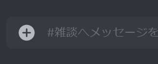
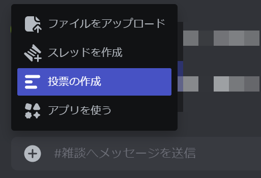
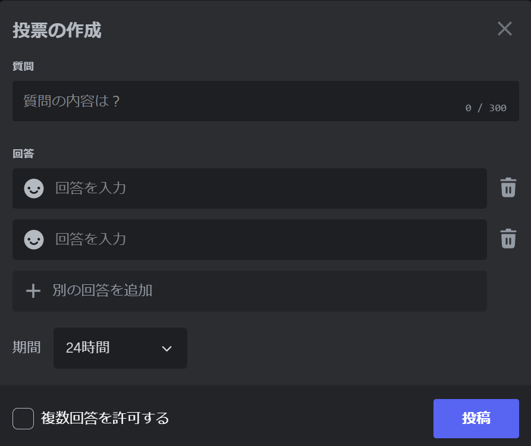

import ArticleCard from "@components/ArticleCard.astro";
import { YouTube } from "@astro-community/astro-embed-youtube";

Discordは、オンラインゲーマーやコミュニティを中心に人気の高いコミュニケーションプラットフォームです。利用者数が増えるにつれて、さまざまなニーズに応える新機能が続々と追加されています。

とくに、アンケート機能は有用で、コミュニティの意見を集めたり、イベントの日程を決めたりするのに役立ちます。これまでアンケートを取るには「Quick Poll」や「Simple Poll」といったBotを使用するのが一般的でしたが、手間がかかることや、Botの信頼性に疑問を抱く声もありました。

しかし、ついに**DiscordでBotを使わずにアンケートを取れる**新機能が一部のサーバーで展開され始めています！この記事では、使い方を紹介します。

<!-- toc -->

## これまでのアンケート方法との違い

<YouTube id="rS3N9k3NaGA" />

これまでDiscord上でアンケートを行う際には、外部からBotを導入し、コマンドを入力するなどの手間が必要でした。また、Botの機能や安全性について十分に理解していなければ、セキュリティのリスクを抱える可能性もありました。

しかし、**新機能によるアンケート**はBotを必要とせず、Discordアプリ内で直接操作できるため、より手軽でセキュリティ面でも安心して利用できます。

:::tip
Botを利用する方法では、導入や設定の手間がかかる一方で、柔軟なカスタマイズが可能です。しかし、安全性やプライバシーに関する懸念があります。
:::

## 利用できるサーバーは？

このアンケート機能は、現時点では全サーバーで一律に提供されているわけではありません。一部の限られたサーバーにテストとして提供されています。Discordは徐々にこの機能を展開しており、将来的にはすべてのユーザーが利用できるようになると予測されます。

:::note[4月9日追記]
[Discordの公式のFAQ](https://support.discord.com/hc/ja/articles/22163184112407-Polls-FAQ)が更新され、今後数日間ですべてユーザーに展開される予定であることが明らかになりました。
:::

## 新機能でアンケートを作成する手順

では、DiscordでBotを使わずにアンケートを取る方法を見ていきましょう。次の手順で簡単にアンケートを作成できます。

### 1. 投票の作成

アンケートを作成したいサーバーのチャット入力ボックスの左にあるプラスマーク（``+``）をクリックします。

*チャット入力ボックスの左端にはプラスマークのボタンが配置されている*

すると、［**投票の作成**］（スマホでは単に［**投票**］）というオプションが表示されます。これを選択して次に進みます。［投票の作成］が表示されない場合は、アプリのバージョンが古いか、そのサーバーにまだアンケート機能が提供されていない可能性があります。

*プラスマークをクリックすると［投票の作成］という選択肢が表示される*

### 2. 質問と選択肢の入力

次に、アンケートの質問内容と、回答者が選べる選択肢を入力します。選択肢は**最大10個まで**作成可能です。選択肢の左端には笑顔の絵文字が表示され、ここをクリックすることで選択肢ごとに異なる絵文字を設定できます。リアクションのような形で回答者が視覚的にも楽しめる工夫です。

### 3. 投票の詳細設定

アンケートの期間も設定でき、スマホアプリでは**1時間、24時間、3日間、1週間**の中から選べます。PCではこれらに加え、**4時間と8時間**も選択できます。

さらに、「**複数回答を許可する**」にチェックを入れると、回答者が複数の選択肢に投票可能になります。ただし、現在は**匿名投票はサポートされていません**。どの選択肢に誰が投票したかが明確に表示される点には注意が必要です。

:::caution
匿名での意見集約を望む場合は、この新機能では対応できないため、他の方法を検討する必要があります。従来のBotを使う方法でも匿名投票には対応していないため、匿名で意見を集めたい場合はGoogleフォームなどを利用することになります。
:::

## まとめ

Discordの新機能により、Botを導入することなく直接アンケートを作成・実施できるようになりました。この機能は簡単に使える一方で、投票期間の設定や複数回答の許可など、基本的なニーズには十分対応しています。

これまでに比べて手軽にアンケートを取れるようになったことで、Discordを利用するコミュニティの中でのコミュニケーションがさらに活発になることが期待されます。一方で、匿名性が確保されていないため、デリケートな質問をする際には他の手段を検討するなどの配慮が求められます。

## オススメの記事

<ArticleCard link="/article/2022/04/17/count-discord-members/" />

## 参考

- [Polls FAQ – Discord](https://support.discord.com/hc/ja/articles/22163184112407-Polls-FAQ)

## 更新履歴

- 3月23日：当初はDiscordのアンケート機能について、公式からの発表はないとしていましたが、公式のFAQページが追加されたため、それを踏まえて記事を更新しました
- 4月9日：公式のFAQが更新され、今後数日間ですべてユーザーに展開される予定であることが明らかになったため、記事を更新しました。また、公式のYouTube動画を追加しました
