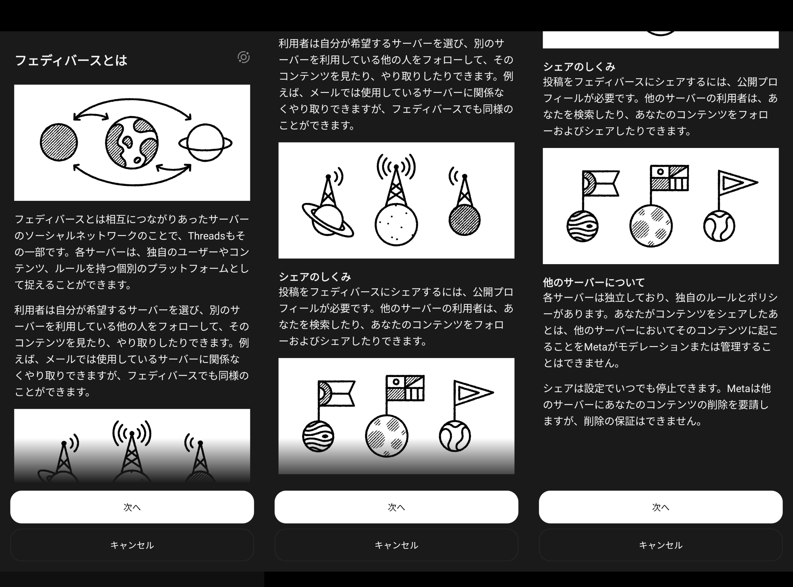
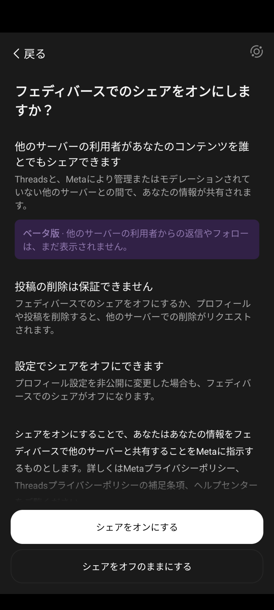

import ArticleCard from "@components/ArticleCard.astro";
import Steps from "/src/starlight/components/Steps.astro";

Threadsの運営元のMetaは、ThreadsユーザーがFediverseの他のプラットフォームに自らの投稿をシェアできるようになったと発表しました。これは、たとえば**MastodonやMisskeyなどとの連携が可能になった**ことを意味します。この機能は現在ベータ版として提供されており、日本を含む一部の国でのみ利用できます。

この記事では、**この新機能の詳細や設定方法**について解説します。なお、ThreadsやMisskeyのアカウントの作り方や基本的な使い方については、別の記事を参照してください。

<ArticleCard link="/article/2023/07/06/meta-twitter-competing-app-threads/" />

<ArticleCard link="/article/2024/01/08/how-to-start-your-misskey-life/" />

<!-- toc -->

## ThreadsとFediverseの連携

Threadsは当初より、World Wide Web Consortium (W3C) によって確立されたActivityPubを通じて、同プロトコルをサポートする他のSNSとの相互運用を可能にすることを[目指していました](https://about.fb.com/news/2023/07/introducing-threads-new-app-text-sharing/#:~:text=soon%2C%20we%20are%20planning%20to%20make%20threads%20compatible%20with%20activitypub%2C%20the%20open%20social%20networking%20protocol%20established%20by%20the%20world%20wide%20web%20consortium%20(w3c)%2C%20the%20body%20responsible%20for%20the%20open%20standards%20that%20power%20the%20modern%20web.)。

ActivityPubは、MisskeyやMastodonなどがサポートしている仕組みで、これに対応しているSNS同士で相互にフォローしたりやり取りしたりできることが特徴です。こうした仕組みに対応したSNSで構築されたネットワークを「Fediverse（フェディバース）」と呼びます。

:::note
フェディバース（Fediverse）とは、既存の中央集権的なソーシャルネットワークとは異なる、オープンで分散型のプラットフォーム群を指します。各サーバーが独自のルールを持ちつつ、共通のプロトコルを使用して相互に通信します。
:::

3月22日、MetaはThreadsの公式アカウントにて、ThreadsがActivityPubに対応したことを発表しました。これにより、ThreadsユーザーはMastodon、WordPressを含む他のプラットフォームのユーザーとつながり、投稿をシェアすることが可能になります。なお、BlueskyはAT Protocolという別の仕組みを採用しているため、連携の対象外です。

<blockquote class="text-post-media" data-text-post-permalink="https://www.threads.net/@threads/post/C4yZGRnOZDy" data-text-post-version="0" id="ig-tp-C4yZGRnOZDy" style=" background:#FFF; border-width: 1px; border-style: solid; border-color: #00000026; border-radius: 16px; max-width:540px; margin: 1px; min-width:270px; padding:0; width:99.375%; width:-webkit-calc(100% - 2px); width:calc(100% - 2px);"> <a href="https://www.threads.net/@threads/post/C4yZGRnOZDy" style=" background:#FFFFFF; line-height:0; padding:0 0; text-align:center; text-decoration:none; width:100%; font-family: -apple-system, BlinkMacSystemFont, sans-serif;" target="_blank"> 

 <svg aria-label="Threads" height="32px" role="img" viewBox="0 0 192 192" width="32px" xmlns="http://www.w3.org/2000/svg"> <path d="M141.537 88.9883C140.71 88.5919 139.87 88.2104 139.019 87.8451C137.537 60.5382 122.616 44.905 97.5619 44.745C97.4484 44.7443 97.3355 44.7443 97.222 44.7443C82.2364 44.7443 69.7731 51.1409 62.102 62.7807L75.881 72.2328C81.6116 63.5383 90.6052 61.6848 97.2286 61.6848C97.3051 61.6848 97.3819 61.6848 97.4576 61.6855C105.707 61.7381 111.932 64.1366 115.961 68.814C118.893 72.2193 120.854 76.925 121.825 82.8638C114.511 81.6207 106.601 81.2385 98.145 81.7233C74.3247 83.0954 59.0111 96.9879 60.0396 116.292C60.5615 126.084 65.4397 134.508 73.775 140.011C80.8224 144.663 89.899 146.938 99.3323 146.423C111.79 145.74 121.563 140.987 128.381 132.296C133.559 125.696 136.834 117.143 138.28 106.366C144.217 109.949 148.617 114.664 151.047 120.332C155.179 129.967 155.42 145.8 142.501 158.708C131.182 170.016 117.576 174.908 97.0135 175.059C74.2042 174.89 56.9538 167.575 45.7381 153.317C35.2355 139.966 29.8077 120.682 29.6052 96C29.8077 71.3178 35.2355 52.0336 45.7381 38.6827C56.9538 24.4249 74.2039 17.11 97.0132 16.9405C119.988 17.1113 137.539 24.4614 149.184 38.788C154.894 45.8136 159.199 54.6488 162.037 64.9503L178.184 60.6422C174.744 47.9622 169.331 37.0357 161.965 27.974C147.036 9.60668 125.202 0.195148 97.0695 0H96.9569C68.8816 0.19447 47.2921 9.6418 32.7883 28.0793C19.8819 44.4864 13.2244 67.3157 13.0007 95.9325L13 96L13.0007 96.0675C13.2244 124.684 19.8819 147.514 32.7883 163.921C47.2921 182.358 68.8816 191.806 96.9569 192H97.0695C122.03 191.827 139.624 185.292 154.118 170.811C173.081 151.866 172.51 128.119 166.26 113.541C161.776 103.087 153.227 94.5962 141.537 88.9883ZM98.4405 129.507C88.0005 130.095 77.1544 125.409 76.6196 115.372C76.2232 107.93 81.9158 99.626 99.0812 98.6368C101.047 98.5234 102.976 98.468 104.871 98.468C111.106 98.468 116.939 99.0737 122.242 100.233C120.264 124.935 108.662 128.946 98.4405 129.507Z" /></svg>
 
 投稿者: @threads
 
 Threadsで見る

</a></blockquote>

### ベータ体験

Fediverseへのシェア機能は現在ベータ版として提供されており、アメリカ、カナダ、日本の18歳以上のユーザーが利用できます。

この新機能を有効にするかどうかは自由に選ぶことができるため、利用者がこの機能を使わなければならないわけではありません。Fediverseでのシェアが興味がある場合には、アカウント設定からベータ版を有効にできます。

:::caution[ベータ版の注意点]

- フェディバースへの投稿のシェアは、18歳以上のアメリカ、カナダ、日本の公開プロフィールをもつ人が利用可能です
- 現時点では、Threadsは外部サーバーからの投稿への返信やフォロワーの情報を表示しませんが、Fediverseのユーザーからの「いいね」の数は確認できます
- シェア設定はいつでもオフに切り替えることができます。シェア機能をオフにした場合や投稿を削除した場合、他のサーバーに投稿の削除を要求するものの、削除が保証されるわけではありません。これは、Fediverseのサーバーはサーバーごとに独立して運営されており、それぞれのサーバーが独自のルールで運用されているためです

:::

## シェアの設定方法

MisskeyやMastodonを含む他のFediverseプラットフォームに投稿をシェアするには、次の手順で設定を変更します。

<Steps>

1. Threadsアプリを開きます
2. 画面下部のメニューからプロフィールアイコンをタップし、プロフィールを表示します
3. 右上のメニューボタンをタップして設定を開きます
4. ［アカウント］を選択します
5. ［フェディバースでのシェア（ベータ）］をタップします
6. 表示された詳細をよく読み、［次へ］を選択します

    
    *Fediverseの仕組みや注意点についての説明が表示される*

7. 免責事項が表示されるので、同意する場合は［シェアをオンにする］をタップします

    

</Steps>

:::note
フェディバースでのシェアはいつでもオフにできますが、一度オフにすると30日間は再度オンにできません。また、シェアをオフにした場合、他のサーバーに投稿の削除を要求するものの、削除が保証されるわけではありません。
:::

フェディバースでのシェアをオンにすると、フェディバースでのシェアの設定画面から、フェディバースにおけるユーザーネームを確認できるようになります。フェディバースにおけるユーザーネームは、``@Threadsでのユーザーネーム@threads.net``の形式です。

### 設定が見つからない場合

設定画面が見つからない場合は、アプリをアップデートしたり、キャッシュを削除したりすると設定画面が表示されることがあります。また、鍵アカウント（非公開アカウント）ではこの機能を利用できないため、一度公開プロフィールに変更してから設定を変更してみてください。

## まとめ

ThreadsがFediverseの他のプラットフォームとの連携を開始したことで、ThreadsユーザーはMastodonやMisskeyなどのユーザーともつながることができるようになりました。この機能は現在ベータ版として提供されており、日本を含む一部の国でのみ利用できます。

この記事では、この新機能の詳細や設定方法について解説しました。Fediverseでのシェアが興味がある場合には、アカウント設定からベータ版を有効にしてみてください。

## 参考

- [@threads • New on Threads: We’re taking another step toward our vision of integrating with the fediverse. ... • Threads](https://www.threads.net/@threads/post/C4yZGRnOZDy)
- [Threadsとフェディバースについて | Instagramヘルプセンター](https://help.instagram.com/169559812696339)
