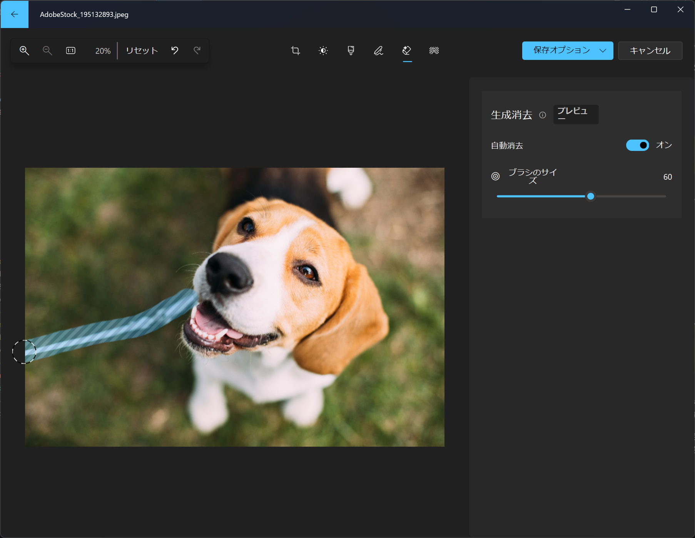
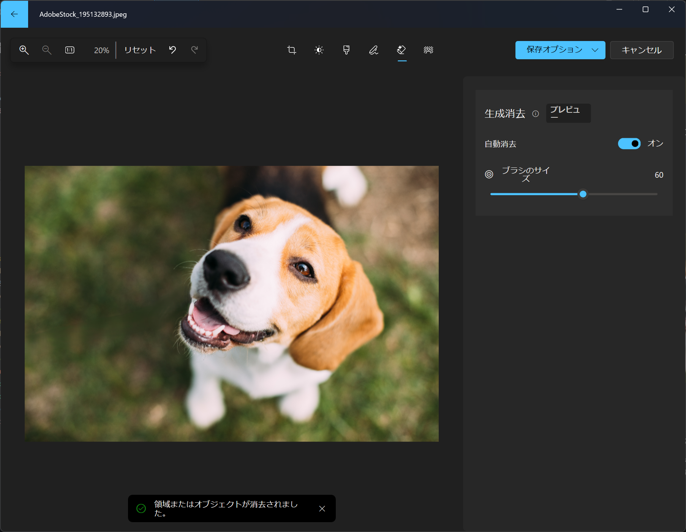
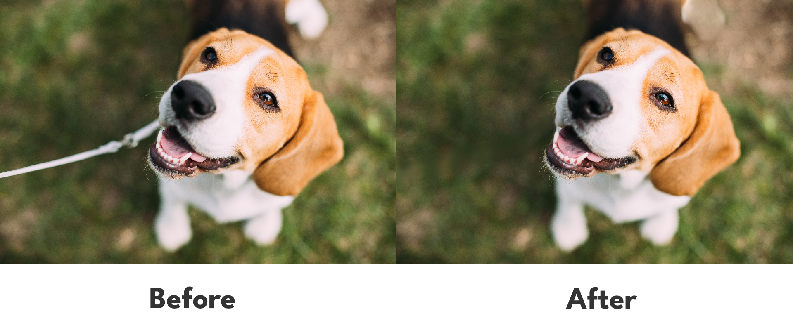
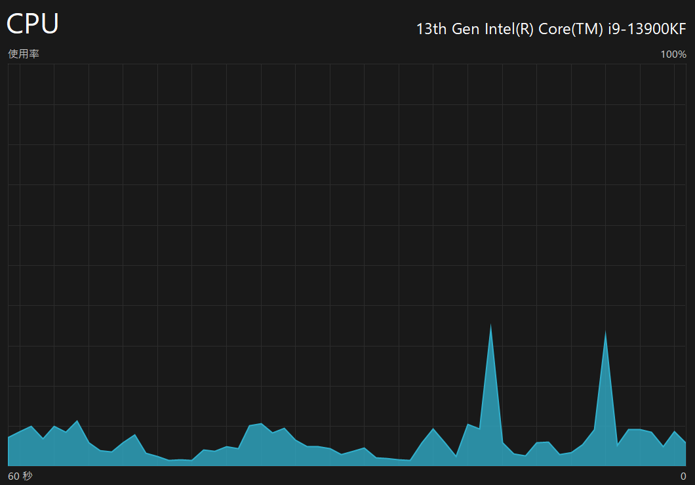

import Steps from "/src/starlight/components/Steps.astro";

Windowsのフォトアプリに「**生成消去**」という新機能が搭載されました。これは、写真から不要なものをAIの力で自然に消去できる機能です。スマートフォンのGoogle Pixelに搭載されている **「消しゴムマジック」機能のWindows版** と考えると分かりやすいかもしれません。

とくに注目すべき点は、この機能がWindowsのフォトアプリに標準搭載されており、別途サードパーティのソフトをインストールする必要がないことです。この記事では「生成消去」の概要と使い方について紹介します。

## 「生成消去」とは？

Windowsのフォトアプリの既存機能「スポット修正」はAIの力を借りてパワーアップし、「生成消去」として生まれ変わりました。

この機能は、背景の物体や視覚的な邪魔者といった不要なものを写真から修正、または除去することを可能にします。従来のスポット修正と比較して、生成消去は写真から大きな領域を消去したあとでも、より自然な見た目を維持できます。

### 「生成消去」のメリット

「生成消去」のメリットは次のとおりです。

- **手軽さ**：専門的な画像編集ソフトウェアを使用する必要がなく、Windowsのフォトアプリだけで高度な編集が可能です。有料のサードパーティのソフトウェアを購入する必要がないため、コストを抑えられます
- **高度なAI処理**：AIが背景を自然に埋めることで、写真からのオブジェクト除去が非常に自然になります
- **オフラインで利用可能**：後述しますが、この機能はオフラインでも利用できます。画像がサーバーにアップロードされないと思われるため、安心して利用できます

## 使い方

:::note
「生成消去」を使用する際には、最新のWindows 11とフォトアプリの最新バージョンが必要です。フォトアプリの更新はMicrosoft Storeアプリから可能です。
:::

生成消去は、次の手順で利用できます。今回は例として、[Adobe Stockからダウンロードした犬の写真](https://stock.adobe.com/jp/images/beautiful-tricolor-puppy-of-english-beagle-sitting-on-green-grass/195132893)からリードを消去してみます。

<Steps>

1. 編集したい画像をWindowsのフォトアプリで開きます
2. フォトアプリの上部にある編集ボタンをクリックします

    
    *メニューバーの左端の編集ボタンをクリックする*

3. 編集画面で消しゴムに星印がついたアイコンをクリックします

    
    *消しゴムアイコンをクリックする*

4. ブラシが表示されるので、必要に応じてサイズを調整したうえで、消去したいオブジェクトをなぞります

    
    *ブラシで消去したいオブジェクトをなぞる*

    :::tip
    複数のオブジェクトを一度に除去する場合や細かいコントロールが必要な場合は、［自動消去］のトグルスイッチをオフにしてマスクを追加または削除します。これにより、消去されるエリアをより細かく制御できます。
    :::

5. オブジェクトを消去できたら、右上の［保存オプション］から適切な保存方法を選択して保存します

    
    *保存オプションを選択して保存する*

</Steps>

## 実際に使ってみた感想

*生成消去を使った編集前と編集後の比較画像*

実際に「生成消去」機能を試してみたところ、オフライン環境でも利用できることを確認しました。タスクマネージャーを確認すると、この機能はCPUを利用して処理しているようです。

*生成消去の処理中のタスクマネージャー。右半分にある2つの山が生成消去を利用したタイミング*

Core i9-13900KFを搭載したPCでは、瞬時に処理が完了しました。処理中のCPU使用率は35%程度、処理中でないときのCPU使用率が5%前後なので、生成消去単体でのCPU使用率は約30%程度と推測されます。それほど高負荷ではありませんが、事務用の性能が低いPCでは処理に時間がかかるかもしれません。

## 使ってみるべき？

「生成消去」は、過去の写真を新たな視点で見直したい、不要なものを消して写真をより美しくしたいと考えている方にはとくにオススメの機能です。また、プロのような画像編集をしたいものの、複雑な編集ソフトに挑戦する時間やお金がない方にとっても、手軽に利用できる点で魅力的でしょう。

## まとめ

Windowsのフォトアプリに搭載された「生成消去」は、画像編集をもっと身近に、そしてもっと楽しくする機能です。最新の技術を活用した「生成消去」を使えば、写真編集の新たな可能性が広がります。

「生成消去」を使って、あなたの写真をもっと美しく、もっと魅力的にしてみてはいかがでしょうか？

## 参考

- [Windows Photos gets Generative erase, and recent AI editing features now available on Arm64 devices and Windows 10 | Windows Insider Blog](https://blogs.windows.com/windows-insider/2024/02/22/windows-photos-gets-generative-erase-and-recent-ai-editing-features-now-available-on-arm64-devices-and-windows-10/)