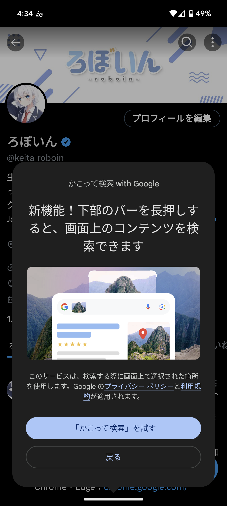

import { YouTube } from "@astro-community/astro-embed-youtube";
import Steps from "/src/starlight/components/Steps.astro";
import ArticleCard from "@components/ArticleCard.astro";

Googleの提供するスマートフォン向け機能「**かこって検索（Circle to Search）**」は、スマホに表示されているさまざまな情報を瞬時に検索できる便利な機能です。

この機能は最近、**Pixel 6シリーズ以降の端末**で利用可能となり、さらに翻訳機能が追加されたりと、使い勝手が向上しています。この記事では、「かこって検索」の概要や使い方について徹底解説します。

<!-- toc -->

## 「かこって検索」とは？

<YouTube id="WdbeqSQjZI8" />

**「かこって検索」は、Android端末の画面上の任意のテキストや画像を選択して、瞬時に検索できる機能**です。翻訳機能の追加も予告されており、旅行中に現地の言語で書かれたメニューや看板などを翻訳するのにも便利です。

たとえば、かこって検索を使わない場合、SNSで見つけた画像を検索するには画像を一度ダウンロードしてから、Googleレンズなどにアップロードして検索する必要があります。しかし、かこって検索を使えば、**画像を丸で囲むだけで瞬時に検索できる**ため、手間が省けます。

### 利用可能な端末

かこって検索は、**Pixel 7/7 Pro**、**Pixel 8/8 Pro**はもちろん、**Samsung Galaxy S24シリーズ**で利用できます。また、記事執筆時点では、次の端末で利用可能になるアップデートが展開中です。これらの端末ではすでに利用できるか、近日中に利用可能になります。

- Pixel 6
- Pixel 6 Pro
- Pixel 6a
- Pixel 7a
- Galaxy S23シリーズ
- S23 FE
- Z Fold5
- Z Flip5
- Tab S9

近日中にPixel FoldとPixel Tabletを含む、より多くのAndroid端末で利用可能になる予定です。iOS端末（iPhone）には対応していません。

:::note
筆者のGoogle Pixel 6では、すでにかこって検索を利用できるようになっています。

*かこって検索を利用できるようになったことを示す画面*
:::

## 「かこって検索」の使い方

ここからは、「かこって検索」の使い方について解説します。

:::caution
かこって検索は、銀行アプリなどの機密性が高いアプリでは使用できません。また、Androidの設定画面でも使用できません。
:::

### 基本的な使い方

かこって検索は、次の手順で利用できます。3ボタンナビゲーションモードとジェスチャーナビゲーションモードの両方に対応しています。

<Steps>

1. 画面の下部にあるホームボタンまたはナビゲーションバーを長押しします
2. 画面下部にGoogle検索バーが表示され画面がグラデーションになったら、必要に応じて、2本の指で画面をズームイン/ズームアウトしたり、画面を移動したりします
3. 検索したい画面上のテキストや画像を丸で囲みます

    :::tip
    きれいに丸で囲む必要はありません。間違えた文字を塗りつぶすときのように、簡単になぐり書きしても検索できます。

    また、テキストや画像をタップしたり、長押ししたりしても検索できます。テキストを詳細に選択したい場合はテキストを長押ししたあと、そのままドラッグすると選択範囲を広げられます。
    :::

4. 元のアプリ画面に戻りたい場合は、戻るジェスチャーを使うか、画面左上の×ボタンをタップします。画面下部のGoogle検索バーを下にスワイプしても元のアプリに戻れます

</Steps>

### 無効化する方法

設定メニューから、「かこって検索」機能をオフにできます。

<Steps>

1. ホーム画面で、アプリドロワーを開きます
2. ［設定］アプリをタップします
3. ［システム］を開きます
4. ［ナビゲーションモード］をタップします
5. ［ジェスチャーナビゲーション］または［3ボタンナビゲーション］の選択画面の横に表示されている設定アイコンをタップします
6. ［円で囲んで検索］のトグルスイッチをオフにします

    :::note
    ［円で囲んで検索］が見つからない場合は、端末が対応していない可能性があります。
    :::

</Steps>

## 「かこって検索」をさらに便利に使うコツ

「かこって検索」をさらに便利に使うためのコツを紹介します。

- **マルチサーチ**：画像を選択したあとに検索キーワードを追加することで、より正確な情報を入手できます
- **AIによる要約生成**：テキストまたはマルチサーチクエリにもとづいて、AIがさまざまなWebサイトの情報を総合して概要を表示してくれます

AIによる要約生成を使うには、アメリカに住んでいるか、Search Labsの生成AIによる検索体験（SGE）にオプトインする必要があります。設定方法や使い方はこちらの記事で解説しています

    <ArticleCard link="/article/2023/06/01/google-search-labs" />

:::tip
もし、たとえば道路標識やポスターなどの周囲のものを翻訳したい場合は、[Google Lens](https://search.google/features/lens/)がオススメです。GoogleアプリのLensアイコンをタップして、翻訳フィルターを選択してください。
:::

## まとめ

この記事では、Googleの提供するスマートフォン向け機能「かこって検索」について解説しました。この機能を使えば、スマホに表示されているさまざまな情報を瞬時に検索できるため、情報収集や翻訳などがより便利になります。

「かこって検索」は、Pixel 6シリーズ以降の端末で利用可能です。使い方も簡単なので、ぜひ活用してみてください。

## 参考

- [Google Pixel の「かこって検索」機能 - Google Pixel ヘルプ](https://support.google.com/pixelphone/answer/14542478?hl=ja)
- [6 ways Google can help you travel smarter this summer](https://blog.google/products/search/google-summer-travel-tips-2024/)
