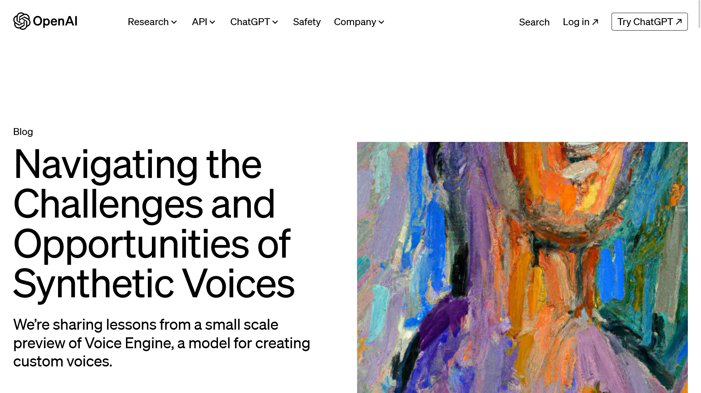

OpenAIが、**わずか15秒の音声サンプルからその人物の声をリアルに再現可能な新技術「Voice Engine」** のプレビューで得られた結果を公開しました。

この技術により、カスタマイズされた声を生成でき、音声に関連する産業やアプリケーションへの影響は計り知れないものがあります。合成された声の悪用の可能性も同時に高まり、OpenAIはこの技術の責任ある展開について社会との対話を開始することを希望しているとのことです。

## Voice Engineの仕組みと初期の応用

*画像：「[Navigating the Challenges and Opportunities of Synthetic Voices](https://openai.com/blog/navigating-the-challenges-and-opportunities-of-synthetic-voices)」*

Voice Engineは、テキスト入力と単一の15秒間の音声サンプルを使って、もとの音声に非常に似た自然な発話を生成します。この技術は、OpenAIが開発した合成音声の生成モデルであり、2022年後半にはじめて開発されました。

OpenAIは、少数のパートナーに対し、Voice Engineを非公開でテストしました。その結果、Voice Engineには次のような用途で利用できることが示されました。

- **読書支援**：これまでのプリセット音声では不可能だった幅広い話者を代表する自然で感情的な声によって、本を読まない人や子どもたちへの読書支援を提供します
- **コンテンツの翻訳**：クリエイターや企業が、自分たちの声で世界中の人々に対して、流暢にコンテンツを届けられます
- **グローバルコミュニティへのリーチの強化**：リモート環境でのカウンセリングなどにおいて、GPT-4と組み合わせて対話型フィードバックを提供します
- **障害をもつ人々のサポート**：会話障害をもつ個人に対する治療的な利用や、学習が必要な人のための教育の強化を支援します。障害をもつ人々は、自分をもっともよく表す自然な音声で会話できるようになります
- **声の回復支援**：突発または退行性の言語障害に苦しんでいる患者の声の回復を支援します。短い音声から声を復元できるため、以前に撮影したビデオの音声を使って声を再現できます

## Voice Engineの安全な開発

音声生成技術のリスクはとくに選挙の年において重要視されています。最近では、[AIを使った偽のバイデン大統領が「選挙に行くな」と呼びかける電話の存在が報じられています](https://forbesjapan.com/articles/detail/68709)。なお、この電話は、OpenAIのVoice Engineではなく、[ElevenLabsのサービスを利用したとみられています](https://wired.jp/article/biden-robocall-deepfake-elevenlabs/)。

OpenAIは、この技術の構築にあたり、政府、メディア、教育、市民社会などからのフィードバックを取り入れています。Voice Engineをテストしているパートナーは、他者または組織からの同意または法的権利なしになりすますことを禁止する利用ポリシーに同意しています。また、元の話者から明示的かつ情報に基づいた同意を必要とし、AI生成の声であることを聞き手に明確に開示する必要があります。

:::note
合成音声技術の広範な展開には、元の話者が自分の声をサービスに意図的に追加していることを確認する音声認証や、重要人物によく似すぎた声の生成を検出して防ぐ禁止音声リストが必要だとOpenAIは考えているとのことです。
:::

## 社会への影響と今後の展望

Voice Engineは、AIと共に可能となることについての理解を深め、その結果を公に共有するというOpenAIの取り組みの一環です。この技術のプレビューは、その潜在力を強調すると同時に、ますます説得力のある生成モデルによってもたらされる課題に対する社会的レジリエンスを高める必要性を促すものです。

とくに、OpenAIは銀行口座やその他の機密情報へのアクセスに音声ベースの認証を段階的に廃止することや、AIでの個人の声の使用を保護するためのポリシーの探求、AI技術の能力と限界を理解するための一般公衆の教育、およびオーディオビジュアルコンテンツの起源を追跡する技術の開発と採用の加速を奨励しています。

なお、OpenAIは、Voice Engineをプレビューしていますが、現時点で広くリリースする予定はないとのことです。

## まとめ

OpenAIが15秒の音声から人の声を再現できるVoice Engineを発表しました。この技術は、音声に関連する産業やアプリケーションへの影響は計り知れないものがありますが、合成された声の悪用の可能性も同時に高まります。OpenAIはこの技術の責任ある展開について社会との対話を開始することを希望しているとのことです。

## 参考リンク

- [Navigating the Challenges and Opportunities of Synthetic Voices](https://openai.com/blog/navigating-the-challenges-and-opportunities-of-synthetic-voices)
