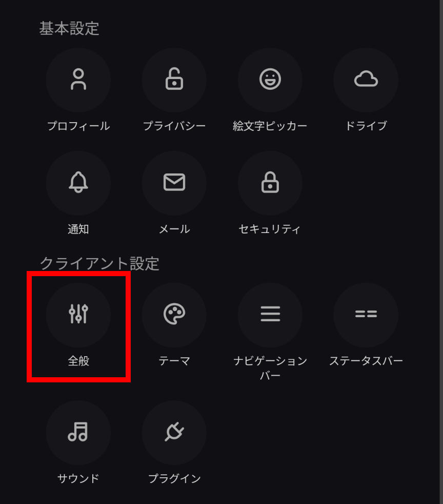
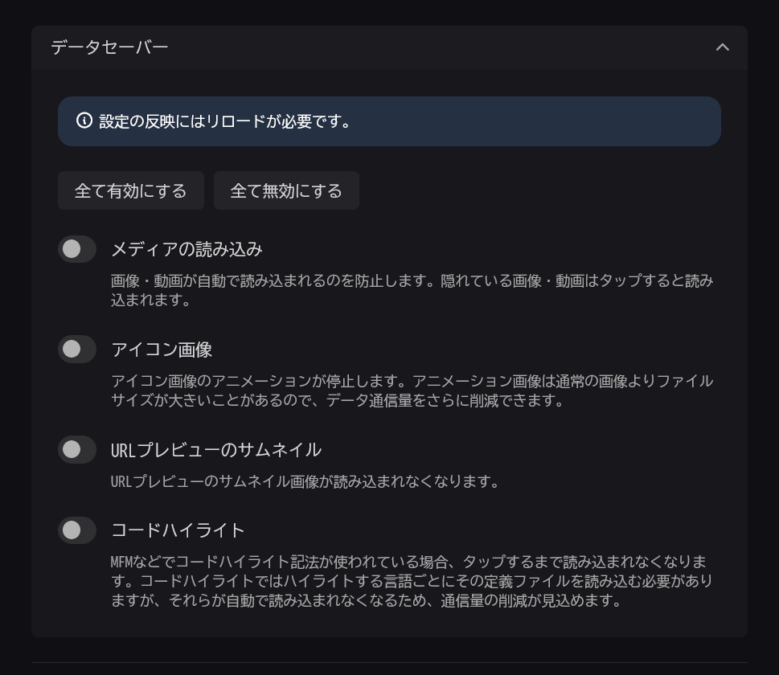

import ArticleCard from "@components/ArticleCard.astro";
import Steps from "/src/starlight/components/Steps.astro";

X（Twitter）の代替として注目されているMisskeyには、**通信量（いわゆる「ギガ」）の消費を減らせる「データセーバー」が搭載されています**。この記事では、データセーバーを有効にする方法を解説します。

<!-- toc -->

## Misskeyとは？

**Misskeyは、Twitterの代替として注目されているSNSです**。

ActivityPubというプロトコルに対応しており、MastodonやThreadsといった他のSNSと連携できます。また、Misskeyはオープンソースで開発されており、自分でサーバーを立てることもできます。

Misskeyの基本的な使い方やThreadsとの連携方法については、次の記事を参考にしてください。

<ArticleCard link="/article/2024/01/08/how-to-start-your-misskey-life/" />

<ArticleCard link="/article/2024/03/22/threads-now-allows-you-to-share-your-post-to-fediverse/" />

## データセーバーとは？

Misskeyには、通信量（いわゆる「ギガ」）の消費を減らせる「**データセーバー**」が搭載されています。データセーバーを有効にすると、**画像や動画を読み込まないように設定**できます。

これにより、通信量を節約できるため、通信制限がある場合や通信速度が遅い場合に便利です。

### データセーバーを使うべきか？

データセーバーを使うと通信料を節約できますが、画像や動画はタップするまで読み込まれないため、見たいコンテンツがすぐに表示されないというデメリットもあります。

そのため、通信制限がある場合や通信速度が遅い場合はデータセーバーを有効にすることをオススメしますが、通信制限がない場合や通信速度が速い場合はデータセーバーを無効にしておくと便利です。

## データセーバーを有効にする方法

Misskeyのデータセーバーを有効にするには、次の手順で設定を変更します。

<Steps>

1. Misskeyにログインします
2. メニューから設定を開きます
3. ［クライアント設定］セクションの［全般］を開きます

    

4. 下までスクロールし、［データセーバー］をタップすると設定項目が表示されます

    

5. データセーバーの設定を変更します。データセーバーをもっとも強力にする場合は［全て有効にする］、データセーバーを完全に無効にする場合は［全て無効にする］を選択します。それぞれの設定の意味は次のとおりです

    - **メディアの読み込み**：ノートに添付されている画像や動画を読み込むかどうかを設定します。この設定をオンにすると、画像や動画はタップするまで読み込まれなくなります
    - **アイコン画像**：アニメーション付きのアイコン画像を読み込むかどうかを設定します。この設定をオンにしても、アニメーションのない通常のアイコン画像は読み込まれます
    - **URLプレビューのサムネイル**：ノートに添付された一部のURLには、サムネイルが表示されます。このサムネイルを読み込むかどうかを設定します
    - **コードハイライト**：コードハイライト（ソースコードを見やすく色分けする機能）を読み込むかどうかを設定します。この設定をオンにすると、タップするまでコードハイライトが読み込まれなくなります。ただし、コードハイライトを使っているノートは少ないため、効果は限定的です

</Steps>

:::tip
データセーバーの設定を変更したあとは、再読み込み（リロード）すると設定が反映されます。データセーバーの設定を変更したい場合は、設定画面を開いて設定を変更したあとに再読み込みしてください。
:::

## まとめ

Misskeyには、通信量の消費を減らせる「データセーバー」が搭載されています。データセーバーを有効にすると、画像や動画を読み込まないように設定できるため、通信量を節約できます。データセーバは、通信制限がある場合や通信速度が遅い場合に便利です。データセーバーを有効にするには、Misskeyの設定画面から設定を変更します。
