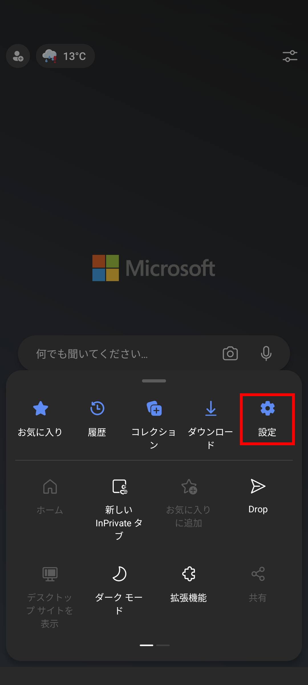
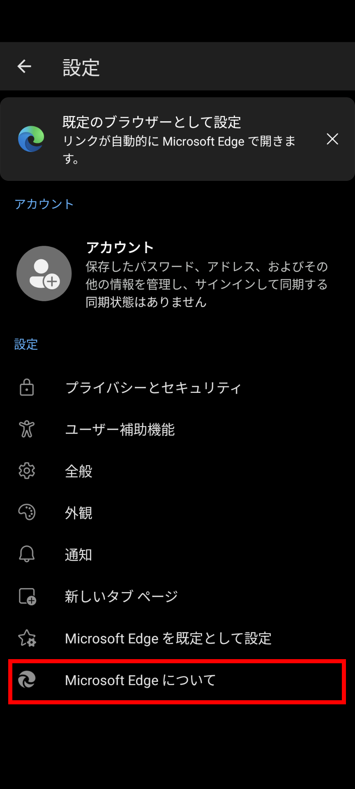
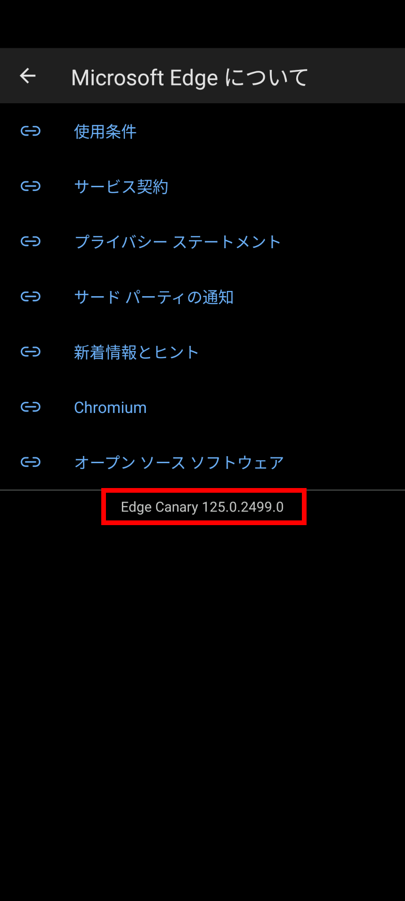
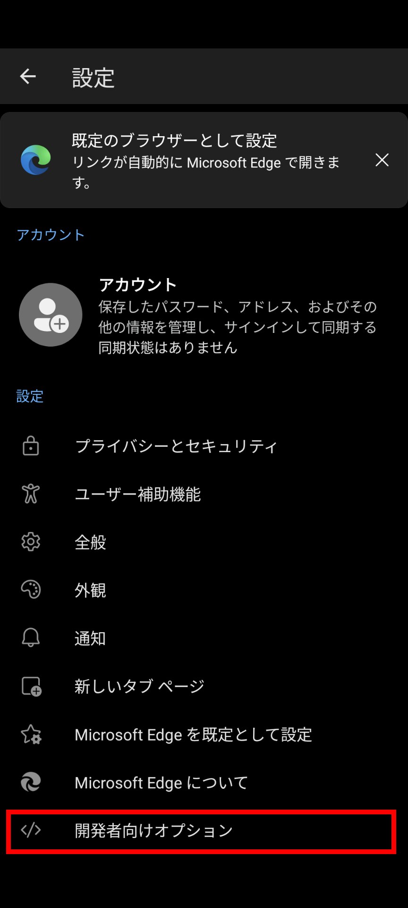
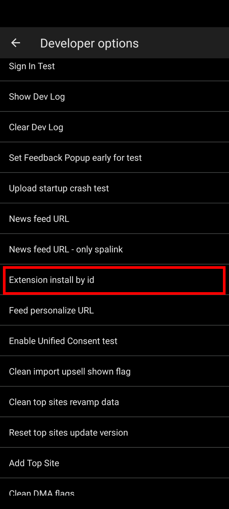
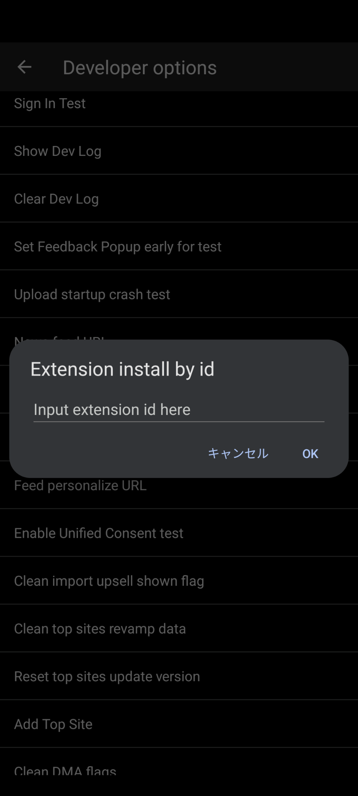

import ArticleCard from "@components/ArticleCard.astro";
import Steps from "/src/starlight/components/Steps.astro";

Androidスマートフォンのブラウザーの**Microsoft EdgeのCanaryバージョンにて、任意の拡張機能をインストールする機能が実装されました**。これにより、ユーザーは自分好みの拡張機能を追加して、より便利にWebを閲覧できるようになります。

## 拡張機能対応の経緯

Android版のMicrosoft Edge Canaryでは、2月に拡張機能のサポートが追加されました。しかし、使用可能だったのは「**Dark Reader**」や「**uBlock Origin**」といった限られたものだけでした。また、拡張機能をインストールする機能はデフォルトで無効化されており、ユーザーが手動でフラグを有効化する必要がありました。

今回、Edge Canaryで任意の拡張機能をインストールする機能が実装されました。これにより、**限られた拡張機能しかインストールできなかった制限がなくなり、より便利に利用できるようになりました**。

この変更で、Android版Firefoxに続き、Microsoft Edgeも任意の拡張機能を使えるAndroid向けの主要ブラウザーのひとつとなりました。

## 任意の拡張機能のインストール方法

任意の拡張機能をインストールするには、いくつかの手順を踏む必要があります。

まずはEdge Canaryをインストールし、``edge://flags``で``#edge-extensions-andoird``フラグを有効化する必要があります。これにより、拡張機能のインストールが可能となります。詳細については、こちらの記事で解説しています。

<ArticleCard link="/article/2024/02/05/microsoft-edge-for-android-now-supports-extensions/" />

:::danger
この機能を利用するには、通常版のMicoroft Edgeではなく、**Edge Canary**を利用する必要があります。Canaryビルドは開発者向けのビルドであり、安定性が保証されていないため、一般ユーザーは注意が必要です。

また、``edge://flags``でフラグを有効化する際は、機能が実験的であることを理解した上で操作してください。フラグの有効化によって何らかの問題が発生する可能性があるため、注意してください。
:::

拡張機能のサポートを有効化したら、次の手順で任意の拡張機能をインストールできます。

<Steps>

1. Edge Canaryの画面下部のハンバーガーメニューをタップし、メニューから［設定］を選択します

    

2. 設定画面の［Microsoft Edgeについて］をタップします

    

3. ［Edge Canary \<バージョン番号\>］と書かれた部分を素早く5回連続でタップします

    

4. 設定画面に戻ると［開発者向けオプション］が追加されているので、これをタップします

    

5. 開発者向けオプションの中から［Extension install by id］をタップします

    

6. ダイアログが表示されるので、インストールしたい拡張機能のMicrosoft Edge Add-onsのIDを入力し、［OK］をタップします

    :::tip
    Microsoft Edge Add-onsのIDは、拡張機能のページURLに含まれています。たとえば、URLが「[https://microsoftedge.microsoft.com/addons/detail/shadowban-scanner/kfeecmboomhggeeceipnbbdjmhjoccbl](kfeecmboomhggeeceipnbbdjmhjoccbl)」となっている場合、「kfeecmboomhggeeceipnbbdjmhjoccbl」がIDになります。
    :::

    

</Steps>

これで、拡張機能のインストールは完了です。拡張機能の設定を開きたい場合は、ハンバーガーメニューをタップし、［拡張機能］を選択して該当する拡張機能を選びます。

実際に私が公開している「[Shadowban Scanner](https://shadowban-scanner.roboin.io/)」という拡張機能で試したところ、正常に動作することを確認しました。ただし、**スマートフォンでの利用を想定していない一部の拡張機能は、正常に動作しない可能性があります**。

Shadowban Scannerは、Twitter（X）のシャドウバンやセンシティブ判定を外部サイトに移動せずに確認できる拡張機能です。Chrome、Edge、Firefoxに対応しており、Android版Firefoxでも利用できます。インストール方法や使い方は、こちらの記事を参考にしてください。

<ArticleCard link="/article/2023/09/30/detect-twitter-shadowban/" />

<ArticleCard link="/article/2023/12/15/shadowban-scanner-now-supports-firefox-for-android/" />

## まとめ

Android版のMicrosoft Edge Canaryにて、任意の拡張機能をインストールする機能が実装されました。これにより、ユーザーは自分好みの拡張機能を追加して、より便利にWebを閲覧できるようになります。ただし、Canaryビルドは開発者向けのビルドであり、安定性が保証されていないため、一般ユーザーは注意が必要です。

## 参考

- [You can now install any extension in Microsoft Edge Canary for Android](https://www.windowslatest.com/2024/04/02/you-can-now-install-any-extension-in-microsoft-edge-canary-for-android/)
