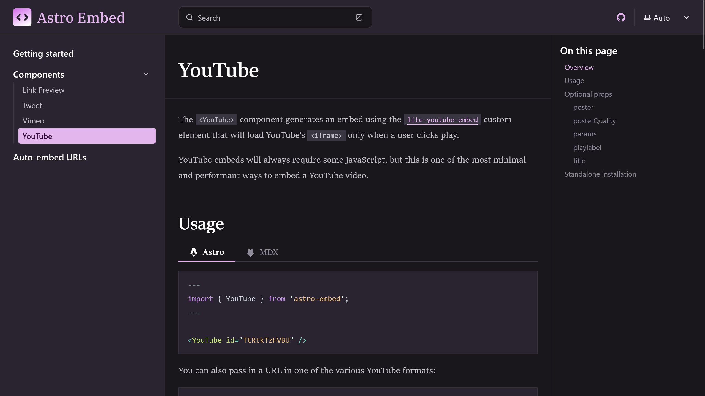

import { YouTube } from "@astro-community/astro-embed-youtube";

[Astro](https://astro.build/)は、近年人気が高まっている静的サイトジェネレーターです。フレームワークに依存せず、フロントエンドで動作させる必要があるスクリプトがないため、高速なページ読み込みが特徴です。

しかし、AstroでYouTubeの通常の埋め込みコードを使用すると、ページの読み込み速度が低下し、[PageSpeed Insights](https://pagespeed.web.dev/)などのツールで評価が下がってしまいます。これは、YouTubeの埋め込みコードが速度を重視していないため、

そこで、この記事ではパフォーマンスを維持しながらAstroベースのサイトにYouTubeを埋め込める「[astro-embed-youtube](https://astro-embed.netlify.app/components/youtube/)」を紹介します。

<!-- toc -->

## astro-embed-youtubeとは？


*画像：[astro-embed-youtubeの公式ドキュメント](https://astro-embed.netlify.app/components/youtube/)*

astro-embed-youtubeは、AstroにYouTubeを埋め込むためのコンポーネントです。

通常のYouTubeの埋め込みコードは、ページの読み込み速度を低下させてしまいます。一方で、astro-embed-youtubeを使用することでパフォーマンスを維持しながらYouTubeを埋め込めます。

astro-embed-youtubeの内部では[Lite YouTube Embed](https://github.com/paulirish/lite-youtube-embed)が使われています。動画が埋め込まれた箇所には、デフォルトではサムネイル画像とYouTubeのロゴのみが表示されます。ユーザーがクリックしてはじめてYouTubeの``iframe``が読み込まれるため、ページの読み込み速度が低下しません。

Lite YouTube Embedの公式ドキュメントによると、YouTubeの埋め込みを224倍高速にレンダリングできるとのことです。

astro-embed-youtubeを使うと、このLite YouTube EmbedをAstroで簡単に利用できます。

:::caution
astro-embed-youtubeはコンポーネントなので、AstroファイルとMDXファイルでのみ利用できます。通常のMarkdownファイルでは利用できません。
:::

## インストール方法

astro-embed-youtubeは、次のコマンドでインストールできます。

```shell
npm install @astro-community/astro-embed-youtube
```

:::note
astro-embed-youtubeは、[Astro Embed](https://astro-embed.netlify.app/)の一部としても提供されています。ツイートやリンクカード、Vimeoなどの埋め込みもまとめて使いたい場合は、Astro Embedをインストールすることをオススメします。

```shell
npm install astro-embed
```

:::

## 使い方

インストールが完了したら、MDXファイルやAstroファイルからコンポーネントを読み込みます。MDXファイルの場合は任意の場所、Astroファイルの場合は``---``ブロック内でインポートします。

```mdx title="index.mdx"
import { YouTube } from "@astro-community/astro-embed-youtube";

通常のコンテンツを入力
```

```astro title="index.astro"
---
import { YouTube } from "@astro-community/astro-embed-youtube";
---

通常のコンテンツを入力
```

:::note
astro-embed-youtubeではなくastro-embedをインストールした場合は、``astro-embed``をインポートします。

```mdx title="index.mdx"
import { YouTube } from "astro-embed";
```

```astro title="index.astro"
---
import { YouTube } from "astro-embed";
---
```

:::

次に、YouTubeの動画を埋め込みたい箇所で``YouTube``コンポーネントを使います。``id``属性には動画のIDを指定します。すると、動画が埋め込まれます。

```mdx
<YouTube id="5u0Ds7wzUeI" />
```

<YouTube id="5u0Ds7wzUeI" />

:::tip
YouTubeの動画のIDは、URLの``v``パラメーターの値です。例えば、``https://www.youtube.com/watch?v=5u0Ds7wzUeI``の場合、IDは``5u0Ds7wzUeI``です。

``https://youtu.be/5u0Ds7wzUeI``のような短縮リンクの場合は、``/``以降の値がIDです。

トラッキングID（``si``パラメーター）は含めないようにしてください。
:::

### オプション

astro-embed-youtubeの``YouTube``コンポーネントには、いくつかのオプションが用意されています。ここでは、主要なオプションを紹介します。他にもいくつかのオプションが用意されているので、詳細は[公式ドキュメント](https://astro-embed.netlify.app/components/youtube/)を参照してください。

#### サムネイルを変更する

サムネイルを変更するには、``poster``属性にサムネイル画像のURLを指定します。

```mdx
<YouTube id="5u0Ds7wzUeI" poster="https://example.com/thumbnail.jpg" />
```

こうすることで、指定したURLの画像がサムネイルとして使用されます。サムネイル画像はユーザーがコンポーネントをクリックするまで表示されます。

#### サムネイルの解像度を変更する

サムネイルの解像度を変更するには、``posterQuality``属性に解像度を示す文字列を指定します。``posterQuality``属性には次の値を使用できます。

- ``low``：120px
- ``default``：480px
- ``high``：640px
- ``max``：1280px

```mdx
<YouTube id="5u0Ds7wzUeI" posterQuality="high" />
```

#### パラメーターを指定する

YouTubeでは、再生時間を指定したり、埋め込みの動作を変更するためのパラメーターが用意されています。astro-embed-youtubeでは、``params``属性を使ってパラメーターを指定できます。たとえば、動画の10秒から再生する場合は、次のように指定します。複数のパラメーターを指定する場合は、``&``で区切ります。

```mdx
<YouTube id="5u0Ds7wzUeI" params="start=10" />
```

#### タイトルを表示する

``<iframe>``が読み込まれるまでの間、サムネイル画像とYouTubeのロゴが表示されます。このとき、サムネイル画像の上に動画のタイトルを表示するには、``title``属性にタイトルを指定します。

```mdx
<YouTube id="5u0Ds7wzUeI" title="Starlight by Astro" />
```

<YouTube id="5u0Ds7wzUeI" title="Starlight by Astro" />

## まとめ

この記事では、AstroにYouTubeを埋め込むためのコンポーネント「astro-embed-youtube」を紹介しました。

通常のYouTubeの埋め込みコードは、ページの読み込み速度を低下させてしまいます。一方で、astro-embed-youtubeを使用することでパフォーマンスを維持しながらYouTubeを埋め込めます。

astro-embed-youtubeを使うことで、AstroベースのサイトにYouTubeを埋め込めます。ぜひ、astro-embed-youtubeを使ってみてください。

## 参考

- [YouTube | Astro Embed](https://astro-embed.netlify.app/components/youtube/)
