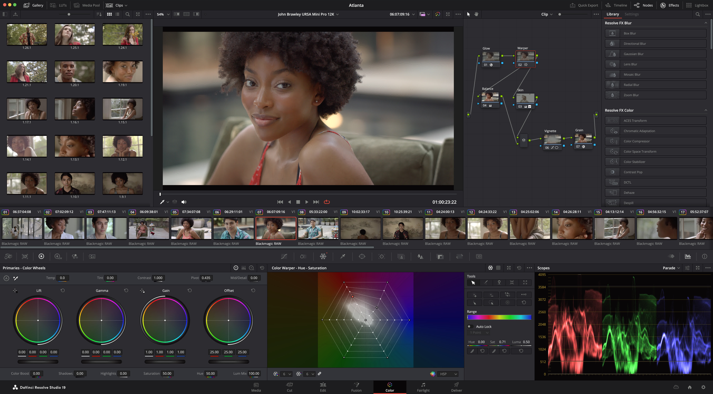
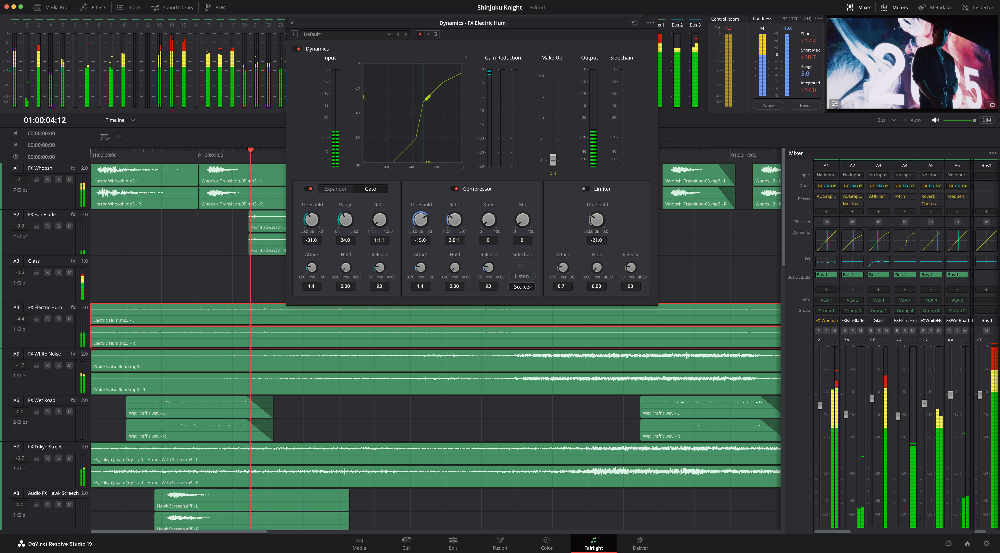
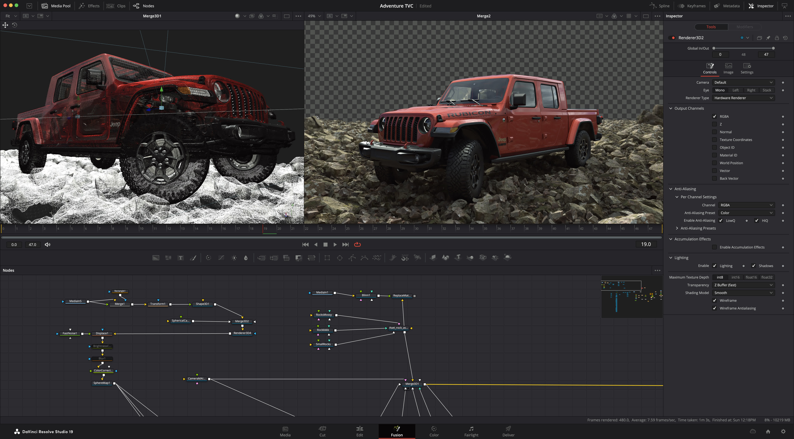

Blackmagic Designが動画編集ソフト「**DaVinci Resolve 19**」のパブリックベータ版をリリースしました。

今回のアップデートでは、新たなAIツール、100以上の機能強化、進化したカラーグレーディング、オーディオ編集機能など、多岐にわたる強化が施されています。動画編集、カラーコレクション、オーディオのポストプロダクションなどがより便利になります。

*DaVinci Resolve 19のエディットページ
画像：「[Blackmagic Design Announces DaVinci Resolve 19 | Blackmagic Design](https://www.blackmagicdesign.com/media/release/20240412-03)」より*

<!-- toc -->

## 新機能の概要

DaVinci Resolve 19は、動画編集者、カラリスト、VFXアーティスト、オーディオエンジニアを対象に、数々の新機能と改良点が盛り込まれています。

### 1. DaVinci Neural Engineの進化

DaVinci Resolveに搭載されている強力なAI機能の「DaVinci Neural Engine」には、多くの新機能が追加されています。音声を自動で文字起こしして、そのテキストから発言者を検索したり、テキストを編集することでタイムラインに編集を反映させたりできます。

### 2. カラーグレーディングの強化

*DaVinci Resolve 19のカラーページ
画像：「[Blackmagic Design Announces DaVinci Resolve 19 | Blackmagic Design](https://www.blackmagicdesign.com/media/release/20240412-03)」より*

新しいColorSlice 6ベクターパレットやUltraNRノイズリダクション機能は、より洗練された色調整と画質向上を可能にします。これにより、映画のようなビジュアルを簡単に生み出すことが可能になります。

### 3. Fairlightのオーディオ機能のアップデート

*DaVinci Resolve 19のFairlightページ
画像：「[Blackmagic Design Announces DaVinci Resolve 19 | Blackmagic Design](https://www.blackmagicdesign.com/media/release/20240412-03)」より*

FairlightではIntelliTrack AIにより、映像内のオブジェクトや人物の動きを追跡し、その動きにもとづいた自動オーディオパンニングが可能となりました。

また、新しいDucker track FXでは、複雑な設定をせずに、あるトラックで別のトラックのレベルを自動調整できます。さらに、完全な球状サウンドトラックを扱える、Ambisonicサラウンドサウンドがサポートされました。AIベースのdialogue separator FXでは、背景音や部屋の残響音に対するダイアログのバランスを調整できます。

### 4. Fusionページの強化

*DaVinci Resolve 19のFusionページ
画像：「[Blackmagic Design Announces DaVinci Resolve 19 | Blackmagic Design](https://www.blackmagicdesign.com/media/release/20240412-03)」より*

Fusionページでは、USDツールが拡張され、新しいMultiPolyロトスコーピングツールが追加されています。これにより、複雑なVFX作業をよりスムーズかつ効率的にできるようになりました。

## その他の新機能

その他にも、DaVinci Resolve 19には次のような新機能が搭載されています。

### 生放送編集の強化

DaVinci Resolve 19は、ライブ放送編集の機能が強化されています。新しいマルチソースビューアーとリプレイツールにより、生放送中のイベントを瞬時に捕捉し、ハイライトとして迅速に再編集できるようになりました。スポーツイベントやコンサートなど、リアルタイムでの編集が求められる場面で非常に便利です。

### Blackmagic Cloudの統合

新たな「Organizations」アプリによるBlackmagic Cloudのサポート拡大により、大企業やチームがプロジェクトをより効率的に共有し、ライセンス管理を簡素化できるようになりました。プロジェクトをグループ全体に共有したり、柔軟にライセンスを割り当て・管理したりできるようになりました。

## まとめ

DaVinci Resolve 19は、動画編集、カラーグレーディング、オーディオ編集など、あらゆるポストプロダクション作業をサポートするための多くの新機能が搭載されています。AI機能の強化やカラーグレーディングの進化、Fairlightのオーディオ機能のアップデートなど、多岐にわたる機能強化が行われています。

DaVinci Resolveの基本的な機能は無料で利用でき、より高度な機能は有料のDaVinci Resolve Studioで利用できます。DaVinci Resolve Studio 19は、記事執筆時点では47,980円で販売されています。

## 参考

- [Blackmagic Design Announces DaVinci Resolve 19 | Blackmagic Design](https://www.blackmagicdesign.com/media/release/20240412-03)
