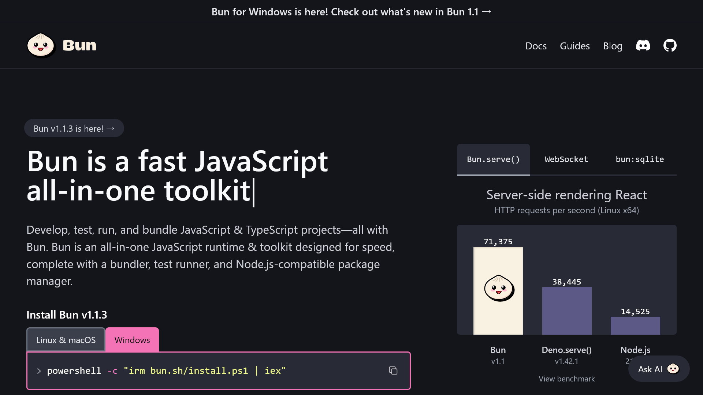
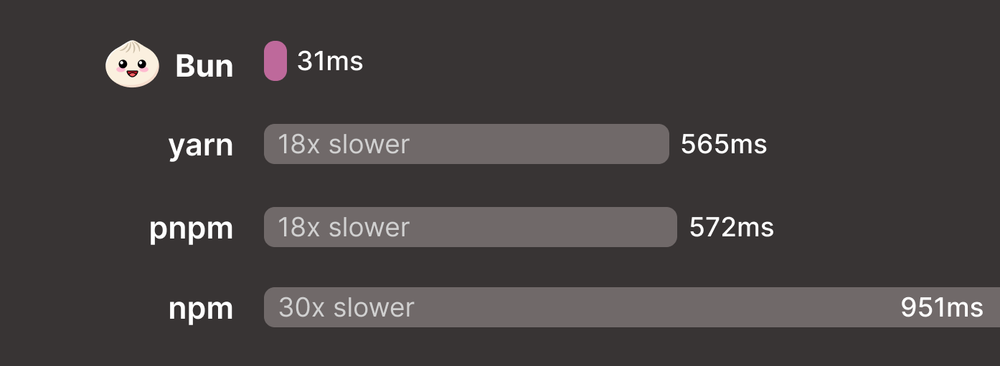

2024年4月1日、Windowsに対応した**Bun 1.1**がリリースされました。この記事では、WindowsにBunをインストールする方法を説明します。

<!-- toc -->

## Bunのインストール方法

BunをWindowsにインストールするには、次のいずれかのコマンドを実行します。

```shell
# PowerShellの場合
powershell -c "irm bun.sh/install.ps1 | iex"

# npmを使う場合
npm install -g bun

# Scoopを使う場合
scoop install bun
```

インストールが完了したら、次のコマンドでBunのバージョンを確認できます。バージョン番号が表示されれば、正常にインストールされています。

```shell
bun --version
```

## Bunとは？


*画像：[Bunの公式サイト](https://bun.sh/)*

Bunは、**JavaScriptおよびTypeScriptを実行、構築、テストするためのオールインワンのツール**です。Bunは、Node.jsのパッケージマネージャーであるnpmと互換性があり、Node.jsやnpmよりも高速で動作することが特徴です。

Windowsでの``bun install``コマンドと他の主要なパッケージマネージャーの速度を比較すると、Bunがもっとも高速であることが分かります。次の画像は、Windowsでの``bun install``コマンドと他の主要なパッケージマネージャー（yarn、pnpm、npm）の速度を比較したものです。


*主要なパッケージマネージャーとの速度の比較
画像：「[Bun 1.1 | Bun Blog](https://bun.sh/blog/bun-v1.1)」より*

また、Bunには高速なホットリロードを可能にする``--watch``オプションや、Node.jsと互換性がある高速なAPIなどの多くの機能が搭載されています。さらに、専用のシェル言語のBun Shellが搭載されており、OS間の差異を吸収してくれます。

## まとめ

この記事では、WindowsにBunをインストールする方法を説明しました。Bunは高速で使いやすいツールであり、JavaScriptやTypeScriptのプロジェクトを効率的に開発できます。ぜひ、Bunを使ってみてください。

## 参考

- [Bun 1.1 | Bun Blog](https://bun.sh/blog/bun-v1.1)
- [Installation | Bun Docs](https://bun.sh/docs/installation)
