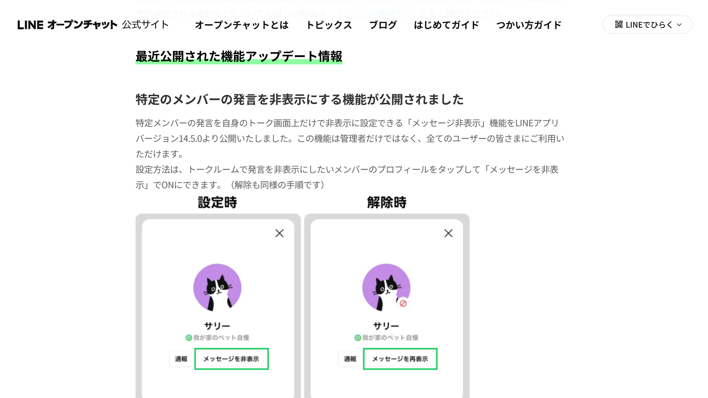
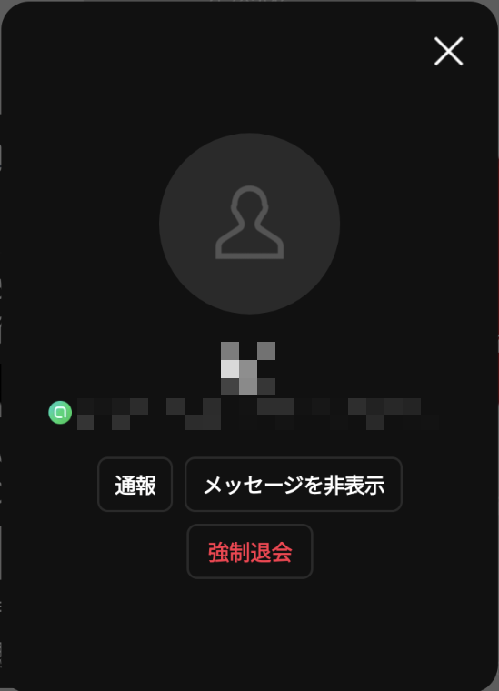

import Steps from "/src/starlight/components/Steps.astro";

最近、LINEオープンチャットに実質的なブロック・ミュート機能ともいえる「**メッセージ非表示**」機能が追加されました。この新機能により、特定のユーザーの発言を自分のトーク画面上だけで非表示にできるようになりました。

今回はこの便利な機能の詳しい使い方と注意点を紹介します。

<!-- toc -->

## 「メッセージ非表示」機能とは？

*画像：「[Admins' Hub - 管理者向け情報をまとめてご紹介 | LINEオープンチャット](https://openchat-jp.line.me/admin/top)」*

**LINEアプリバージョン14.5.0**から導入された「メッセージ非表示」機能は、**オープンチャットにおいて特定のメンバーの発言を非表示にできる機能**です。

これにより、気になる発言や不快に感じる内容を排除して、快適なコミュニケーションを楽しめるようになります。

### 主な特徴

メッセージ非表示機能には、次のような特徴があります。

- **すべてのユーザーが利用可能**：管理者だけでなく、すべてのユーザーが利用できます
- **非表示設定は個人ごとに有効**：設定したユーザーの端末上でのみ有効で、他のメンバーの表示には影響しません
- **過去のメッセージには適用されない**：非表示設定は、設定後に投稿されたメッセージにのみ反映されます
- **相手には知られない**：非表示設定をしていることが、他のメンバーや管理者に知られることはありません

### 注意事項

メッセージ非表示機能には、いくつかの注意点もあります。

- 管理者や共同管理者のメッセージは非表示にできない
- 非表示にしたメンバーからのメンションがあった場合は通知が届く
  - 将来的には通知が届かないようになる予定
- 発言の存在自体が非表示になるわけではなく、発言内容が［非表示にしたメッセージです。］というテキストに置き換わる

## 設定方法

LINEの「メッセージ非表示」機能は、次の手順で設定できます。

<Steps>

1. **オープンチャットを開く**

    まず、LINEアプリを開き、非表示に設定したいオープンチャットのトークルームを開きます。

2. **非表示にしたいユーザーのプロフィールを表示**

    トークルームで非表示にしたいユーザーの発言を見つけ、そのユーザーの名前やアイコンをタップします。

3. **「メッセージを非表示」を選ぶ**

    ユーザーのプロフィール画面が開いたら、［メッセージを非表示］というボタンをタップします。

    
    *プロフィール画面で［メッセージを非表示］をタップする*

</Steps>

これで、そのユーザーの発言が非表示になります。非表示にしたユーザーの発言は、［非表示にしたメッセージです。］というテキストに置き換わります。

## 設定を解除する

非表示設定を解除したい場合は、同じユーザーのプロフィール画面に再度アクセスし、［メッセージを再表示］をタップします。

## まとめ

LINEオープンチャットの「メッセージ非表示」機能を使えば、特定のユーザーの発言を非表示にできます。これにより、快適なコミュニケーションを楽しむことができるでしょう。

ぜひ、気になる発言や不快に感じる内容がある場合には、この機能を活用してみてください。

## 参考

- [Admins' Hub - 管理者向け情報をまとめてご紹介 | LINEオープンチャット](https://openchat-jp.line.me/admin/top)
