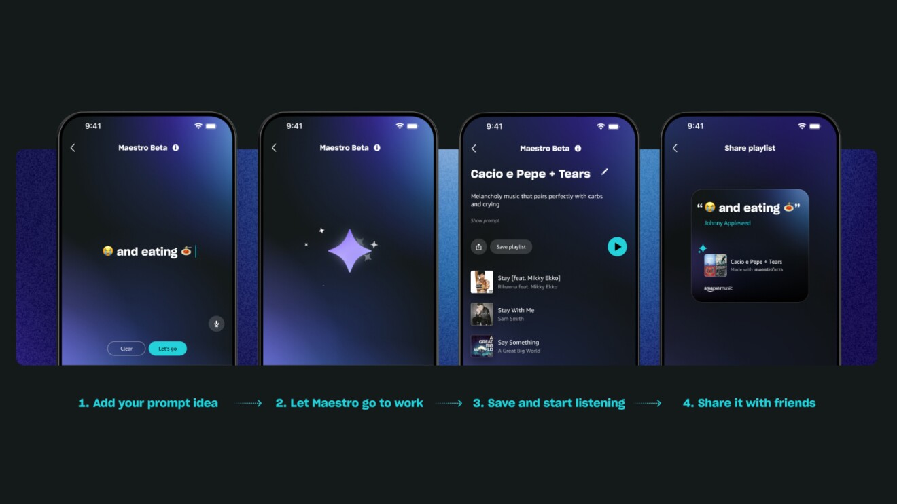

import { YouTube } from "@astro-community/astro-embed-youtube";
import Steps from "/src/starlight/components/Steps.astro";

2024年4月16日（現地時間）、Amazon Musicは、**新しいAI**技術を活用したプレイリスト生成ツール「**Maestro**」を公開しました。アメリカの一部のユーザー向けにiOSとAndroidアプリにて、ベータ版として提供されています。

Maestroは、プロンプトを入力するだけで、そのプロンプトに合った楽曲を自動的に選曲してプレイリストを生成してくれる機能です。自分の好みや感情に合わせたプロンプトを入力するだけで、Maestroがそれに合った楽曲を選曲してプレイリストを作成してくれます。

<!-- toc -->

## Maestroとは？

<YouTube id="g830h05HppE" title="Meet Maestro | Amazon Music" />

Amazon MusicのMaestroは、**AI技術**を活用して、ユーザーの入力したプロンプト（キーワードや絵文字、感情、アクティビティなど）に基づいてプレイリストを自動生成する機能です。

自分の好みや感情に合わせたプロンプトを入力するだけで、Maestroがそれに合った楽曲を選曲してプレイリストを作成してくれます。

たとえば、「😭 and eating 🍝」をプロンプトに設定すると、それにふさわしい楽曲を集めたプレイリストを生成してくれます。

### 使用例として挙げられるプロンプト

AmazonはMaestroのプロンプトの例として、次のようなものを挙げています。

- 😭 and eating 🍝
- Make my 👶 a genius
- Myspace era hip-hop
- 🏜️🌵🤠
- Music my grandparents made out to
- 🎤🚿🧼
- I tracked my friends and they’re all hanging out without me

このように、Maestroは、絵文字を含む特徴的なプロンプトでプレイリストを生成できます。Maestroを使って自分だけのプレイリストを簡単に作成し、保存して友達と共有できるとのことです。

### Maestroの仕組み

MaestroのAIは、**Amazon Musicが提供する複雑なアルゴリズムとデータ解析**を活用しているとのことです。Amazonは不適切な言葉やプロンプトを事前にブロックするシステムを導入し、安全を確保しています。

## Maestroの使い方

Maestroは現在、**ベータ版**として提供されています。Amazon Musicの無料会員、プライム会員、そしてUnlimited会員のうち、一部のアメリカのユーザーが対象となっています。

対象のユーザーは、次の手順でMaestroを利用できます。

<Steps>

1. **最新バージョンの Amazon Musicモバイルアプリをダウンロードする**

    - [Android版](https://play.google.com/store/apps/details?id=com.amazon.mp3)
    - [iOS（iPhone）版](https://apps.apple.com/jp/app/id510855668)

2. **Maestroを開く**

    ホーム画面か、新しいプレイリストを作成するプラス記号からMaestroにアクセスできます。

3. **プロンプトを入力する**

    プレイリストのプロンプトをキーボードか音声で入力し、［Let's go!］をタップします。

4. **プレイリストを再生する**

    生成されたプレイリストを再生したり、保存したり、友達と共有したりできます。

</Steps>

*Maestroを使う手順
画像：「[Amazon Music launches Maestro, a new AI playlist generator in beta](https://www.aboutamazon.com/news/entertainment/amazon-music-maestro-ai-playlist-generator)」より*

## まとめ

Amazonは、AI技術を活用したプレイリスト生成ツール「Maestro」をリリースしました。Maestroは、ユーザーが入力したプロンプトに基づいて、自動的にプレイリストを生成する機能です。

自分の好みや感情に合わせたプロンプトを入力するだけで、Maestroがそれに合った楽曲を選曲してプレイリストを作成してくれます。

Maestroの登場により、音楽の楽しみ方が変わる可能性があります。プレイリストを通じて、音楽との新たな出会いがあるかもしれません。将来的には、Maestroのサービスの提供範囲の拡大が期待されます。

## 参考

- [Amazon Music launches Maestro, a new AI playlist generator in beta](https://www.aboutamazon.com/news/entertainment/amazon-music-maestro-ai-playlist-generator)
