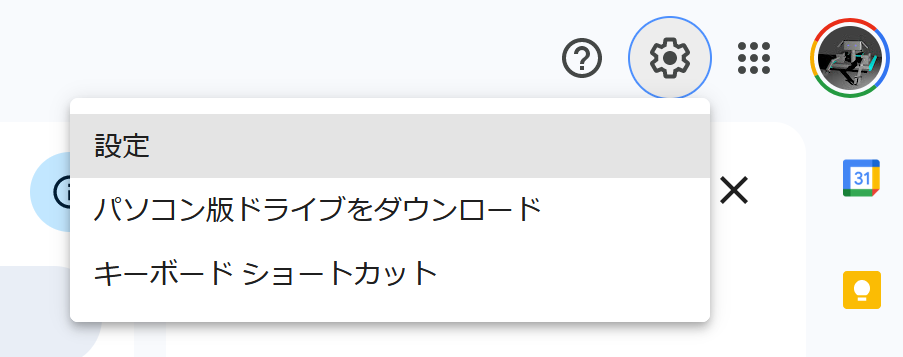
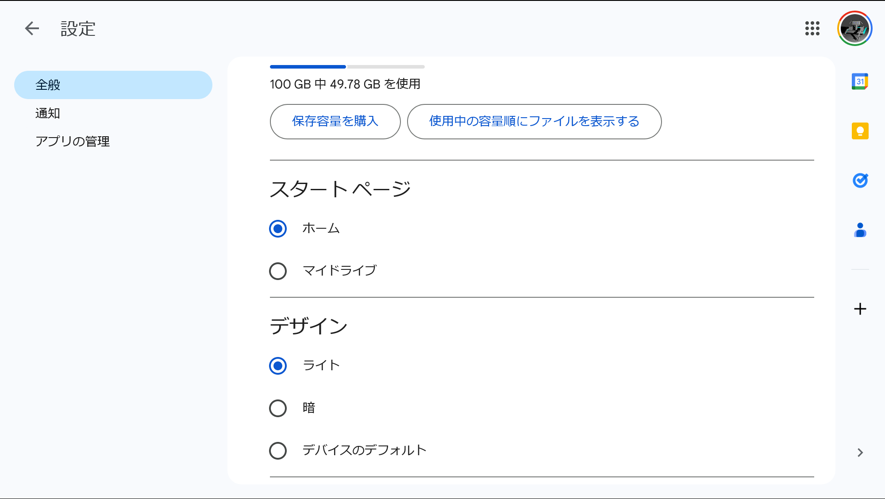
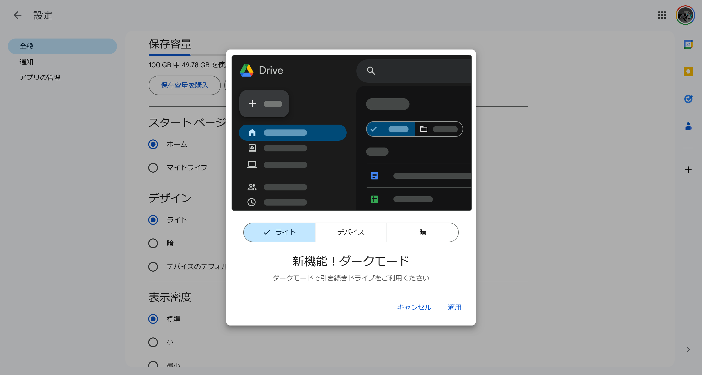
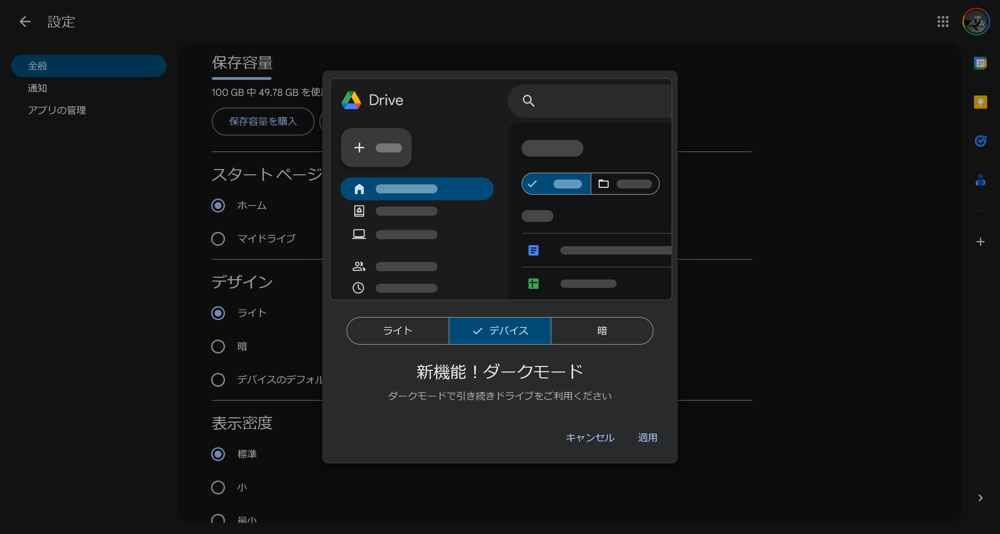

import ArticleCard from "@components/ArticleCard.astro";
import Steps from "/src/starlight/components/Steps.astro";

2024年4月16日（現地時間）、Googleは、Googleドライブ（Google Drive）が **ダークモード（ダークテーマ）** をサポートしたことを発表しました。ダークモードでは、目の負担を減らし、夜間の作業でも快適に利用できるなど、多くのメリットがあります。

この記事では、Googleドライブのダークモードの設定方法を詳しく解説します。

<!-- toc -->

## Googleドライブにダークモードが実装

Googleドライブでは、これまで標準のライトテーマのみが提供されていました。しかし、多くのユーザーからの要望を受け、4月16日から**Web版でのダークモードが導入**されました。

これまで、Googleドライブでダークモードを使うには、「**Google Drive Dark Mode**」や「**Dark Reader**」といったサードパーティ製の拡張機能をインストールする必要がありました。

- [Google Drive Dark Mode（Chrome）](https://chromewebstore.google.com/detail/google-drive-dark-mode/mhlhbpejnmlkaiaggagblklodbbldmmc?hl=ja)
- [Dark Reader（Chrome）](https://chromewebstore.google.com/detail/dark-reader/eimadpbcbfnmbkopoojfekhnkhdbieeh?hl=ja)
- [Dark Reader（Firefox）](https://addons.mozilla.org/ja/firefox/addon/darkreader/)

今回の新機能により、サードパーティの拡張機能を利用せずに、Googleドライブでダークモードを利用できるようになりました。Googleドライブがよりカスタマイズしやすく、目に優しい環境で使用できるようになります。

## ダークモードの設定方法

Googleドライブのダークモードは、次の手順で設定できます。

<Steps>

1. **Googleドライブを開く**

    まず、[Googleドライブ](http://drive.google.com)へアクセスします。

2. **設定を開く**

    画面右上の設定アイコンをクリックし、メニューから［設定］を選択します。

    

3. **［デザイン］からテーマを選択**

    設定の［全般］タブの［デザイン］セクションから、［**ライト**］［**暗**］［**デバイスのデフォルト**］のいずれかを選択します。

    

    :::note
    デザインの設定のそれぞれの選択肢の意味は、次のとおりです。

    - **ライト**：ライトテーマを適用します
    - **暗**：ダークテーマを適用します
    - **デバイスのデフォルト**：デバイスの設定に合わせて、ライトテーマまたはダークテーマを適用します

    :::

</Steps>

筆者が実際に試してみたところ、設定画面を開いたときに、ダークモードが実装されたことを示す画面が表示されました。

このモーダルウィンドウには［ライト］［デバイス］［暗］の3つのボタンが表示されており、この画面からも設定を変更できるようになっています。いずれかのボタンを選択すると即座に反映され、［適用］をクリックすると設定が保存されます。

*設定画面を開くとダークモードが実装されたことを示すモーダルウィンドウが表示された*

*このモーダルウィンドウで［デバイス］を選択したようす*

## ダークモードのメリット

ダークモードの主なメリットには、次のようなものがあります。

- **目の保護**：長時間の使用による目の疲れを軽減します
- **省エネ**：ディスプレイの消費電力が抑えられるため、とくO有機ELディスプレイではバッテリー持ちが改善します

ただし、**ダークモードは必ずしも消費電力を抑制できるわけではありません**。ディスプレイの種類や設定によっては、消費電力を削減できたり、できなかったりします。詳しくは、別の記事で解説しています。

<ArticleCard link="/article/2022/06/27/power-saving-with-dark-mode/" />

:::tip
ダークモードは、環境によってはテキストが読みづらく感じることもあります。利用状況に合わせて、ライトモードと使い分けることをオススメします。
:::

## まとめ

Googleは、リクエストが多かったダークモードをGoogleドライブに導入しました。

この記事では、Googleドライブのダークモードの設定方法を解説しました。ダークモードを利用することで、目の負担を軽減し、夜間の作業でも快適に利用できるようになります。ぜひ、設定してみてください。

## 参考

- [Google Workspace Updates: Dark mode now available in Google Drive web](https://workspaceupdates.googleblog.com/2024/04/dark-mode-now-available-in-google-drive.html?m=1)
- [Use Dark theme in Google Drive - Computer - Google Drive Help](https://support.google.com/drive/answer/9962935?sjid=17704956304989371040-NA)
