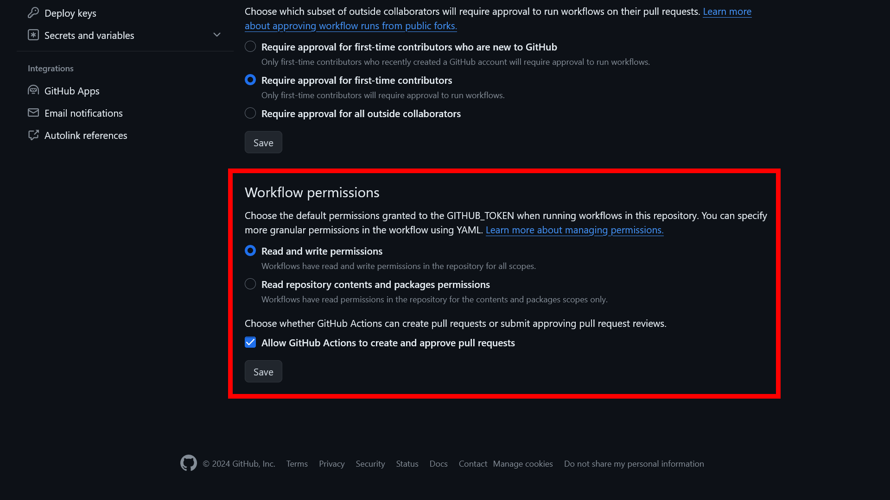
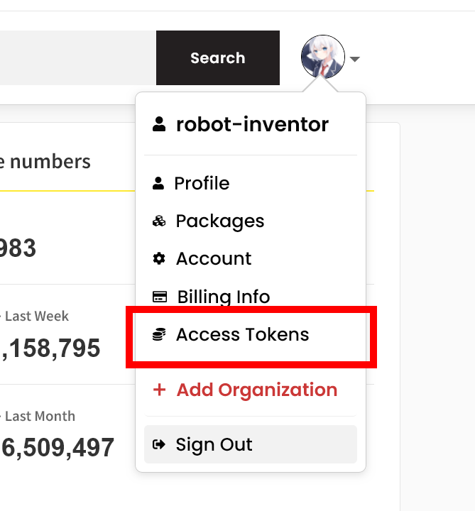
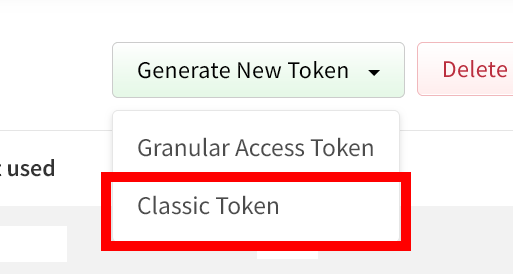
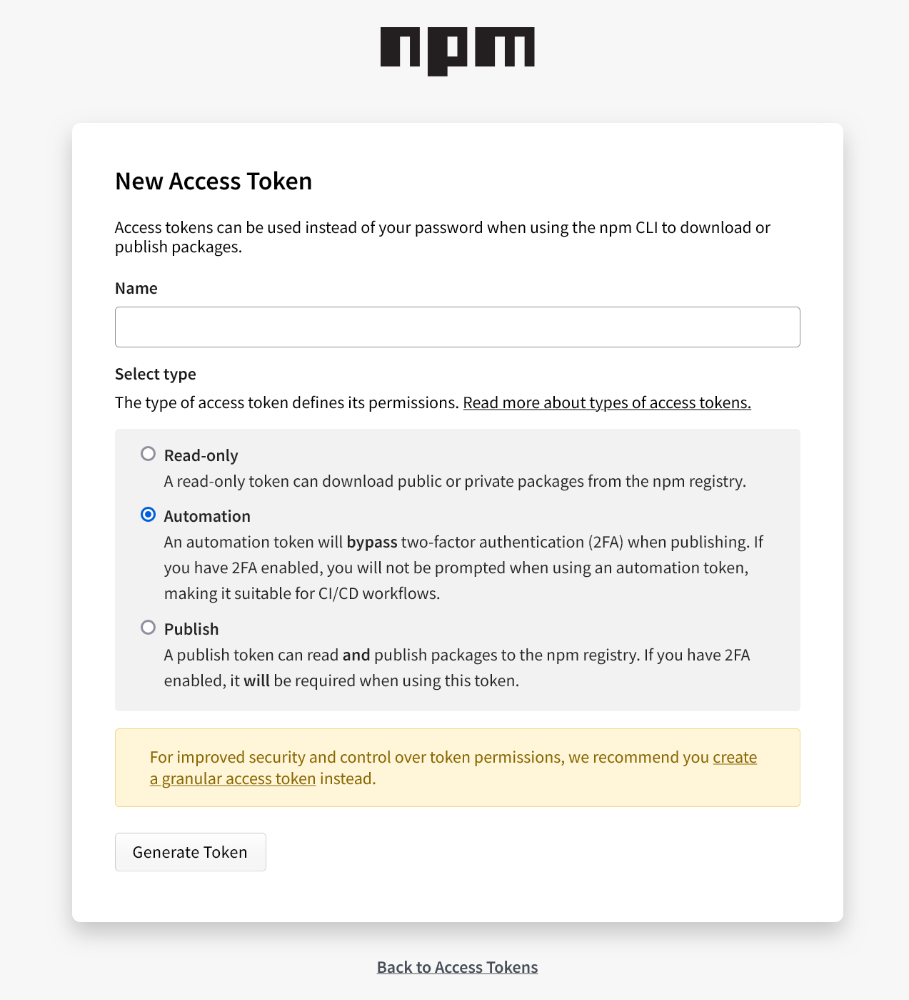
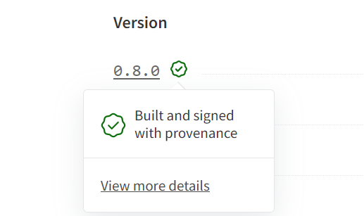
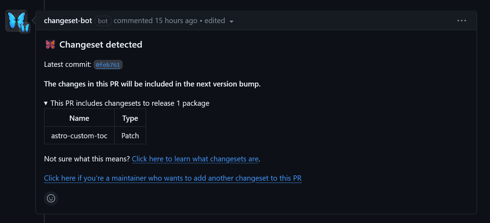
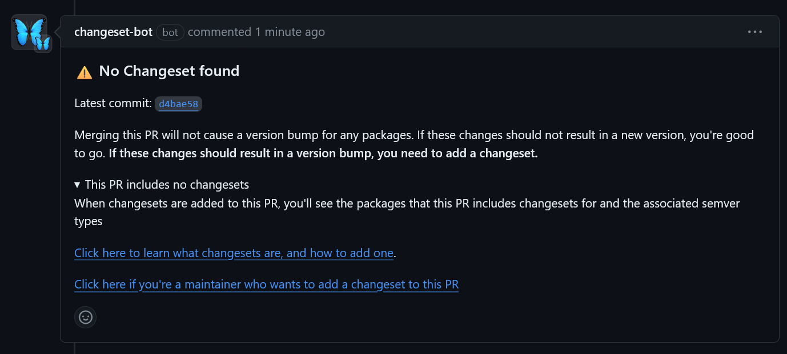
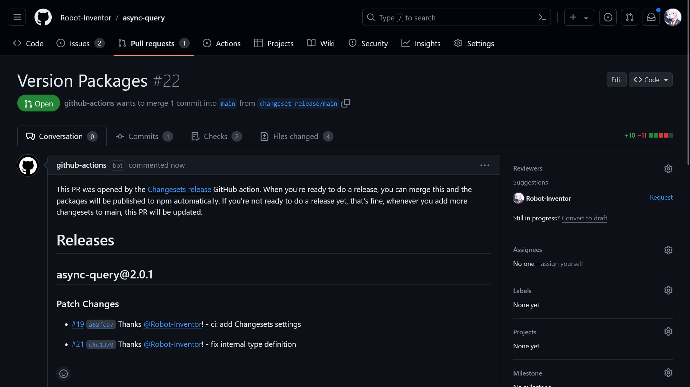

最近、筆者が管理するいくつかのGitHubリポジトリーに[Changesets](https://github.com/changesets/changesets)を導入しました。これによってnpmへのリリース作業を自動化でき、負担が減りました。この記事では、Changesetsを導入する手順を詳しく解説します。

<!-- toc -->

## Changesetsとは

Changesetsは、パッケージのバージョニングやリリースノートの作成、さらにはnpmへの公開までを自動化できるシステムです。[Astro](https://astro.build/)や[pnpm](https://pnpm.js.org/)の開発でも利用されています。

モノリポジトリーにも通常のシングルリポジトリーにも対応しています。また、コミットメッセージの形式についての制約がなく、生成されたリリースノートを編集することもできます。

Changesetsを使った開発は、次のような流れになります。

1. コードに変更を加える
2. ``npx changeset``を実行して変更の規模（``major``/``minor``/``patch``）とその内容を入力する
3. 変更をコミットし、プルリクエストを作成する
4. プルリクエストをマージする
5. Changesetsがバージョン番号の変更やリリースノートが含まれるプルリクエストを自動で作成する
6. 複数の変更をまとめてリリースしたい場合は、1〜4を繰り返す（その間、Changesetsのプルリクエストは自動で更新される）
7. 任意のタイミングでChangesetsのプルリクエストをマージすると、GitHubのリリースページが自動で作成され、パッケージがnpmへ公開される

この記事では、Changesetsを使って次のことを自動化するための設定方法を詳しく説明します。

- パッケージのバージョニング
- リリースノートの作成
  - 自動で生成されたリリースノートは必要に応じて手動で編集できます
- GitHubのリリースページの作成
- npmへの公開
  - 任意でnpmのprovenance statementsへの対応可

## 設定方法

ここからは、ChangesetsをGitHubリポジトリーで使うための手順を説明します。

### CLIのインストール

まずは、ChangesetsのCLIをインストールします。

```shell
npm install -D @changesets/cli
```

次に、設定ファイルを作成します。``changesets init``コマンドを実行すると、``.changeset``ディレクトリーと設定ファイルが作成されます。

```console
$ npx changeset init

🦋  Thanks for choosing changesets to help manage your versioning and publishing
🦋
🦋  You should be set up to start using changesets now!
🦋
🦋  info We have added a `.changeset` folder, and a couple of files to help you out:
🦋  info - .changeset/README.md contains information about using changesets
🦋  info - .changeset/config.json is our default config
```

### 設定ファイルの編集

デフォルトでは、パッケージの公開設定が``restricted``になっています。一般向けにnpmで公開する場合は、``.changeset/config.json``の``access``を``public``に変更します。

```diff lang="json" title=".changeset/config.json"
{
  "$schema": "https://unpkg.com/@changesets/config@3.0.0/schema.json",
  "changelog": "@changesets/cli/changelog",
  "commit": false,
  "fixed": [],
  "linked": [],
-  "access": "restricted",
+  "access": "public",
  "baseBranch": "main",
  "updateInternalDependencies": "patch",
  "ignore": []
}
```

また、デフォルトではリリースノートが``./CHANGELOG.md``として生成されます。これが不要な場合は、``changelog``に``false``を設定します。

```diff lang="json" title=".changeset/config.json"
{
  "$schema": "https://unpkg.com/@changesets/config@3.0.0/schema.json",
-  "changelog": "@changesets/cli/changelog",
+  "changelog": false,
  "commit": false,
  "fixed": [],
  "linked": [],
  "access": "public",
  "baseBranch": "main",
  "updateInternalDependencies": "patch",
  "ignore": []
}
```

リリースノートの形式をカスタマイズすることも可能です。コミットやプルリクエストのリンク、コントリビューターの情報を含めたい場合は、``@changesets/changelog-github``を利用します。``<org>``にはGitHubのユーザー名、``<repo>``にはリポジトリー名を指定します。

```shell
npm install -D @changesets/changelog-github
```

```diff lang="jsonc" title=".changeset/config.json"
{
  "$schema": "https://unpkg.com/@changesets/config@3.0.0/schema.json",
-  "changelog": "@changesets/cli/changelog",
  // ``<org>/<repo>``にはGitHubのユーザー名とリポジトリー名を指定
+  "changelog": ["@changesets/changelog-github", { "repo": "<org>/<repo>" }],
  "commit": false,
  "fixed": [],
  "linked": [],
  "access": "public",
  "baseBranch": "main",
  "updateInternalDependencies": "patch",
  "ignore": []
}
```

### リリース用のスクリプトの設定

``package.json``に、バージョン番号の変更時やnpmへの公開時に利用するスクリプトを設定します。``changeset-version``と``changeset-publish``は他の名前でも大丈夫ですが、その場合は後述のGitHub Actionsのコードを変更する必要があります。

```diff lang="jsonc" title="package.json"
{
    // ...色々な設定
    "scripts": {
+        "changeset-version": "changeset version",
+        "changeset-publish": "changeset publish"
    }
}
```

ビルド処理などが必要な場合は、``changeset-version``や``changeset-publish``に追加します。たとえば、私のリポジトリーでは次のように設定しています。

```jsonc title="package.json"
{
    // ...色々な設定
    "scripts": {
        "build": "tsc",
        "version": "npm run build && git add .",
        "changeset-version": "changeset version && npm run version",
        "changeset-publish": "npm run build && changeset publish"
    }
}
```

:::caution[重要！]
ビルドスクリプトを追加する場合でも、``changeset version``や``changeset publish``が実行されるようにしてください。これらがないと、正しくバージョニングされなかったり、GitHubのリリースが作成されなかったりします。（これで1時間ムダにしました）
:::

### GitHub Actionsの設定

Changesetsを使ってリリースを自動化するために、GitHub Actionsを利用します。``.github/workflows/release.yml``を作成し、次の内容を入力します。このコードは、[公式のサンプル](https://github.com/changesets/action/tree/c62ef9792fd0502c89479ed856efe28575010472?tab=readme-ov-file#with-publishing)からSlack通知を削除したり、依存関係をアップデートしたりしています。

```yaml title=".github/workflows/release.yml"
name: Release

on:
    push:
        branches: [main]

concurrency: ${{ github.workflow }}-${{ github.ref }}

jobs:
    release:
        runs-on: ubuntu-latest

        strategy:
            matrix:
                node-version: [21.x]

        steps:
            - uses: actions/checkout@v4

            - name: Use Node.js ${{ matrix.node-version }}
              uses: actions/setup-node@v4
              with:
                  node-version: ${{ matrix.node-version }}

            - run: npm ci

            - name: Create Release Pull Request or Publish to npm
              id: changesets
              uses: changesets/action@v1
              with:
                  version: npm run changeset-version
                  publish: npm run changeset-publish
              env:
                  GITHUB_TOKEN: ${{ secrets.GITHUB_TOKEN }}
                  NPM_TOKEN: ${{ secrets.NPM_TOKEN }}
```

### GitHubとnpmの設定

GitHub Actionsによるファイルの更新やプルリクエストの作成を許可するために、権限を変更します。

GitHubのリポジトリーの［Settings］>［Actions］>［General］を開きます。下にスクロールし、［Workflow permissions］を［Read and write permissions］に変更します。また、［Allow GitHub Actions to create and approve pull requests］をオンにします。

設定の変更後は［Save］ボタンをクリックしてください。



次に、リリースを自動化するために、npmのアクセストークンを作成します。npmに移動してプロフィールアイコンをクリックし、メニューから［Access Tokens］を選択します。



［Generate New Token］から［Classic Token］をクリックし、アクセストークンを発行します。



トークン名には分かりやすいものを設定し、種類では［Automation］を選択してください。



トークンが生成されたら、トークンをコピーします。トークンは一度しか表示されないので注意してください。

トークンをコピーしたらGitHubの設定画面に戻り、［Secrets and variables］>［Actions］から［Repository secrets］を作成します。シークレットの名前は``NPM_TOKEN``、値は先ほどコピーしたトークンを入力してください。

### provenance statementsの設定（任意）

必須ではありませんが、[npmのprovenance statements](https://docs.npmjs.com/generating-provenance-statements)を利用できます。provenance statementsは、npmパッケージの透明性を向上させられる機能です。日本語では「来歴証明」や「来歴情報」といったところでしょうか。

この機能を使うと、パッケージのnpmページにチェックマークのバッジが表示されるようになります。このバッジをクリックすると、パッケージがどのリポジトリーのどのコミットからどのようなシステムでビルドされたかを確認できます。



従来のnpmでは、GitHubで公開されているコードとnpmで公開されているコードが同一であるという保証がありませんでした。もちろん、自分でビルドして、npmで公開されているコードと差分を取れば確認できますが、逆にいえばそうしない限りは確認する手段がありませんでした。provenance statementsを使えば、GitHubのコードとnpmで公開されているコードが同一であることを簡単に証明できます。

この機能を利用するには、``package.json``の``publishConfig.provenance``を``true``を設定します。

```jsonc title="package.json" add={3-5}
{
    // ...色々な設定
    "publishConfig": {
        "provenance": true
    }
}
```

次に、``.github/workflows/release.yml``に、必要な``permissions``を追加します。

```yaml title=".github/workflows/release.yml" add={13-16}
name: Release

on:
    push:
        branches: [main]

concurrency: ${{ github.workflow }}-${{ github.ref }}

jobs:
    release:
        runs-on: ubuntu-latest

        permissions:
            contents: write
            id-token: write
            pull-requests: write

        strategy:
            matrix:
                node-version: [21.x]

        steps:
            - uses: actions/checkout@v4

            - name: Use Node.js ${{ matrix.node-version }}
              uses: actions/setup-node@v4
              with:
                  node-version: ${{ matrix.node-version }}

            - run: npm ci

            - name: Create Release Pull Request or Publish to npm
              id: changesets
              uses: changesets/action@v1
              with:
                  version: npm run changeset-version
                  publish: npm run changeset-publish
              env:
                  GITHUB_TOKEN: ${{ secrets.GITHUB_TOKEN }}
                  NPM_TOKEN: ${{ secrets.NPM_TOKEN }}
```

これで、npmのprovenance statementsを利用できるようになりました。

:::note
[npm公式のコード例](https://docs.npmjs.com/generating-provenance-statements#example-github-actions-workflow)では、``contents: read``と``id-token: write``を設定していますが、これでは不十分です。バージョン番号を変更したり、プルリクエストを作成したりするために、``contents: write``と``pull-requests: write``が必要です。これらの権限がないと、GitHub Actionsで次のようなエラーが発生します。

```console
/usr/bin/git add .
/usr/bin/git commit -m Version Packages
[changeset-release/main adfafc6] Version Packages
 10 files changed, 32 insertions(+), 31 deletions(-)
 delete mode 100644 .changeset/happy-cars-shake.md
/usr/bin/git push origin HEAD:changeset-release/main --force
remote: Permission to Robot-Inventor/twi-ext.git denied to github-actions[bot].
fatal: unable to access 'https://github.com/Robot-Inventor/twi-ext/': The requested URL returned error: 403
Error: Error: The process '/usr/bin/git' failed with exit code 128
Error: The process '/usr/bin/git' failed with exit code 128
```

:::

### Botの導入（任意）

Changesetsには[公式のBot](https://github.com/apps/changeset-bot)があります。このBotはChangesetsの動作に必須ではありませんが、導入するとプルリクエストにChangesetsのデータが含まれているかを確認してくれます。また、Changesetsのデータが含まれていない場合は、リンクから簡単に作成できるようになっています。


*Changesetsのデータが含まれている場合*


*Changesetsのデータが含まれていない場合*

このBotはすべてのプルリクエストにメッセージを送信するので、必要なリポジトリーにだけ導入することをオススメします。

### プルリクエストを作成する

これで、必要な設定がすべて完了しました。次に、練習を兼ねて、ここまでの変更を含むプルリクエストを作成しましょう。新しいブランチに切り替えます。

```shell
git checkout -b add-changesets
```

ブランチを切り替えたら、``changeset``コマンドを実行します。まずは、変更の規模を``patch``/``minor``/``major``から選択します。ここでの選択は、バージョン番号の変更時に利用されます。たとえば、前回のバージョンからの変更の中で、もっとも大きな変更が``minor``だった場合、次のバージョンはマイナーバージョンが上がります。

```console
$ npx changeset

🦋  What kind of change is this for async-query? (current version is 2.0.0) ...
> patch
  minor
  major
```

次に、変更の内容を入力します。変更の内容は、リリースノートに含まれるため、他の開発者が理解できるように簡潔に記述してください。

```console
$ npx changeset
🦋  What kind of change is this for async-query? (current version is 2.0.0) · patch
🦋  Please enter a summary for this change (this will be in the changelogs).
🦋    (submit empty line to open external editor)
🦋  Summary »  ci: add Changesets settings
```

変更の内容を入力してエンターを押すと、入力内容を確認されます。内容に問題がなければ、``y``かエンターを押します。

```console
$ npx changeset
🦋  What kind of change is this for async-query? (current version is 2.0.0) · patch
🦋  Please enter a summary for this change (this will be in the changelogs).
🦋    (submit empty line to open external editor)
🦋  Summary · ci: add Changesets settings
🦋
🦋  === Summary of changesets ===
🦋  patch:  async-query
🦋
🦋  Is this your desired changeset? (Y/n) » true
```

これで、変更内容が記録されました。あとは、変更をコミットしてプルリクエストを作成します。

```shell
git add .
git commit -m "ci: add Changesets settings"
git push add-changesets
```

GitHubのリポジトリーにアクセスし、プルリクエストを作成します。先ほどChangesetsのBotを導入していた場合は、Botからのコメントが付いているはずです。

問題がなければプルリクエストをマージします。少し待つと、チェンジログの更新やバージョン番号の変更が含まれるプルリクエストが作成されます。チェンジログを修正したい場合は、このプルリクエストに対して変更を加えてください。



このプルリクエストを任意のタイミングでマージすると、GitHubのリリースページが自動で作成され、npmへの公開が行われます。お疲れさまでした！

## まとめ

この記事では、Changesetsを使ってnpmへのリリースを自動化する手順を解説しました。Changesetsを導入することで、バージョニングやリリースノートの作成、GitHubのリリースページの作成、npmへの公開を自動化できます。

GitHubリポジトリーでの権限の設定やprovenance statementsの設定などまで書かれた記事が見つからなかったので、この記事を書きました。参考になれば幸いです。

## 参考

- [changesets/changesets: 🦋 A way to manage your versioning and changelogs with a focus on monorepos](https://github.com/changesets/changesets/)
- [changesets/action](https://github.com/changesets/action)
- 参考にさせていただいた記事
  - [Changesetsで頑張らないリリース（モノレポ対応）](https://zenn.dev/mouse_484/articles/easy-changesets)
  - [時期を決めて定期的に更新するnpmパッケージをChangesetsで管理する | Web Scratch](https://efcl.info/2023/07/17/regular-updates-by-changesets/)
- つまづいたときに参考にさせていただいたIssue
  - [Add support for publishing with provenance · Issue #1152 · changesets/changesets](https://github.com/changesets/changesets/issues/1152)
  - [Changesets GithubAction not creating github releases · Issue #1202 · changesets/changesets](https://github.com/changesets/changesets/issues/1202)
- 設定などを参考にさせていただいたリポジトリー
  - [mscharley/dot: A lightweight inversion of control framework for JavaScript and TypeScript](https://github.com/mscharley/dot)
  - [cultureamp/kaizen-design-system: Culture Amp's Kaizen Design System :seedling:](https://github.com/cultureamp/kaizen-design-system)
  - [alvesvaren/zod-to-openai-tool: Easily create tools from zod schemas to use with OpenAI Assistants and Chat Completions, inspired by tRPC](https://github.com/alvesvaren/zod-to-openai-tool/tree/main)
  - [expressive-code/expressive-code: A text marking & annotation engine for presenting source code on the web.](https://github.com/expressive-code/expressive-code)
  - [withastro/astro: The web framework for content-driven websites. ⭐️ Star to support our work!](https://github.com/withastro/astro)
