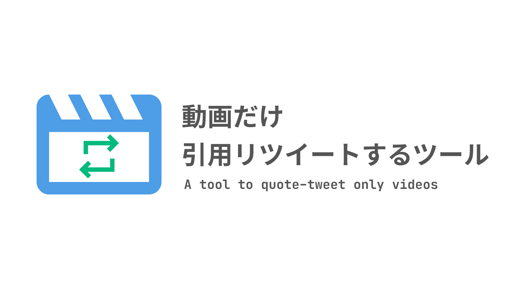

<input type="url" placeholder="ここにツイートのURLを貼り付ける" id="tweet_url_textbox" autofocus="">
<button id="open_twitter_button">ツイート画面を開く</button>

## 説明

Twitterには、動画だけを引用リツイートできる機能があります。このツールに引用元ツイートのURLを貼り付けると、動画だけを引用したツイートの作成画面が開きます。

## 使い方

1. 動画が含まれた引用したいツイートを用意する
2. 共有ボタンなどからツイートのURLをコピーする
3. このツールのテキストボックスに貼り付ける
4. ［ツイート画面を開く］をクリック

## 用途

このツールは、たとえば次のような用途で利用できます。

- おもしろい動画を見つけて引用リツイートしたいが、通常の引用リツイートだと見た目がごちゃごちゃするとき
- 自分の過去の動画をツイートに添付したいが、毎回動画をアップロードし直すのが面倒なとき
  - 配信者さんが毎週固定ツイートを更新する際、動画だけ引用リツイートすれば、毎回アップロードせずに自己紹介動画を添付できる

## 注意事項

- このツールはTwitterの機能を利用しているものの、ツール自体はTwitter非公式です
- このツールを使用して生じたいかなる損害やトラブルの責任も負いません。自己責任で利用してください
- 他人のツイートから動画のみ引用リツイートする場合、無断転載だと勘違いされる可能性があります。特別な理由がない限り、他人のツイートは普通の引用リツイートを利用することを推奨します
- 動画のみ引用リツイートした場合、その動画の再生数は元ツイートの再生数として扱われます
