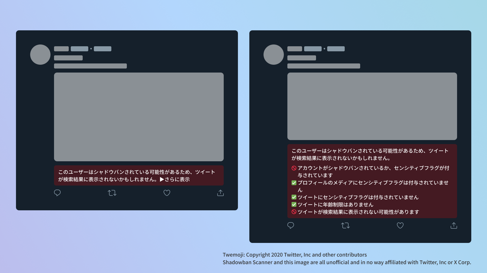
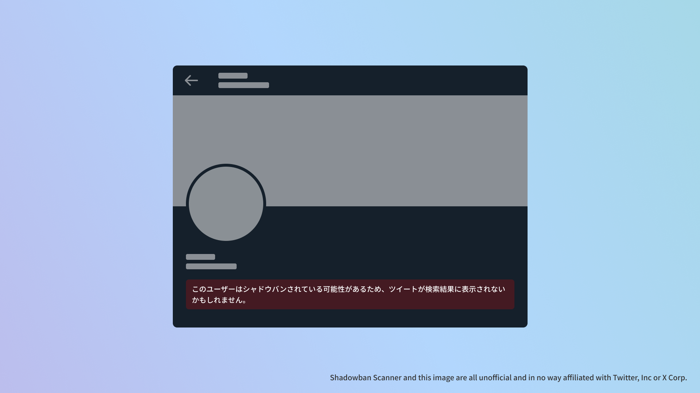

import { YouTube } from "@astro-community/astro-embed-youtube";
import ExtensionBadges from "./ExtensionBadges.astro";

## Shadowban Scannerとは？

Shadowban Scannerは、Twitterのいわゆるシャドウバンやセンシティブ判定を、外部サイトに移動せずにその場で確認できる拡張機能です。

<YouTube id="S2mRHz9SEig" />

- [Shadowban Scanner公式サイト](https://shadowban-scanner.roboin.io/)

Shadowban Scannerは、次のリンクからダウンロードできます。

<ExtensionBadges/>

お使いのWebブラウザーにインストールするだけで、次の機能が利用できるようになります。

- アカウント単位のシャドウバンとセンシティブフラグの検出
- プロフィールのメディア（アイコンとヘッダー画像）のセンシティブフラグの検出
- 法的な理由によりアカウントをブロックしている国の検出
- ツイート単位のセンシティブフラグの検出
- ツイートの年齢制限の検出
- 非表示にされたツイートを表示するボタンを追加

すべての処理はユーザーのコンピューター上で行われます。一部の拡張機能でみられるような、外部サーバーと通信したり、ユーザーの認証情報を無断で取得してTwitterの内部APIにアクセスしたりするような処理はありません。あなたのデータとプライバシーを守ります。

Shadowban Scannerは、PC向けの最新バージョンのGoogle Chrome、Microsoft Edge、Mozilla Firefoxで利用できます。技術的な理由により、スマートフォンでは利用できません（Android版Firefox Nightlyを除く）。

仕組みなどの詳細は、次のページから確認できます。

- [Shadowban Scannerの仕組みとシャドウバンについて - Shadowban Scanner](https://github.com/Robot-Inventor/shadowban-scanner/blob/main/doc/ja/about-shadowban.md)

:::note
Shadowban Scannerは、他の類似のツールと同様に、偽陽性や偽陰性が発生することがあります。Shadowban Scannerで継続的にアカウントやツイートの状態を確認しつつ、他のツールと併用することをオススメします。
:::
