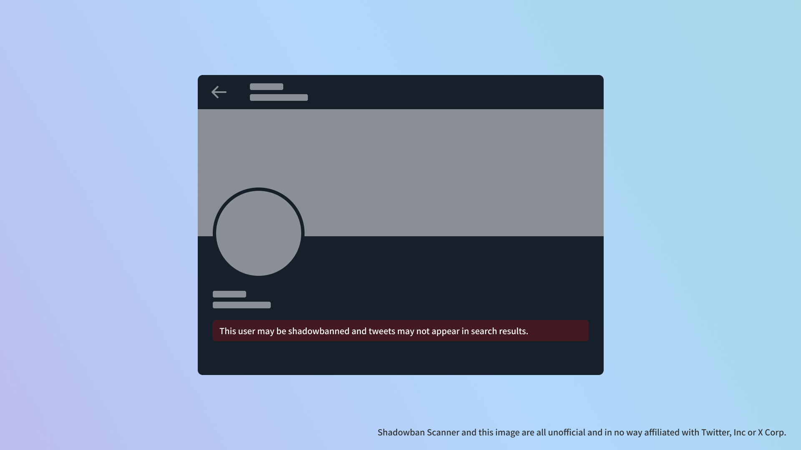
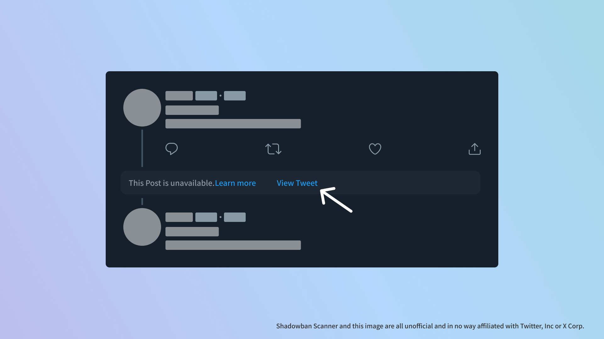

import { YouTube } from "@astro-community/astro-embed-youtube";
import ExtensionBadges from "./ExtensionBadges.astro";

## What is Shadowban Scanner?

Shadowban Scanner is an extension that allows you to check Twitter's so-called shadowban and sensitive judgments on the fly without having to go to an external site.

<YouTube id="6c4MCItd7wY" />

- [Shadowban Scanner official website](https://shadowban-scanner.roboin.io/)

Shadowban Scanner can be downloaded from the following links:

<ExtensionBadges/>

Just install it on your web browser and you will have access to the following features

- Per-account shadowban and sensitive flag detection
- Sensitive flag detection for profile media (icons and header images)
- Detection of sensitive flags per tweet
- Detect age restrictions on tweets
- Add buttons to show hidden tweets

All processing is done on the user's computer. There is no communication with external servers or access to Twitter's internal APIs to obtain your credentials without your permission, as is the case with some extensions. Your data and privacy are protected.

Shadowban Scanner is available in the latest versions of Google Chrome, Microsoft Edge, and Mozilla Firefox for PCs. For technical reasons, it is not available on smartphones (except Firefox for Android).

More information on how it works can be found on the following page.

- [How Shadowban Scanner Works and About Shadowban - Shadowban Scanner](https://github.com/Robot-Inventor/shadowban-scanner/blob/main/doc/en/about-shadowban.md)

:::note[Note]
Shadowban Scanner, like other similar tools, can produce false positives and false negatives; I recommend using it in conjunction with other tools while continuously checking account and tweet status with Shadowban Scanner.
:::
